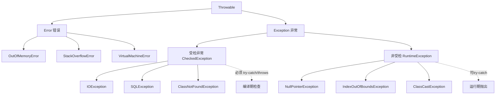
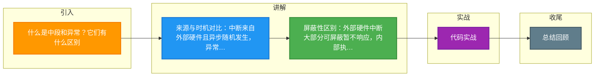

# 什么是中段和异常？它们有什么区别

**中断**和**异常**都是操作系统用来打断当前进程执行，转而处理特定事件的机制，但它们的来源和性质有所不同。

### 1. 中断
- **定义**：中断是指 CPU 在执行程序的过程中，遇到外部硬件设备（如键盘、网卡、时钟）发出的信号，而暂停当前程序，转去处理该信号的过程。
- **来源**：外部硬件，与当前执行的指令无关。
- **特点**：**异步**发生。也就是说，指令执行到任何位置都可能发生中断。
- **屏蔽性**：大部分中断是可以被屏蔽的（通过 CPU 的 IF 标志位），CPU 可以选择暂时不响应低优先级的中断。

### 2. 异常
- **定义**：异常是指 CPU 在执行指令时，遇到了非法情况（如除零、缺页、非法指令）而产生的内部同步事件。
- **来源**：CPU 内部，由当前正在执行的指令直接触发。
- **特点**：**同步**发生。如果指令重新执行，同样的异常通常还会再次出现。
- **分类**：
  - **故障**：如缺页异常，修复后可以重新执行指令，通常能恢复。
  - **陷阱**：如系统调用，故意设计的异常，用于从用户态切换到内核态。
  - **终止**：如硬件错误，通常无法恢复，导致程序终止。
- **屏蔽性**：异常一旦产生，通常**不能被屏蔽**，CPU 必须立即处理，以保证系统的一致性和正确性。

### 实战案例
在高并发网络服务器（如 Nginx/Redis）开发中，为了减少硬中断带来的上下文切换开销，通常会开启网卡的多队列或使用 **eBPF**/XDP 在内核态早期处理数据包，避免频繁打断用户态进程。

### 核心区别对比表

| 维度 | 中断 | 异常 |
| :--- | :--- | :--- |
| **来源** | CPU 外部硬件（如网卡、键盘） | CPU 内部指令执行（如除零、缺页） |
| **发生时机** | 异步，指令执行任意时刻 | 同步，指令执行特定时刻 |
| **可屏蔽性** | 大部分可屏蔽（通过 CLI/STI 指令） | 不可屏蔽，必须立即处理 |
| **典型用途** | 设备 I/O 完成、时钟中断 | 系统调用、程序错误调试 |
| **返回位置** | 通常返回下一条指令 | 故障通常返回当前指令（重试） |

### 代码示例（x86 汇编：区分中断与异常入口）
```assembly
; 中断描述符表 (IDT) 设置示例
; 这里的 Type 字段区分了类型

; 0x2E 表示 32位中断门，用于外部硬中断 (如网卡)
set_interrupt_gate:
    mov edx, handler_interrupt  ; 异步处理函数
    mov [idt + 0x2E * 8], dx
    mov [idt + 0x2E * 8 + 2], ax
    mov word [idt + 0x2E * 8 + 4], 0x8E00 ; P=1, DPL=0, Type=1110 (Interrupt Gate)

; 0x80 表示 陷阱门，用于系统调用 (异常的一种)
set_trap_gate:
    mov edx, handler_syscall   ; 同步处理函数
    mov [idt + 0x80 * 8], dx
    mov [idt + 0x80 * 8 + 2], ax
    mov word [idt + 0x80 * 8 + 4], 0xEF00 ; P=1, DPL=3, Type=1111 (Trap Gate, 允许用户态调用)
```

### 流程对比图

```text
      CPU 执行流
          |
    +-----+-----+
    | 执行指令 |
    +-----+-----+
          |
   +------v------+         +------------------+
   | 指令执行结束 |         | 外部事件 (硬件)  |
   +------+------+         +--------+---------+
          |                          |
          v                          v
   +------v------+           +------v------+
   |   异常检测   |           |  中断信号   |
   +------+------+           +------+------+      
          |                          |
          v                          v
   (同步，指令触发)          (异步，随机发生)
          |                          |
          +-----------+--------------+
                      |
                      v
              +-------+-------+
              | 保存上下文    |
              | (PC, 寄存器)  |
              +-------+-------+
                      |
                      v
              +-------+-------+
              | 执行处理程序  | <--- 中断处理程序 / 异常处理程序
              +-------+-------+
                      |
                      v
              +-------+-------+
              | 恢复上下文    |
              +-------+-------+
                      |
                      v
              (返回原程序或终止)
```

## 常见考点
1. **系统调用是属于中断还是异常？**
   - 系统调用通常通过软中断（如 x86 的 `int 0x80` 指令）或专用指令（`syscall`）实现，从机制上讲，它利用了**陷阱**这种异常机制来陷入内核态，但逻辑上它被视为一种主动发起的服务请求。

2. **软中断和硬中断的区别？**
   - 硬中断：由外部硬件产生。
   - 软中断：由内核指令产生，用于内核内部的异步处理（如内核中的 Tasklet），或者模拟硬件中断。


## 核心架构图



## 记忆要点

- 来源与时机对比：中断来自外部硬件且异步随机发生，异常源于内部指令且同步触发
- 屏蔽性区别：外部硬件中断大部分可屏蔽暂不响应，内部执行异常不可屏蔽必须立刻处理
- 异常细分：故障(Fault如缺页)可重试修复，陷阱(Trap如系统调用)是故意设计用于切换内核态，终止则直接退出

## 结构化回答

**30 秒电梯演讲：** 中断是外部通知，异常是内部故障。打个比方，中断是有人敲门找你，异常是自己走路突然崴了脚。

**展开框架：**
1. **来源与时机对比** — 中断来自外部硬件且异步随机发生，异常源于内部指令且同步触发
2. **屏蔽性区别** — 外部硬件中断大部分可屏蔽暂不响应，内部执行异常不可屏蔽必须立刻处理
3. **异常细分** — 故障(Fault如缺页)可重试修复，陷阱(Trap如系统调用)是故意设计用于切换内核态，终止则直接退出

**收尾：** 我在项目里踩过坑——在高并发网络服务器（如 Nginx/Redis）开发中，为了减少硬中断带来的上下文切换开销，通常会开启网卡的多队列或使用 eBPF/XDP 在内核态早期处理数据包，避免频繁打断用户态进程。您想深入聊哪一段：原理、避坑还是对比选型？

## 视频脚本

> 预计时长：4 分钟 | 由浅入深

| 时间 | 画面/字幕 | 口播台词 | 讲解要点 |
|------|----------|----------|----------|
| 0:00 | 标题卡：什么是中段和异常？它们有什么区别 | "什么是中段和异常？它们有什么区别？一句话——中断是有人敲门找你，异常是自己走路突然崴了脚。" | 开场钩子 |
| 0:48 | 概念动画/示意图 | "中断是外部通知，异常是内部故障——中断是有人敲门找你，异常是自己走路突然崴了脚" | 核心定义 |
| 1:36 | 来源与时机对比示意 | "中断来自外部硬件且异步随机发生，异常源于内部指令且同步触发" | 要点1 |
| 2:24 | 屏蔽性区别示意 | "外部硬件中断大部分可屏蔽暂不响应，内部执行异常不可屏蔽必须立刻处理" | 要点2 |
| 3:12 | 异常细分示意 | "故障(Fault如缺页)可重试修复，陷阱(Trap如系统调用)是故意设计用于切换内核态，终止则直接退出" | 要点3 |
| 4:00 | 总结卡 | "记住这几条，面试不慌。下期讲进阶追问。" | 收尾 |

### 视频流程图



