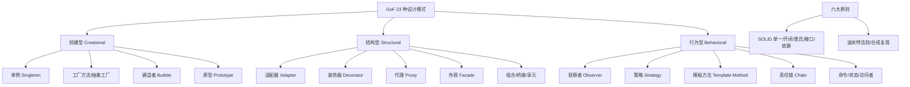

# 常用设计模式

设计模式是软件设计中常见问题的典型解决方案。以下是几种最常用的设计模式详解：

### 1. 单例模式
**意图**：确保一个类只有一个实例，并提供一个全局访问点。
**实现要点**：
- 私有构造函数（防止外部 new）。
- 私有静态引用指向实例。
- 公有静态方法返回实例。

**实战案例**：在 Java Spring 框架中，默认的 Bean 作用域就是 Singleton，这避免了频繁创建数据库连接池或线程池带来的资源开销。

**常见写法**：
1. **饿汉式**（线程安全）
   ```java
   public class Singleton {
       private static final Singleton instance = new Singleton();
       private Singleton() {}
       public static Singleton getInstance() { return instance; }
   }
   ```
   - *优点*：简单，无线程安全问题。
   - *缺点*：如果从未使用，会造成内存浪费。

2. **懒汉式**（线程不安全 -> 线程安全）
   - 线程不安全写法：在 `getInstance` 中直接判断 `if(instance == null)`，多线程下可能创建多个实例。
   - 线程安全写法（同步方法）：加 `synchronized`，但性能差。
   - **双重检查锁定**：
     ```java
     public class Singleton {
         private static volatile Singleton instance;
         private Singleton() {}
         public static Singleton getInstance() {
             if (instance == null) { // 第一次检查
                 synchronized (Singleton.class) {
                     if (instance == null) { // 第二次检查
                         instance = new Singleton();
                     }
                 }
             }
             return instance;
         }
     }
     ```
   - **关键点**：必须使用 `volatile` 修饰 instance，防止指令重排序导致其他线程获取到未初始化完全的对象。

3. **静态内部类**（推荐）
   - 利用类加载机制保证线程安全，且实现懒加载。
   ```java
   public class Singleton {
       private Singleton() {}
       private static class Holder {
           private static final Singleton INSTANCE = new Singleton();
       }
       public static Singleton getInstance() {
           return Holder.INSTANCE;
       }
   }
   ```

### 2. 工厂模式
**意图**：定义一个创建对象的接口，但由子类决定要实例化的类是哪一个。
- **简单工厂**：一个工厂类根据参数创建不同产品。不符合开闭原则（新增产品需修改工厂代码）。
- **工厂方法**：定义抽象工厂接口，每个具体产品对应一个具体工厂。符合开闭原则。
- **抽象工厂**：创建产品家族，而不仅仅是单一产品。适合需要多个相互关联的产品组合的场景。

**代码示例（简单工厂）**：
```javascript
class Car {}
class Bike {}
const factory = (type) => {
  switch(type) {
    case 'car': return new Car();
    case 'bike': return new Bike();
  }
}
```

### 3. 观察者模式
**意图**：定义对象间的一对多依赖，当一个对象状态改变时，所有依赖它的对象都会收到通知并自动更新。
- **应用**：事件驱动系统（如 Vue 的数据双向绑定原理、消息订阅发布）。

**代码示例**：
```javascript
class Subject {
  constructor() { this.observers = []; }
  subscribe(observer) { this.observers.push(observer); }
  notify(data) { this.observers.forEach(obs => obs.update(data)); }
}
```


## 核心架构图



## 记忆要点

- 单例核心：私有构造防外部new，私有静态变量存实例，公有静态方法获取
- 单例演进对比：饿汉式耗内存，懒汉式需加锁，推荐使用静态内部类实现懒加载与线程安全
- 双重检查关键：必须用volatile修饰，防止指令重排导致获取未初始化实例
- 三大模式意图：单例防多创，工厂解耦创建与使用，观察者实现一对多联动

## 结构化回答

**30 秒电梯演讲：** 解决特定软件设计问题的成熟方案。打个比方，像建筑蓝图，盖房子（写代码）时直接套用的经典结构。

**展开框架：**
1. **单例核心** — 私有构造防外部new，私有静态变量存实例，公有静态方法获取
2. **单例演进对比** — 饿汉式耗内存，懒汉式需加锁，推荐使用静态内部类实现懒加载与线程安全
3. **双重检查关键** — 必须用volatile修饰，防止指令重排导致获取未初始化实例

**收尾：** 我在项目里踩过坑——public class Singleton {。您想深入聊哪一段：原理、避坑还是对比选型？

## 视频脚本

> 预计时长：4 分钟 | 由浅入深

| 时间 | 画面/字幕 | 口播台词 | 讲解要点 |
|------|----------|----------|----------|
| 0:00 | 标题卡：常用设计模式 | "常用设计模式？一句话——像建筑蓝图，盖房子（写代码）时直接套用的经典结构。" | 开场钩子 |
| 0:48 | 概念动画/示意图 | "解决特定软件设计问题的成熟方案——像建筑蓝图，盖房子（写代码）时直接套用的经典结构" | 核心定义 |
| 1:36 | 单例核心示意 | "私有构造防外部new，私有静态变量存实例，公有静态方法获取" | 要点1 |
| 2:24 | 单例演进对比示意 | "饿汉式耗内存，懒汉式需加锁，推荐使用静态内部类实现懒加载与线程安全" | 要点2 |
| 3:12 | 双重检查关键示意 | "必须用volatile修饰，防止指令重排导致获取未初始化实例" | 要点3 |
| 4:00 | 总结卡 | "记住这几条，面试不慌。下期讲进阶追问。" | 收尾 |
