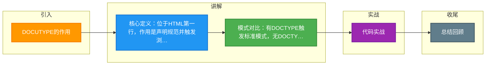

# DOCUTYPE的作用

DOCTYPE (Document Type Declaration) 是文档类型声明，它必须位于 HTML 文档的第一行（在 `<html>` 标签之前）。它的主要作用是告诉浏览器当前文档使用哪种 HTML 或 XHTML 规范版本，从而触发浏览器的**渲染模式**。

**1. 渲染模式**
浏览器的渲染模式主要分为两种：
- **标准模式**：浏览器按照 W3C 标准规范解析和渲染页面。它使用最严格、最标准的布局方式。
- **怪异模式**：浏览器使用一种比较宽松的、向后兼容的方式模拟老式浏览器的行为。为了兼容早期的网页设计（如 IE5/6），它会刻意违反某些 CSS 标准。

**2. DOCTYPE 的影响**
- **CSS 解析**：在怪异模式下，浏览器可能会使用非标准的盒模型（如 IE 盒模型，width 包含 padding 和 border），而在标准模式下使用标准盒模型（content-box）。
- **JavaScript 行为**：某些 DOM 属性或方法的获取在不同模式下可能有差异（例如 `table.cellPadding` 等）。

**3. HTML5 的简化**
在 HTML5 中，DOCTYPE 声明被极大简化为：
`<!DOCTYPE html>`
这个声明不引用 DTD（文档类型定义），但它足以让所有现代浏览器进入标准模式。

**4. 实战案例**
在某次修复 IE11 兼容性问题时，发现模态框遮罩层无法完全覆盖屏幕，检查发现是旧项目漏写了 `<!DOCTYPE html>` 导致浏览器进入怪异模式，使得 `height: 100%` 计算基准变为视口内容高度而非视口高度，补全声明后修复。

**5. 关键代码示例 (CSS)**
```css
/* 怪异模式模拟：没有DOCTYPE时，width包含padding和border */
.box {
  width: 100px;
  padding: 10px;
  /* 怪异模式总宽度 = 100px (符合直觉，但破坏标准) */
}

/* 标准模式：width仅指内容 */
.box-stand {
  box-sizing: content-box; /* 默认值 */
  width: 100px;
  padding: 10px;
  /* 实际占用宽度 = 100 + 10*2 = 120px */
}
```

## 常见考点
1. 不写 DOCTYPE 会发生什么？（浏览器进入怪异模式，布局可能错乱，盒模型表现不一致）
2. 如何触发浏览器的标准模式？（在文档第一行写上正确的 `<!DOCTYPE html>`）
3. 标准盒模型和 IE 盒模型的区别？（`box-sizing: content-box` vs `border-box`）

## 技术原理

DOCTYPE 的本质是**浏览器渲染引擎的"模式开关"**——它决定浏览器用哪套规则解析 CSS 和 HTML。这个看似简单的声明，背后是浏览器大战时代遗留的兼容性机制。

- **三种渲染模式的历史渊源**：IE6 之前浏览器有自己的非标准渲染逻辑（IE 盒模型等）。W3C 推出标准后，如果 IE6 直接切到标准模式，会破坏大量当时已存在的、依赖 IE 行为的网页。所以 IE6 引入了"DOCTYPE 嗅探"——有 DOCTYPE 就标准模式，没有就怪异模式（模拟 IE5 行为）。后来 Web 标准化形成了三种模式：标准模式（Standards）、怪异模式（Quirks）、几乎标准模式（Almost Standards，处理表格单元格高度等的细微差异）。
- **DOCTYPE 嗅探的判定逻辑**：浏览器解析 HTML 第一行，如果是 `<!DOCTYPE html>` 或包含严格 DTD 引用，进标准模式；如果是过渡型 DTD（带 URL）进几乎标准模式；没有 DOCTYPE 或写错进怪异模式。HTML5 的 `<!DOCTYPE html>` 是最简短的标准模式触发器，所有现代浏览器都识别。
- **盒模型差异的根因**：怪异模式下 `width` 包含 `content + padding + border`（IE5 盒模型），标准模式下 `width` 只指 `content`（W3C 盒模型）。同一个 `width:100px; padding:10px;` 在两种模式下实际占用宽度差 40px。CSS3 的 `box-sizing: border-box` 让开发者可以手动选择 IE 盒模型（很多 UI 框架默认用 border-box 因为更符合直觉）。
- **`height: 100%` 的基准差异**：标准模式下，`html` 和 `body` 默认高度是 `auto`（由内容撑开），子元素 `height:100%` 要生效必须先给 `html, body { height: 100% }`。怪异模式下浏览器会自动把视口高度作为基准，这是实战中遮罩层失效的典型原因。

## 代码示例

```html
<!-- 1. 标准 HTML5 文档结构（必须 DOCTYPE 在第一行） -->
<!DOCTYPE html>
<html lang="zh-CN">
<head>
    <meta charset="UTF-8">
    <title>标准模式</title>
    <style>
        html, body { height: 100%; margin: 0; }   /* 让 100% 高度生效 */
        .full-overlay {
            position: fixed;
            top: 0; left: 0;
            width: 100%; height: 100%;
            background: rgba(0,0,0,0.5);
        }
    </style>
</head>
<body>
    <div class="full-overlay">标准模式正常覆盖</div>
</body>
</html>
```

```css
/* 2. 盒模型对比：box-sizing 的两种模式 */
.content-box-demo {
    box-sizing: content-box;   /* 标准模式默认值 */
    width: 100px;
    padding: 10px;
    border: 5px solid black;
    /* 实际占用宽度 = 100 + 10*2 + 5*2 = 130px */
}

.border-box-demo {
    box-sizing: border-box;    /* IE 盒模型，手动开启 */
    width: 100px;
    padding: 10px;
    border: 5px solid black;
    /* 实际占用宽度 = 100px（width 已含 padding+border） */
}

/* 全局推荐：使用 border-box 避免尺寸计算困扰 */
*, *::before, *::after {
    box-sizing: border-box;   /* Bootstrap/Tailwind 默认 */
}
```

```html
<!-- 3. 怪异模式的触发（反面教材，不要这样写） -->
<html>   <!-- 第一行没有 DOCTYPE，触发怪异模式 -->
<head><title>Quirks</title></head>
<body>
    <!-- 这里的布局行为可能与预期完全不同 -->
    <div style="width:100px; padding:10px;">
        怪异模式：总宽度 100px（含 padding）
    </div>
</body>
</html>
```

```html
<!-- 4. 旧版 HTML4 严格 DTD（历史遗留，现在不用） -->
<!DOCTYPE HTML PUBLIC "-//W3C//DTD HTML 4.01//EN" "http://www.w3.org/TR/html4/strict.dtd">
<html>
<!-- 引用外部 DTD URL 才能确保标准模式，HTML5 简化了 -->
```

## 对比选型

| 维度 | 标准模式 | 怪异模式 | 几乎标准模式 |
| :--- | :--- | :--- | :--- |
| **触发条件** | `<!DOCTYPE html>` | 无 DOCTYPE 或错误 | 过渡型 DTD |
| **盒模型** | W3C（content-box） | IE5（border-box） | W3C |
| **height:100%** | 需 `html,body` 显式声明 | 自动以视口为基准 | 同标准模式 |
| **表格行高** | 标准计算 | 老式计算 | 部分老式（行高继承差异） |
| **font-size 继承** | 标准 | 兼容旧 IE | 标准 |
| **现代浏览器** | 推荐唯一模式 | 兼容老页面 | 基本不再使用 |

## 常见坑

- **DOCTYPE 必须是绝对第一行**：前面如果有空行、注释、BOM 字符（UTF-8 with BOM 保存的文件），IE 会把它当作"非 DOCTYPE 开头"，触发怪异模式。CI/CD 部署时模板拼接容易引入 BOM 或换行，导致线上布局错乱。
- **XML 声明在 DOCTYPE 前会触发怪异模式**：`<?xml version="1.0"?>` 写在 DOCTYPE 前会让 IE 进入怪异模式。XHTML 时代的经典坑，现在 XHTML 已基本不用。
- **height:100% 失效排查清单**：先确认有 DOCTYPE（F12 看 document.compatMode 是否为 `CSS1Compat`），再确认 `html, body` 设了 `height:100%`，最后看父元素链上是否有 `height` 断层。
- **document.compatMode 检测**：JS 可用 `document.compatMode` 判断当前模式——`CSS1Compat` 是标准模式，`BackCompat` 是怪异模式。线上排查时一行代码就能定位。
- **iframe 内的文档独立判断**：父页面是标准模式不代表 iframe 内的页面也是，iframe 文档需各自声明 DOCTYPE。富文本编辑器内嵌 iframe 常踩这个坑。
- **DOCTYPE 大小写不敏感但建议大写**：`<!doctype html>` 也能进标准模式，但规范写法是大写 `<!DOCTYPE html>`，团队规范统一。


## 核心架构图

```mermaid
flowchart TD
    classDef start fill:#4CAF50,color:#fff
    classDef process fill:#2196F3,color:#fff
    classDef decision fill:#FF9800,color:#fff
    classDef special fill:#9C27B0,color:#fff
    classDef error fill:#f44336,color:#fff
    classDef info fill:#607D8B,color:#fff
    class A start
    class B process
    class C decision
    class CSS special
    class Canvas error
    class D info
    class DOCTYPE start
    class E process
    class F decision
    class G special
    class H error
    class HTML info
    class HTML5 start
    class I process
    class J decision
    class JS special
    class K error
    class L info
    class M start
    class Mode process
    class N decision
    class O special
    class P error
    class Q info
    class R start
    class S process
    class SEO decision
    class Standards special
    class Video error
    class WebSocket info
    class WebStorage start
    class WebWorker process
    class a11y decision
    class article special
    class aside error
    class body info
    class charset start
    class footer process
    class head decision
    class header special
    class html error
    class icon info
    class link start
    class main process
    class meta decision
    class nav special
    class script error
    class section info
    class title start
    A[HTML 文档结构] --> B["<!DOCTYPE html> 声明"]
    B --> C[标准模式 Standards Mode]
    B --> D[触发 HTML5 解析规则]
    E[html 根元素] --> F[head 元数据]
    F --> G[meta charset/title]
    F --> H[link CSS/icon]
    F --> I[script JS]
    E --> J[body 可见内容]
    J --> K[语义化标签 header/nav/main]
    J --> L[article/section/aside/footer]
    M[语义化价值] --> N[SEO 搜索引擎友好]
    M --> O[无障碍 a11y]
    M --> P[可读性 维护性]
    Q[HTML5 特性] --> R[Canvas/Video/WebStorage]
    Q --> S[WebWorker/WebSocket]
```



## 记忆要点

- 核心定义：位于HTML第一行，作用是声明规范并触发浏览器的渲染模式
- 模式对比：有DOCTYPE触发标准模式，无DOCTYPE则触发怪异模式
- 盒模型差异：因为怪异模式用IE盒模型(width含padding/border)，所以标准模式用content-box
- HTML5写法：因为抛弃了旧版SGML规范，所以仅用<!DOCTYPE html>简化声明

## 结构化回答

**30 秒电梯演讲：** 告诉浏览器用哪种标准渲染页面。打个比方，像说明书封底，告诉阅读者（浏览器）这本书（HTML）按什么规则排版。

**展开框架：**
1. **核心定义** — 位于HTML第一行，作用是声明规范并触发浏览器的渲染模式
2. **模式对比** — 有DOCTYPE触发标准模式，无DOCTYPE则触发怪异模式
3. **盒模型差异** — 因为怪异模式用IE盒模型(width含padding/border)，所以标准模式用content-box

**收尾：** 我在项目里踩过坑——在某次修复 IE11 兼容性问题时，发现模态框遮罩层无法完全覆盖屏幕，检查发现是旧项目漏写了 `<!DOCTYPE html>` 导致浏览器进入怪异模式，使得 `height: 100%` 计算基准变为视口内容高度而非视口高度，补全声明后修复。您想深入聊哪一段：原理、避坑还是对比选型？

## 视频脚本

> 预计时长：2 分钟 | 由浅入深

| 时间 | 画面/字幕 | 口播台词 | 讲解要点 |
|------|----------|----------|----------|
| 0:00 | 标题卡：DOCUTYPE的作用 | "DOCUTYPE的作用？一句话——像说明书封底，告诉阅读者（浏览器）这本书（HTML）按什么规则排版。" | 开场钩子 |
| 0:40 | 概念动画/示意图 | "告诉浏览器用哪种标准渲染页面——像说明书封底，告诉阅读者（浏览器）这本书（HTML）按什么规则排版" | 核心定义 |
| 1:20 | 核心定义示意 | "位于HTML第一行，作用是声明规范并触发浏览器的渲染模式" | 要点1 |
| 2:00 | 总结卡 | "记住这几条，面试不慌。下期讲进阶追问。" | 收尾 |

### 视频流程图



