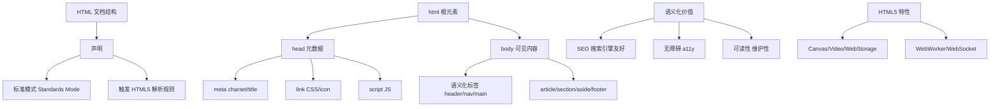

# html语义化

HTML 语义化是指根据内容的结构化特征，选择最恰当的标签（如 `<header>`, `<article>` 而非全是 `<div>`）来构建页面。

**1. 核心优势**
- **可读性与维护性**：代码结构清晰，开发者可以通过标签名快速理解区块含义，降低团队协作成本。
- **SEO 优化**：搜索引擎爬虫依赖语义化标签（如 `<h1>`-`<h6>`, `<strong>`）来分析页面的重点内容和层级结构，有助于提升关键词排名。
- **无障碍访问**：屏幕阅读器等辅助设备能根据标签（如 `nav`, `article`）为视障用户提供更好的导航和朗读体验。
- **样式降级**：在 CSS 加载失败或未加载时，页面依然能呈现出良好的文档结构和可读性，而非一坨文字。

**2. 常见语义化标签详解**
- `<header>`：定义页面或区块的头部（Logo、导航、搜索框）。
- `<nav>`：定义导航链接的部分。
- `<main>`：指定文档的主要内容，每个页面应唯一。
- `<article>`：定义独立完整的内容单元（如博客文章、新闻帖），可独立分发或复用。
- `<section>`：定义文档中的节（章节、页眉等），通常包含一个标题（h1-h6）。
- `<aside>`：定义与周围内容相关但独立的内容（侧边栏、广告组）。
- `<footer>`：定义页面或区块的页脚（版权信息、联系方式）。
- `<address>`：定义文章作者或拥有者的联系信息。

**3. 实战案例**
接手一个全 `div` 堆砌的旧官网进行 SEO 优化时，将原本嵌套了 5 层 `div` 的新闻列表重构为 `<article>` 包裹 `<h2>` 和 `<time>`，两个月后该页面在搜索引擎的关键词收录量提升了约 30%。

**4. 代码示例 (HTML)**
```html
<!-- 不推荐：无语义，开发者难以理解区块用途 -->
<div class="header">...</div>
<div class="news-item">
  <div class="title">标题</div>
  <div class="date">2023-10-01</div>
</div>

<!-- 推荐：语义化，利于SEO和无障碍阅读 -->
<header>...</header>
<article class="news-item">
  <h2>标题</h2>
  <time datetime="2023-10-01">2023年10月1日</time>
</article>
```

## 常见考点
1. `<strong>` 和 `<b>` 的区别？（`<strong>` 表示语义上的重要性，`<b>` 仅表示样式加粗）
2. `<i>` 和 `<em>` 的区别？（`<em>` 表示强调，`<i>` 仅表示斜体）
3. 为什么说 SEO 需要语义化？（爬虫赋予不同标签不同的权重，如 h1 权重高于 div）


## 核心架构图


## 记忆要点

- 核心定义：用恰当的语义标签（如header/article）替代无语义的div构建页面
- 核心优势：提升代码可读性，助力爬虫SEO，支持屏幕阅读器无障碍访问
- 标签对比：strong和em表语义强调，而b和i仅表视觉粗体斜体
- 常见区块：header表头部，nav表导航，article表独立内容，footer表页脚

## 结构化回答

**30 秒电梯演讲：** 用特定标签表达内容的结构和含义。打个比方，像写文章用标题、正文、注释，而不是全加粗，让人一眼看懂重点。

**展开框架：**
1. **核心定义** — 用恰当的语义标签（如header/article）替代无语义的div构建页面
2. **核心优势** — 提升代码可读性，助力爬虫SEO，支持屏幕阅读器无障碍访问
3. **标签对比** — strong和em表语义强调，而b和i仅表视觉粗体斜体

**收尾：** 我在项目里踩过坑——接手一个全 `div` 堆砌的旧官网进行 SEO 优化时，将原本嵌套了 5 层 `div` 的新闻列表重构为 `<article>` 包裹 `<h2>` 和 `<time>`，两个月后该页面在搜索引擎的关键词收录量提升了约 30%。您想深入聊哪一段：原理、避坑还是对比选型？

## 视频脚本

> 预计时长：3 分钟 | 由浅入深

| 时间 | 画面/字幕 | 口播台词 | 讲解要点 |
|------|----------|----------|----------|
| 0:00 | 标题卡：html语义化 | "html语义化？一句话——像写文章用标题、正文、注释，而不是全加粗，让人一眼看懂重点。" | 开场钩子 |
| 0:45 | 概念动画/示意图 | "用特定标签表达内容的结构和含义——像写文章用标题、正文、注释，而不是全加粗，让人一眼看懂重点" | 核心定义 |
| 1:30 | 核心定义示意 | "用恰当的语义标签（如header/article）替代无语义的div构建页面" | 要点1 |
| 2:15 | 核心优势示意 | "提升代码可读性，助力爬虫SEO，支持屏幕阅读器无障碍访问" | 要点2 |
| 3:00 | 总结卡 | "记住这几条，面试不慌。下期讲进阶追问。" | 收尾 |
