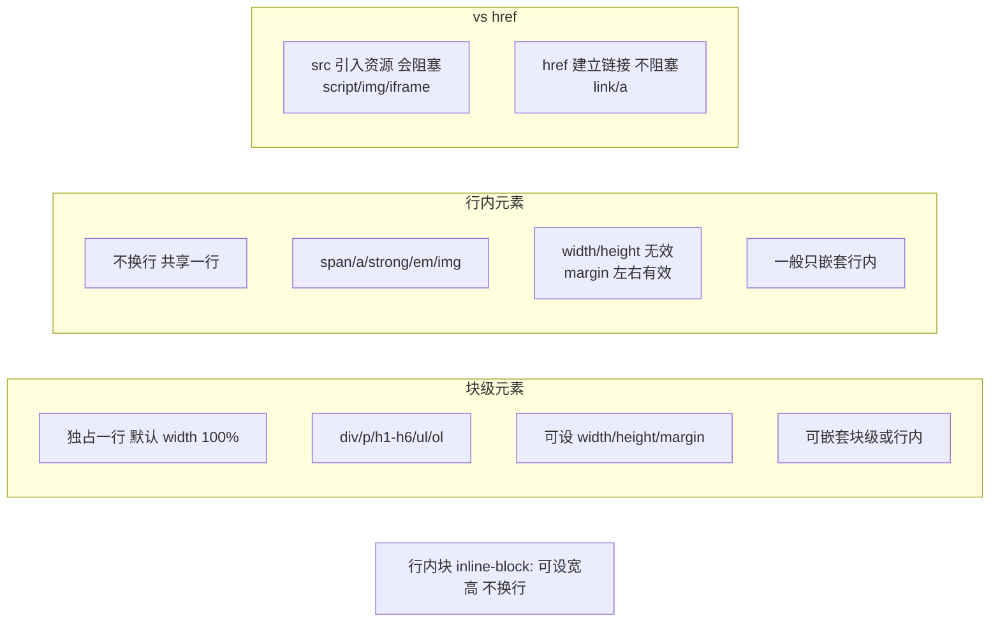

# 行内元素 和 块级元素有哪些

### 一、元素种类分类

CSS display 属性主要将元素分为**块级元素** 和 **行内元素** (Inline Elements)，以及两者结合的 **行内块元素** (Inline-block)。

#### 1. 行内元素
- **表现**：和其他元素在同一行上；不占据独占一行。
- **盒模型**：
  - **宽高**：不可设置（无效），宽高由内容决定。
  - **边距**：水平方向的 `padding` 和 `margin` 有效；垂直方向的 `padding` 和 `margin` **在视觉上可能生效（如背景色溢出）但不占据布局空间**，即不会推开周围元素。
- **内容**：一般只能容纳文本或者其他行内元素（`<a>` 例外，HTML5 中 `<a>` 可以包裹块级元素）。
- **常见标签**：
  - 容器类：`<span>`, `<a>`, `<label>`
  - 文本类：`<strong>`, `<b>`, `<em>`, `<i>`, `<del>`, `<s>`, `<ins>`, `<u>`
  - 表单控件类（属于替换元素，虽是行内但可设宽高）：`<input>`, ``, `<select>`, `<textarea>`, `<button>`

#### 2. 块级元素
- **表现**：总是从新行开始，占据一整行；其后的元素也会另起一行。
- **盒模型**：
  - **宽高**：可以设置 `width` 和 `height`。默认宽度为父容器的 100%（即占据整行）。
  - **边距**：所有方向的 `margin`, `padding` 均有效且占据布局空间。
- **内容**：可以容纳行内元素和其他块级元素。
- **常见标签**：
  - 结构类：`<div>`, `<p>`, `<li>`
  - 标题类：`<h1>` ~ `<h6>`
  - 列表类：`<ul>`, `<ol>`, `<dl>`, `<dt>`, `<dd>`
  - 表格/表单类：`<table>`, `<form>`, `<header>`, `<footer>`, `<section>`, `<article>`

#### 3. 行内块元素
- **表现**：既像行内元素一样在一行排列，又像块级元素一样可以设置宽高、边距。
- **特点**：默认宽度由内容决定，不会强制占满一行。元素之间会有默认的空白间隙（由 HTML 换行符产生）。
- **常见标签**：``, `<input>`, `<button>`, `<textarea>`, `<select>`。

### 二、实战案例
在做导航栏菜单时，给 `<a>` 标签设置 `padding` 增加点击区域，发现垂直方向背景色有延伸但没撑开高度，导致两个 `<a>` 标签的背景重叠。解决方法是将 `<a>` 设置为 `display: inline-block` 或 `display: block`（配合浮动或 Flex）。

### 三、代码示例
```css
/* 场景：修复行内元素垂直边距无效的问题 */
a.nav-link {
  /* 此时 padding-top/bottom 背景可见，但不撑开高度，可能重叠 */
  display: inline;
  padding: 10px 15px; 
  background: blue;
}

a.nav-link-fixed {
  /* 修复：转为行内块，垂直 padding 生效并占据空间 */
  display: inline-block;
  padding: 10px 15px;
  background: blue;
}
```

### 四、转换方式 (CSS)

```css
/* 转换为块级元素 */
display: block;

/* 转换为行内元素 */
display: inline;

/* 转换为行内块元素 */
display: inline-block;
```

### 五、区别总结

| 特性 | 行内元素 | 块级元素 |
| :--- | :--- | :--- |
| **排列方式** | 一行多个 | 独占一行 |
| **宽高设置** | 无效 | 有效 |
| **Margin/Padding** | 水平有效，垂直不占据空间 | 全方位有效 |
| **默认宽度** | 内容宽度 | 父容器 100% |
| **包含内容** | 文本或行内元素 | 任意元素 |
| **垂直对齐** | 默认 baseline (基线对齐) | 顶对齐 |

### 六、常见考点
1.  **行内元素的垂直 margin/padding 为什么不生效？**
    - 行内元素的垂直盒模型计算与行内框有关，虽然 `padding` 会显示背景色延伸出去，但不会影响行高布局，也不会推开上下元素。若要推开上下元素，需使用 `line-height` 或转为 `inline-block`。
2.  **什么是替换元素？**
    - 像 ``, `<input>`, `<textarea>` 等标签，其内容由外部属性决定，而非 CSS 或内部内容。它们通常具有内在尺寸，表现为 `inline` 但拥有 `block` 的特性（可设宽高）。
3.  **消除 inline-block 间隙的方法**
    - 父元素 `font-size: 0` (子元素需重置 font-size)。
    - HTML 代码中将标签写在一行，不留空格和换行。
    - 使用 `float` 或 `flex` 布局替代。


## 核心架构图


## 记忆要点

- 布局对比：块级元素独占一行可设宽高，而行内元素一行多个宽高由内容决定
- 盒模型对比：块级元素四周margin/padding全有效，而行内元素仅水平方向有效
- 特殊元素：img/input等是行内替换元素，表现为行内但可设置宽高
- 清间隙技巧：消除inline-block空白间隙，可用font-size:0或改用Flex布局

## 结构化回答

**30 秒电梯演讲：** 块级元素独占一行，行内元素共占一行且宽高不可控。打个比方，块级像积木块，单独占一行；行内像水流里的字，挨着排列。

**展开框架：**
1. **布局对比** — 块级元素独占一行可设宽高，而行内元素一行多个宽高由内容决定
2. **盒模型对比** — 块级元素四周margin/padding全有效，而行内元素仅水平方向有效
3. **特殊元素** — img/input等是行内替换元素，表现为行内但可设置宽高

**收尾：** 我在项目里踩过坑——在做导航栏菜单时，给 `<a>` 标签设置 `padding` 增加点击区域，发现垂直方向背景色有延伸但没撑开高度，导致两个 `<a>` 标签的背景重叠。您想深入聊哪一段：原理、避坑还是对比选型？

## 视频脚本

> 预计时长：3 分钟 | 由浅入深

| 时间 | 画面/字幕 | 口播台词 | 讲解要点 |
|------|----------|----------|----------|
| 0:00 | 标题卡：行内元素 和 块级元素有哪些 | "行内元素 和 块级元素有哪些？一句话——块级像积木块，单独占一行；行内像水流里的字，挨着排列。" | 开场钩子 |
| 0:45 | 概念动画/示意图 | "块级元素独占一行，行内元素共占一行且宽高不可控——块级像积木块，单独占一行；行内像水流里的字，挨着排列" | 核心定义 |
| 1:30 | 布局对比示意 | "块级元素独占一行可设宽高，而行内元素一行多个宽高由内容决定" | 要点1 |
| 2:15 | 盒模型对比示意 | "块级元素四周margin/padding全有效，而行内元素仅水平方向有效" | 要点2 |
| 3:00 | 总结卡 | "记住这几条，面试不慌。下期讲进阶追问。" | 收尾 |
