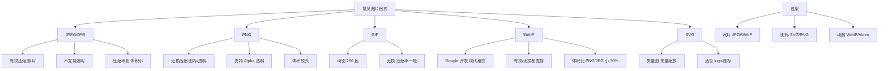

# 常见的图片格式

### 一、常见图片格式及特点

| 格式 | 全称 | 类型 | 特点 | 适用场景 |
| :--- | :--- | :--- | :--- | :--- |
| **JPEG / JPG** | Joint Photographic Experts Group | 有损压缩 | 色彩丰富（24位真彩），文件小，加载快；**不支持透明**；压缩会丢失细节。 | 照片、复杂渐变色背景。 |
| **PNG** | Portable Network Graphics | 无损压缩 | 图片质量高，**支持 Alpha 透明通道**（半透明）；文件比 JPEG 大。 | Logo、图标、需要透明背景的图片。 |
| **GIF** | Graphics Interchange Format | 无损/LZW | 支持**动画**；支持透明（仅全透明或不透明）；色彩限制在 256 色（8位），不适合复杂图片。 | 简单动画图标、色彩单一的图片。 |
| **SVG** | Scalable Vector Graphics | 矢量图 | 基于 XML，无限缩放不失真；文件极小；支持 CSS 操作和 JS 交互；**不是像素点**。 | Logo、图标、插画、需要高清显示的图形。 |
| **WebP** | | 同时支持有损/无损 | Google 推出的现代格式，**同质量下比 JPEG/PNG 小 30%+**；支持动图和透明；兼容性较老浏览器差（IE）。 | 现代网页图片，优化加载速度。 |
| **BMP** | Bitmap | 无损 | 不压缩，文件巨大；无兼容性问题。 | Windows 桌面壁纸，几乎不用于 Web。 |
| **Base64** | | 文本编码 | 将图片编码为 ASCII 字符串，可内嵌在 HTML/CSS 中；**无额外 HTTP 请求**；但文件体积增大约 33%，且不易缓存。 | 极小的图标（如 1kb 以下的 loader、空白像素）。 |

### 二、深入解析与选择策略

1.  **透明度支持**：
    - **透明背景（镂空）**：首选 PNG-8 或 PNG-24。
    - **半透明（阴影、渐变）**：必须使用 PNG-24 (32位) 或 WebP。

2.  **矢量 vs 位图**：
    - **SVG**：适合图标，可以用 CSS 控制 `fill` 颜色和 `hover` 效果，在任何 Retina 屏幕上都清晰。
    - **位图**：放大后会模糊（锯齿），适合照片类。

3.  **性能优化（WebP）**

WebP 是目前 Web 开发的首选格式。为了兼容不支持 WebP 的老浏览器，通常采用 `<picture>` 标签进行优雅降级：

```html
<picture>
  <source srcset="image.webp" type="image/webp">
  
</picture>
```

### 三、实战案例与代码

**实战案例**：
某活动页加载一张 2MB 的 PNG 轮播图，在弱网环境下首屏加载极慢。通过使用 Sharp 库将图片转为 WebP 格式并调整质量，体积降至 300KB，且视觉差异几乎不可见，LCP 指标显著改善。

**代码示例**：
```javascript
// 利用 Canvas 实现图片压缩（前端通用方案）
function compressImage(file, quality = 0.7) {
  return new Promise((resolve) => {
    const reader = new FileReader();
    reader.readAsDataURL(file);
    reader.onload = (e) => {
      const img = new Image();
      img.src = e.target.result;
      img.onload = () => {
        const canvas = document.createElement('canvas');
        const ctx = canvas.getContext('2d');
        canvas.width = img.width;
        canvas.height = img.height;
        ctx.drawImage(img, 0, 0, canvas.width, canvas.height);
        // 导出为压缩后的 JPEG/WebP
        resolve(canvas.toDataURL('image/jpeg', quality));
      };
    };
  });
}
```

### ## 常见考点
1.  **为什么会有“白边”或“毛边”？**
    - 通常是因为 JPG 图片透明背景处理不当（JPG 不支持透明），或者 PNG 图片的阴影边缘在半透明混合时出现了锯齿。解决办法是使用高质量 PNG 或 WebP，并在设计时处理好边缘。
2.  **Base64 图片的优缺点及阈值？**
    - **优点**：减少 HTTP 请求，适用于移动端首屏。
    - **缺点**：体积膨胀，无法被浏览器单独缓存（除非包含 HTML/CSS 被缓存），解码消耗 CPU。
    - **阈值**：一般建议小于 2KB（甚至 1KB）的图片使用 Base64，大图片绝对不要用。
3.  **SVG 注入安全风险？**
    - 直接使用 SVG 可能包含恶意脚本（XSS）。如果是用户上传的 SVG，建议在前端展示时进行净化或转换为 Canvas 渲染。


## 核心架构图


## 记忆要点

- 场景口诀：照片用JPG，透明用PNG，动画用GIF，图标用SVG。
- WebP是现代首选：同质量体积小30%以上，支持透明和动画，但老浏览器兼容差需降级。
- Base64本质：将图片转为文本字符内嵌，省去HTTP请求，但体积膨胀约33%。
- Base64阈值：仅限极小且不易缓存的图片（如<2KB）使用，大图绝对不用。
- 矢量对比：SVG基于XML无限缩放不失真，位图放大则会产生锯齿。

## 结构化回答

**30 秒电梯演讲：** 不同图片格式在压缩、透明、动画和色彩上各有权衡。打个比方，像不同画笔，素描用黑白，风景用彩绘，图标用透明贴纸。

**展开框架：**
1. **场景口诀** — 照片用JPG，透明用PNG，动画用GIF，图标用SVG。
2. **WebP是现代首选** — 同质量体积小30%以上，支持透明和动画，但老浏览器兼容差需降级。
3. **Base64本质** — 将图片转为文本字符内嵌，省去HTTP请求，但体积膨胀约33%。

**收尾：** 我在项目里踩过坑——某活动页加载一张 2MB 的 PNG 轮播图，在弱网环境下首屏加载极慢。您想深入聊哪一段：原理、避坑还是对比选型？

## 视频脚本

> 预计时长：2 分钟 | 由浅入深

| 时间 | 画面/字幕 | 口播台词 | 讲解要点 |
|------|----------|----------|----------|
| 0:00 | 标题卡：常见的图片格式 | "常见的图片格式？一句话——像不同画笔，素描用黑白，风景用彩绘，图标用透明贴纸。" | 开场钩子 |
| 0:40 | 概念动画/示意图 | "不同图片格式在压缩、透明、动画和色彩上各有权衡——像不同画笔，素描用黑白，风景用彩绘，图标用透明贴纸" | 核心定义 |
| 1:20 | 场景口诀示意 | "照片用JPG，透明用PNG，动画用GIF，图标用SVG。" | 要点1 |
| 2:00 | 总结卡 | "记住这几条，面试不慌。下期讲进阶追问。" | 收尾 |
