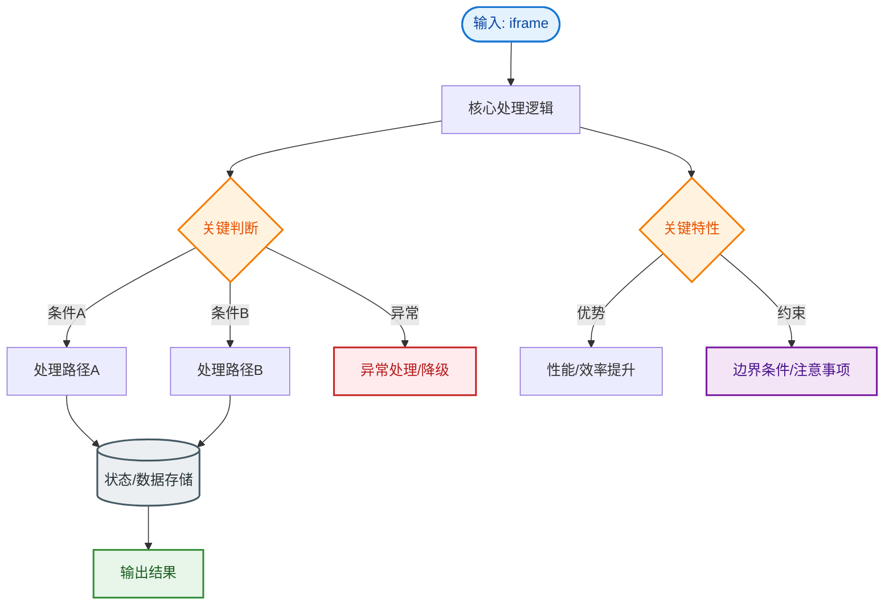

# iframe

### 一、iframe 定义与用途
**iframe** (Inline Frame) 是 HTML 中的内联框架元素，它能够在当前 HTML 文档中嵌入另一个独立的 HTML 页面。

**主要用途**：
- 跨域安全隔离（如第三方登录页、支付页）。
- 嵌入第三方内容（如 Google Maps、YouTube 视频）。
- 历史遗留系统的后台管理界面（左侧菜单右侧内容，通过 iframe 切换，避免全局刷新）。
- 广告展示。

### 二、优缺点分析

#### 优点
1.  **隔离性**：iframe 内的 JavaScript 和 CSS 不会影响（污染）主页面，反之亦然。提供了天然的沙箱环境（部分隔离）。
2.  **独立加载**：iframe 内容可以独立加载和刷新，不会阻塞主页面的渲染（但会占用资源）。
3.  **解决跨域**：配合 `postMessage` 可以实现不同源之间的安全通信（如单点登录）。

#### 缺点（面试重点）
1.  **阻塞主页面的 Load 事件**：
    - 浏览器在触发 `window.onload` 之前，必须等待页面内**所有** iframe（及其子资源）加载完成。这会导致页面看似加载完毕，但 `onload` 触发延迟。
2.  **性能开销大**：
    - iframe 会创建完整的浏览器上下文，包括 Document、Window、History 等，极其消耗内存和 CPU。
    - 阻塞主页面 `Onload`，影响 SEO 搜索引擎爬取（爬虫通常难以深入抓取 iframe 内容）。
3.  **布局受限**：
    - iframe 本身是块级元素，高度固定时，内部内容高度变化会导致滚动条出现或不一致，体验较差。动态调整高度（自适应）需要复杂的 JS 计算（受同源策略限制）。
4.  **上下文丢失**：
    - iframe 内部的页面无法使用浏览器的“前进/后退”按钮控制主页面的历史记录（除非利用 HTML5 History API 或 hash 变化）。

### 三、通信机制
由于同源策略，主页面不能直接访问 iframe 内的 DOM（反之亦然），除非两者同源。跨域通信需使用 `window.postMessage`。

**通信流程图：**

```text
[主页面 Main.com]                   [子页面 Iframe.com]
      │                                   │
      │  1. iframe.contentWindow           │
      │     .postMessage('data', '*')  ───▶│  2. window.onmessage
      │                                   │     接收消息并处理
      │                                   │
      │◀──────────────────────────────────│
      │  4. window.onmessage              │  3. window.parent
      │     接收回执                       │     .postMessage('reply', '*')
```

### 四、实战案例与代码

**实战案例**：
某 H5 活动页嵌入了第三方抽奖组件 iframe。由于未设置 `sandbox` 属性，第三方组件出现异常时弹出了 `alert`，导致主页面用户体验极差。此外，抽奖过程中不断轮询父页面高度，导致主页面频繁重排卡顿。

**代码示例**：
```html
<!-- 推荐的安全配置 -->
<iframe 
  src="https://third-party.com/widget" 
  sandbox="allow-scripts allow-same-origin allow-forms"
  loading="lazy"
  title="Third Party Widget">
</iframe>
```

```javascript
// 父页面接收高度消息并自适应（防抖处理）
let resizeTimer;
window.addEventListener('message', (e) => {
  // 安全校验：必须验证来源 origin
  if (e.origin !== 'https://third-party.com') return;
  
  if (e.data.type === 'resize') {
    clearTimeout(resizeTimer);
    resizeTimer = setTimeout(() => {
      const iframe = document.getElementById('myIframe');
      iframe.style.height = `${e.data.height}px`;
    }, 100); // 防抖 100ms
  }
});
```

### ## 常见考点
1.  **iframe 如何自适应高度？**
    - **同源**：在 iframe 内部 `window.onload` 时，获取 `document.body.scrollHeight`，然后通过 `parent.document.getElementById('iframeId').style.height` 设置高度。
    - **跨域**：无法直接获取高度。需借助中间代理页面（双域架构）或使用 `postMessage` 将高度信息从 iframe 内部发送给父页面，父页面接收后动态设置高度。
2.  **延迟加载 iframe (Lazy Load)**
    - 为了提升首屏速度，可以使用 `loading="lazy"` 属性（浏览器原生支持）或将 iframe 的 `src` 替换为 `data-src`，当滚动到可视区域时再赋值给 `src`。
3.  **SEO 的影响**
    - 搜索引擎通常不索引 iframe 中的内容。如果内容重要，尽量直接嵌入 HTML 或使用 SSR (Server Side Rendering)。


## 核心流程图


## 记忆要点

- 定义本质：iframe是用于在当前页面内嵌套另一个完整独立HTML文档的元素。
- 最大优点：提供天然的CSS/JS沙箱隔离，避免互相污染。
- 致命缺点：会阻塞主页面的onload事件，且极其消耗内存和CPU资源。
- 跨域通信：因为同源策略限制，跨域iframe必须通过postMessage进行通信。
- 安全建议：配合sandbox属性限制内部脚本权限，并使用loading=lazy延迟加载。

## 结构化回答

**30 秒电梯演讲：** iframe 在当前页面嵌入另一个独立的 HTML 文档。打个比方，在窗户里挂一个电视机，播放另一个频道的节目。

**展开框架：**
1. **定义本质** — iframe是用于在当前页面内嵌套另一个完整独立HTML文档的元素。
2. **最大优点** — 提供天然的CSS/JS沙箱隔离，避免互相污染。
3. **致命缺点** — 会阻塞主页面的onload事件，且极其消耗内存和CPU资源。

**收尾：** 我在项目里踩过坑——某 H5 活动页嵌入了第三方抽奖组件 iframe。您想深入聊哪一段：原理、避坑还是对比选型？

## 视频脚本

> 预计时长：2 分钟 | 由浅入深

| 时间 | 画面/字幕 | 口播台词 | 讲解要点 |
|------|----------|----------|----------|
| 0:00 | 标题卡：iframe | "iframe？一句话——在窗户里挂一个电视机，播放另一个频道的节目。" | 开场钩子 |
| 0:40 | 概念动画/示意图 | "iframe 在当前页面嵌入另一个独立的 HTML 文档——在窗户里挂一个电视机，播放另一个频道的节目" | 核心定义 |
| 1:20 | 定义本质示意 | "iframe是用于在当前页面内嵌套另一个完整独立HTML文档的元素。" | 要点1 |
| 2:00 | 总结卡 | "记住这几条，面试不慌。下期讲进阶追问。" | 收尾 |
