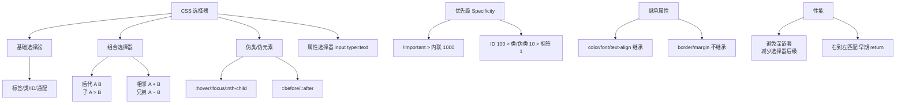

# CSS选择器

CSS 选择器是 CSS 用来匹配 DOM 元素并应用样式的语法规则。它通过标签名、类、ID、属性及元素间的层级关系，精确描述"给谁应用样式"。选择器从最基础的 `*` 通配符、标签、类（`.`）、ID（`#`），到组合关系（后代空格、子级 `>`、相邻兄弟 `+`、通用兄弟 `~`），再到属性匹配（`[attr]`、`[attr=value]`、`[attr^=value]`）和伪类/伪元素（`:hover`、`:nth-child`、`::before`），构成了从粗到细的精确匹配能力。

## 技术原理

- **基础选择器**：通配符 `*` 匹配所有元素（性能差，慎用）；标签选择器如 `div` 匹配所有该标签；类 `.box` 匹配 `class="box"`；ID `#header` 匹配 `id="header"`（页面内唯一）。ID 优先级最高（权重 100），类次之（10），标签最低（1）。
- **关系选择器**：后代（空格，如 `.list li`）匹配所有层级后代；子级（`>`，如 `.list > li`）只匹配直接子元素；相邻兄弟（`+`，如 `h1 + p`）匹配紧邻的下一个兄弟；通用兄弟（`~`，如 `h1 ~ p`）匹配后续所有兄弟。
- **属性选择器**：`[type]` 匹配带该属性的元素；`[type="text"]` 精确匹配；`[href^="https"]` 前缀匹配；`[href$=".pdf"]` 后缀匹配；`[class*="btn"]` 包含匹配。
- **伪类与伪元素**：伪类用单冒号描述状态或结构——`:hover`/`:focus` 是交互状态，`:nth-child(n)`/`:first-child` 是结构位置；伪元素用双冒号描述"虚拟元素"——`::before`/`::after` 通过 `content` 属性插入生成内容（如装饰图标、清除浮动）。

## 优先级与匹配示例

CSS 特异性权重（从高到低）：

```
内联 style  →  ID   →  类/属性/伪类  →  标签/伪元素
   1000      100          10                1
#nav .item:hover   权重 = 100 + 10 + 10 = 120
```

```css
/* 基础 */
* { margin: 0; }              /* 通配符 */
button { ... }                /* 标签 */
.card { ... }                 /* 类 */
#submit-btn { ... }           /* ID */

/* 关系 */
.nav a { ... }                /* 后代：.nav 下任意层级的 a */
.nav > li { ... }             /* 子级：.nav 的直接 li */
h2 + p { ... }                /* 相邻兄弟：h2 后紧邻的 p */

/* 属性 */
input[type="checkbox"] { ... }
a[href^="https://"] { ... }

/* 伪类 / 伪元素 */
li:nth-child(odd) { ... }
button:hover { ... }
.clearfix::after { content: ""; display: block; clear: both; }
```

## 常见坑/注意事项

- **通配符 `*` 性能差**：会遍历页面所有元素，慎用在大样式表里，尤其不要 `* { box-sizing }` 之外滥用。
- **ID 选择器不可复用**：ID 页面唯一，样式应优先用 class 实现复用，ID 主要留给 JS 锚点。
- **`!important` 是反模式**：用 `!important` 强制覆盖会破坏特异性体系，后期维护灾难。应通过提升选择器权重（多写一个 class）而非 `!important` 解决。
- **伪类与伪元素冒号区别**：CSS3 规范伪类单冒号、伪元素双冒号，老代码伪元素也用单冒号兼容，新代码应区分。
- **`nth-child` 与 `nth-of-type` 易混**：`:nth-child(n)` 数所有兄弟，`:nth-of-type(n)` 只数同标签的兄弟。


## 核心架构图


## 核心知识点图


## 记忆要点

- 基础选择器：通配符(*)、标签、类(.)、ID(#)，ID优先级最高。
- 关系选择器：后代(空格)、子级(>)、相邻兄弟(+)、通用兄弟(~)。
- 属性选择器：[attr]、[attr=value]、[attr^=value]，按属性匹配元素。
- 伪类单冒号：状态(:hover/:focus)、结构(:nth-child)。
- 伪元素双冒号：::before/::after 插入生成内容。

## 结构化回答

**30 秒电梯演讲：** CSS 选择器通过标签、类、ID、属性及层级关系精确定位元素。打个比方，像地址或筛选器，从茫茫人海中找到具体的那个人。

**展开框架：**
1. **基础选择器** — 通配符(*)、标签、类(.)、ID(#)，ID优先级最高。
2. **关系选择器** — 后代(空格)、子级(>)、相邻兄弟(+)、通用兄弟(~)。
3. **属性选择器** — [attr]、[attr=value]、[attr^=value]，按属性匹配元素。

**收尾：** 这三点都能配合实战聊。您想深入聊原理、对比还是避坑？

## 视频脚本

> 预计时长：4 分钟 | 由浅入深

| 时间 | 画面/字幕 | 口播台词 | 讲解要点 |
|------|----------|----------|----------|
| 0:00 | 标题卡：CSS选择器 | "CSS选择器？一句话——像地址或筛选器，从茫茫人海中找到具体的那个人。" | 开场钩子 |
| 0:48 | 概念动画/示意图 | "CSS 选择器通过标签、类、ID、属性及层级关系精确定位元素——像地址或筛选器，从茫茫人海中找到具体的那个人" | 核心定义 |
| 1:36 | 基础选择器示意 | "通配符(*)、标签、类(.)、ID(#)，ID优先级最高。" | 要点1 |
| 2:24 | 关系选择器示意 | "后代(空格)、子级(>)、相邻兄弟(+)、通用兄弟(~)。" | 要点2 |
| 3:12 | 属性选择器示意 | "[attr]、[attr=value]、[attr^=value]，按属性匹配元素。" | 要点3 |
| 4:00 | 总结卡 | "记住这几条，面试不慌。下期讲进阶追问。" | 收尾 |
