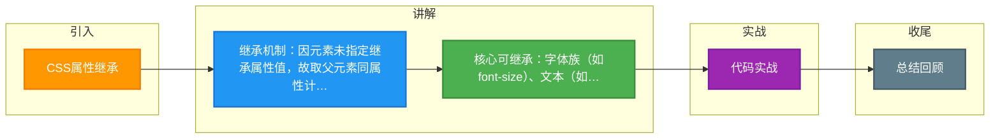

# CSS属性继承

!important优先级最⾼。避免使⽤，会破坏样式表中固有的级联规则！！
样式表来源不同时 优先级顺序为：内联>内部>外部>浏览器⽤户⾃定义>浏览器默认。
兄弟选择器 li ~ a
相邻兄弟选择器 li + a
属性选择器 a[rel="external"]
伪类选择器 a:hover, li:nth-child
通配选择器 *{}
类型选择器h1{}
:link ：选择未被访问的链接
:visited：选取已被访问的链接
:active：选择活动链接
:hover ：⿏标指针浮动在上⾯的元素
:focus ：选择具有焦点的
:first-child：⽗元素的⾸个⼦元素
伪元素选择器 ::before、::after
::first-letter ：⽤于选取指定选择器的⾸字⺟
::first-line ：选取指定选择器的⾸⾏
::before : 选择器在被选元素的内容前⾯插⼊内容
::after : 选择器在被选元素的内容后⾯插⼊内容
CSS属性继承

**实战案例**：在重构老项目时，遇到过在`body`上设置`font-size`，导致第三方组件库（如AntD）的图标大小异常，原因是图标使用了`em`单位且继承了不期望的字体大小。最佳实践是在根节点定义设计变量，内部组件使用`rem`或显式重置继承属性。

继承属性和⾮继承属性

继承属性：
当元素的⼀个继承属性 没有指定值时，则取⽗元素的同属性的计算值
⾮继承属性：
当元素的⼀个⾮继承属性没有指定值时，则取属性的初始值
那么这两类属性都有哪些呢？
⼀、⽆继承性的属性
1、display：
规定元素应该⽣成的框的类
2、⽂本属性：
vertical-align：垂直⽂本对⻬
text-decoration：规定添加到⽂本的装饰
text-shadow：⽂本阴影效果
white-space：空⽩符的处理

unicode-bidi：设置⽂本的⽅向
3、盒⼦模型的属性：
width、height、margin  、margin-top、margin-right、margin-bottom、margin-left、border、borderstyle、border-top-style、border-right-style、border-bottom-style、border-left-style、border-width、
border-top-width、border-right-right、border-bottom-width、border-left-width、border-color、
border-top-color、border-right-color、border-bottom-color、border-left-color、border-top、borderright、border-bottom、border-left、padding、padding-top、padding-right、padding-bottom、
padding-left
4、背景属性：
background、background-color、background-image、background-repeat、background-position、
background-attachment
5、定位属性：
float、clear、position、top、right、bottom、left、min-width、min-height、max-width、max-height、
overflow、clip、z-index
6、⽣成内容属性：
content、counter-reset、counter-increment
7、轮廓样式属性：
outline-style、outline-width、outline-color、outline
8、⻚⾯样式属性：
size、page-break-before、page-break-after
9、声⾳样式属性：
pause-before、pause-after、pause、cue-before、cue-after、cue、play-during
⼆、有继承性的属性
1、字体系列属性
font：组合字体
font-family：规定元素的字体系列
font-weight：设置字体的粗细
font-size：设置字体的尺⼨
font-style：定义字体的⻛格
font-variant：设置⼩型⼤写字⺟的字体显示⽂本，这意味着所有的⼩写字⺟均会被转换为⼤写，但是所有使
⽤⼩型⼤写字体的字⺟与其余⽂本相⽐，其字体尺⼨更⼩。
font-stretch：对当前的 font-family 进⾏伸缩变形。所有主流浏览器都不⽀持。
font-size-adjust：为某个元素规定⼀个 aspect 值，这样就可以保持⾸选字体的 x-height。
2、⽂本系列属性
text-indent：⽂本缩进
text-align：⽂本⽔平对⻬
line-height：⾏⾼

word-spacing：增加或减少单词间的空

**代码示例**：
```css
/* 强制重置继承：即使父元素设置了红色，子元素强制显示黑色，避免样式污染 */
.clean-component {
  color: black !important; /* 或使用 initial/all: unset */
  font-size: 14px; /* 避免继承父元素可能过大的字体 */
}
```


## 核心架构图

```mermaid
flowchart TD
    classDef start fill:#4CAF50,color:#fff
    classDef process fill:#2196F3,color:#fff
    classDef decision fill:#FF9800,color:#fff
    classDef special fill:#9C27B0,color:#fff
    classDef error fill:#f44336,color:#fff
    classDef info fill:#607D8B,color:#fff
    class A start
    class B process
    class C decision
    class CSS special
    class D error
    class E info
    class F start
    class G process
    class H decision
    class I special
    class ID error
    class J info
    class K start
    class L process
    class M decision
    class N special
    class O error
    class P info
    class Q start
    class R process
    class S decision
    class Specificity special
    class after error
    class align info
    class before start
    class border process
    class br decision
    class child special
    class color error
    class focus info
    class font start
    class hover process
    class important decision
    class input special
    class margin error
    class nth info
    class return start
    class text process
    class type decision
    A[CSS 选择器] --> B[基础选择器]
    B --> C[标签/类/ID/通配]
    A --> D[组合选择器]
    D --> E[后代 A B<br/>子 A > B]
    D --> F[相邻 A + B<br/>兄弟 A ~ B]
    A --> G[伪类/伪元素]
    G --> H[:hover/:focus/:nth-child]
    G --> I["::before/::after"]
    A --> J["属性选择器 input type=text"]
    K[优先级 Specificity] --> L["!important > 内联 1000"]
    K --> M["ID 100 > 类/伪类 10 > 标签 1"]
    N[继承属性] --> O[color/font/text-align 继承]
    N --> P[border/margin 不继承]
    Q[性能] --> R[避免深嵌套<br/>减少选择器层级]
    Q --> S[右到左匹配 早期 return]
```



## 记忆要点

- 继承机制：因元素未指定继承属性值，故取父元素同属性计算值；非继承则取初始值。
- 核心可继承：字体族（如font-size）、文本（如color、line-height）、可见性（visibility）。
- 核心不继承：盒模型（margin/padding/border）、背景（background）、定位（position）。
- 防污染实践：因父级字体易波及子组件，故推荐在根节点定基准或用initial强制重置。

## 结构化回答

**30 秒电梯演讲：** 部分样式属性（如字体）会自动应用于子元素，无需重复设置。打个比方，像基因遗传，父母（父元素）的特征会传给孩子（子元素）。

**展开框架：**
1. **继承机制** — 因元素未指定继承属性值，故取父元素同属性计算值；非继承则取初始值。
2. **核心可继承** — 字体族（如font-size）、文本（如color、line-height）、可见性（visibility）。
3. **核心不继承** — 盒模型（margin/padding/border）、背景（background）、定位（position）。

**收尾：** 我在项目里踩过坑——当元素的⼀个继承属性 没有指定值时，则取⽗元素的同属性的计算值。您想深入聊哪一段：原理、避坑还是对比选型？

## 视频脚本

> 预计时长：4 分钟 | 由浅入深

| 时间 | 画面/字幕 | 口播台词 | 讲解要点 |
|------|----------|----------|----------|
| 0:00 | 标题卡：CSS属性继承 | "CSS属性继承？一句话——像基因遗传，父母（父元素）的特征会传给孩子（子元素）。" | 开场钩子 |
| 0:48 | 概念动画/示意图 | "部分样式属性（如字体）会自动应用于子元素，无需重复设置——像基因遗传，父母（父元素）的特征会传给孩子（子元素）" | 核心定义 |
| 1:36 | 继承机制示意 | "因元素未指定继承属性值，故取父元素同属性计算值；非继承则取初始值。" | 要点1 |
| 2:24 | 核心可继承示意 | "字体族（如font-size）、文本（如color、line-height）、可见性（visibility）。" | 要点2 |
| 3:12 | 核心不继承示意 | "盒模型（margin/padding/border）、背景（background）、定位（position）。" | 要点3 |
| 4:00 | 总结卡 | "记住这几条，面试不慌。下期讲进阶追问。" | 收尾 |

### 视频流程图



