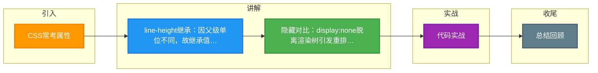

# CSS常考属性

不可/可继承属性

可继承
字体属性
⽂本属性
元素可⻅性
列表布局属性
光标属性
不可继承
盒⼦模型属性
display
背景属性
定位属性
⽣成内容、轮廓样式、⻚⾯样式、声⾳样式
line-height 如何继承

⽗元素的 line-height 写了具体数值，⽐如 30px，则⼦元素 line-height 继承该值。
⽗元素的 line-height 写了⽐例，⽐如 1.5 或 2，则⼦元素 line-height 也是继承该⽐例。
⽗元素的 line-height 写了百分⽐，⽐如 200%，则⼦元素 line-height 继承的是⽗元素 fontSize * 200% 计算
出来的值。
CSS常考属性

CSS隐藏元素的⽅法有哪些

常⻅的隐藏属性的⽅法有 display: none 与 visibility: hidden：
display: none：渲染树不会包含该渲染对象，因此该元素不会在⻚⾯中占据位置，也不会响应绑定的监听事
件。
visibility: hidden：元素在⻚⾯中仍占据空间，但是不会响应绑定的监听事件。
opacity: 0：将元素的透明度设置为0，以此来实现元素的隐藏。元素在⻚⾯中仍然占据空间，并且能够响应
元素绑定的监听事件。
position: absolute：通过使⽤绝对定位将元素移除可视区域内，以此来实现元素的隐藏。
z-index: 负值：来使其他元素遮盖住该元素，以此来实现隐藏。
clip/clip-path：使⽤元素裁剪的⽅法来实现元素的隐藏，这种⽅法下，元素仍在⻚⾯中占据位置，但是不会
响应绑定的监听事件。
transform: scale(0,0)：将元素缩放为0，来实现元素的隐藏。这种⽅法下，元素仍在⻚⾯中占据位置，但是
不会响应绑定的监听事件。
在VUE中还有 v-if 和 v-show 这两个指令，在⽬录你能看到关于这两个的使⽤区别

display: none与 visibility: hidden的区别

| 维度 | display: none | visibility: hidden |
| :--- | :--- | :--- |
| **渲染树** | 元素完全从渲染树中消失 | 元素仍在渲染树中，占据空间 |
| **重绘/重排** | 引起文档重排 | 只引起本元素的重绘 |
| **事件响应** | 不响应事件（如点击） | 不响应事件 |
| **子孙元素** | 非继承，子孙节点直接消失，无法通过修改子节点显示 | 继承，子孙节点可通过设置 visible 显示 |
| **读屏器** | 内容不会被读取 | 内容会被读取 |

修改常规⽂档流中元素的 display 通常会造成⽂档的重排，但是修改 visibility 属性只会造成本元素的重绘
如果使⽤读屏器，设置为 display: none 的内容不会被读取，设置为 visibility: hidden 的内容会被读取。
这两者的关系类似于 v-if 和 v-show 之间的关系

**实战案例**：做图片懒加载或骨架屏时，推荐使用`opacity`或`visibility`配合`absolute`定位隐藏，因为频繁切换`display: none`会导致页面严重的重排和抖动，影响性能体验。

⽂本溢出

单⾏溢出
1. text-overflow：当⽂本溢出时，显示省略符号代表被修剪的⽂本
2. white-space：设置⽂字在⼀⾏显示，不能换⾏
3. overflow：⽂字⻓度超出限定宽度，隐藏超出的内容
overflow:hidden，普通情况⽤在块级元素的外层隐藏内部溢出元素，或配合以下两个属性实现⽂本溢出省略
white-space:nowrap，设置⽂本不换⾏，是overflow:hidden和text-overflow:ellipsis⽣效的基础
text-overflow属性值如下：
1. clip：对象内⽂本溢出部分裁掉
2. ellipsis：对象内⽂本溢出时显示...
多⾏溢出
基于⾼度截断
伪元素+定位
通过伪元素绝对定位到⾏尾并遮住⽂字，再通过overflow:hidden，隐藏多余⽂字
优点
1. 兼容性好
2. 响应式截断，根据不同宽度做出调整
基于⾏数截断

**代码示例**：
```css
/* 兼容性最好的多行省略方案 (Webkit内核) */
.multi-line-ellipsis {
  display: -webkit-box;
  -webkit-line-clamp: 3; /* 显示3行 */
  -webkit-box-orient: vertical;
  overflow: hidden;
  text-overflow: ellipsis;
}
```

background-size

设置背景图⽚⼤⼩。图⽚可以保有其原有的尺⼨、拉伸到新的尺⼨，或者在保持原有⽐例的同时缩放到元素的可⽤
空间的尺⼨
属性
100%：整个图⽚铺满div
cover：整个图⽚铺满div，缩放背景图⽚以完全覆盖背景区，可能背景图⽚部分看不⻅。和 contain 相反，cover 
尽可能⼤地缩放背景图像并保持图像的宽⾼⽐例（图像不会被压扁）。背景图以它的全部宽或者⾼覆盖所在容器。
当容器和背景图⼤⼩不同时，背景图的 左/右 或者 上/下 部分会被裁剪
contain：不能铺满整个div，缩放背景图⽚以完全装⼊背景区，可能背景区部分空⽩。cont


## 核心架构图

```mermaid
flowchart TD
    classDef start fill:#4CAF50,color:#fff
    classDef process fill:#2196F3,color:#fff
    classDef decision fill:#FF9800,color:#fff
    classDef special fill:#9C27B0,color:#fff
    classDef error fill:#f44336,color:#fff
    classDef info fill:#607D8B,color:#fff
    class A start
    class B process
    class C decision
    class CSS special
    class D error
    class E info
    class F start
    class G process
    class H decision
    class I special
    class ID error
    class J info
    class K start
    class L process
    class M decision
    class N special
    class O error
    class P info
    class Q start
    class R process
    class S decision
    class Specificity special
    class after error
    class align info
    class before start
    class border process
    class br decision
    class child special
    class color error
    class focus info
    class font start
    class hover process
    class important decision
    class input special
    class margin error
    class nth info
    class return start
    class text process
    class type decision
    A[CSS 选择器] --> B[基础选择器]
    B --> C[标签/类/ID/通配]
    A --> D[组合选择器]
    D --> E[后代 A B<br/>子 A > B]
    D --> F[相邻 A + B<br/>兄弟 A ~ B]
    A --> G[伪类/伪元素]
    G --> H[:hover/:focus/:nth-child]
    G --> I["::before/::after"]
    A --> J["属性选择器 input type=text"]
    K[优先级 Specificity] --> L["!important > 内联 1000"]
    K --> M["ID 100 > 类/伪类 10 > 标签 1"]
    N[继承属性] --> O[color/font/text-align 继承]
    N --> P[border/margin 不继承]
    Q[性能] --> R[避免深嵌套<br/>减少选择器层级]
    Q --> S[右到左匹配 早期 return]
```



## 记忆要点

- line-height继承：因父级单位不同，故继承值不同。数值照搬，比例照搬，百分比算成px后再继承。
- 隐藏对比：display:none脱离渲染树引发重排且不响应事件，而visibility:hidden保留空间仅重绘。
- 多行省略口诀：盒子模型弹性展，轴向垂直限行数，超出隐藏加省略。
- 背景图缩放：cover尽可能大填满容器（可能裁剪），而contain尽可能小装入容器（可能留白）。

## 结构化回答

**30 秒电梯演讲：** 不同隐藏方式决定了元素是否占据空间及是否响应交互。打个比方，display:none 像凭空消失；visibility:hidden 像隐身人还在；opacity:0 像透明玻璃。

**展开框架：**
1. **line-height继承** — 因父级单位不同，故继承值不同。数值照搬，比例照搬，百分比算成px后再继承。
2. **隐藏对比** — display:none脱离渲染树引发重排且不响应事件，而visibility:hidden保留空间仅重绘。
3. **多行省略口诀** — 盒子模型弹性展，轴向垂直限行数，超出隐藏加省略。

**收尾：** 我在项目里踩过坑——text-overflow：当⽂本溢出时，显示省略符号代表被修剪的⽂本。您想深入聊哪一段：原理、避坑还是对比选型？

## 视频脚本

> 预计时长：4 分钟 | 由浅入深

| 时间 | 画面/字幕 | 口播台词 | 讲解要点 |
|------|----------|----------|----------|
| 0:00 | 标题卡：CSS常考属性 | "CSS常考属性？一句话——display:none 像凭空消失；visibility:hidden 像隐身人还在；opacity:0 像透明玻璃。" | 开场钩子 |
| 0:48 | 概念动画/示意图 | "不同隐藏方式决定了元素是否占据空间及是否响应交互——display:none 像凭空消失；visibility:hidden 像隐身人还在；opacity:0 像透明玻璃" | 核心定义 |
| 1:36 | 要点1图解示意 | "因父级单位不同，故继承值不同。数值照搬，比例照搬，百分比算成px后再继承。" | 要点1 |
| 2:24 | 隐藏对比示意 | "display:none脱离渲染树引发重排且不响应事件，而visibility:hidden保留空间仅重绘。" | 要点2 |
| 3:12 | 多行省略口诀示意 | "盒子模型弹性展，轴向垂直限行数，超出隐藏加省略。" | 要点3 |
| 4:00 | 总结卡 | "记住这几条，面试不慌。下期讲进阶追问。" | 收尾 |

### 视频流程图



