# CSS3新特性

### CSS3 新特性详解

CSS3 带来了许多强大的新特性，极大地丰富了 Web 页面的表现力和交互性。以下按类别进行梳理：

#### 1. 选择器增强
- **属性选择器**：`a[src^="https"]`, `div[class*="demo"]`
- **伪类选择器**：
  - `:nth-child(n)`: 选择第 n 个子元素。
  - `:last-child`, `:nth-last-child(n)`
  - `:checked`: 选中被选中的 input 元素。
  - `:not(selector)`: 否定伪类，选择不匹配该选择器的元素。
- **伪元素**：双冒号语法 `::before`, `::after`, `::first-line`, `::first-letter`。

#### 2. 布局模型
- **Flexbox (弹性盒模型)**：一维布局，适合组件级或导航栏布局。
  ```css
  display: flex;
  justify-content: center;
  align-items: center;
  ```
- **Grid (网格布局)**：二维布局，适合页面整体架构。
  ```css
  display: grid;
  grid-template-columns: 1fr 200px;
  ```
- **多列布局**: `column-count: 3;`

#### 3. 视觉效果
- **圆角**：`border-radius: 50%;` (实现圆形)
- **阴影**：
  - 盒阴影：`box-shadow: 10px 10px 5px #888888;`
  - 文字阴影：`text-shadow: 2px 2px #ff0000;`
- **渐变**：
  - 线性渐变：`background: linear-gradient(direction, color-stop1, color-stop2, ...);`
  - 径向渐变：`background: radial-gradient(shape size at position, start-color, ..., last-color);`
- **边框图片**：`border-image: url(border.png) 30 round;`

#### 4. 变换与过渡 (Transitions & Animations)
- **Transition (过渡)**：
  - 用于实现简单的状态变化动画（如 hover 效果）。
  - 属性：`transition-property`, `transition-duration`, `transition-timing-function`, `transition-delay`。
- **Animation (动画)**：
  - 使用 `@keyframes` 定义关键帧动画，比 transition 更复杂，可控制中间状态。
  - 属性：`animation-name`, `animation-duration`, `animation-timing-function`, `animation-delay`, `animation-iteration-count`, `animation-direction`, `animation-fill-mode`。

#### 5. 其他新特性
- **背景增强**：
  - `background-size`: `cover`, `contain`。
  - `background-origin`: `content-box`, `padding-box`, `border-box`。
  - `background-clip`: 裁剪背景区域。
  - 多重背景：`background: url(a.jpg), url(b.jpg);`
- **文字换行**：
  - `word-wrap: break-word;` (允许长单词或 URL 地址换行到下一行)
  - `word-break: break-all;` (允许在单词内换行)
- **颜色模式**：支持 RGBA (`rgba(0,0,0,0.5)`) 和 HSLA。
- **滤镜**：`filter: blur(5px); grayscale(100%);`
- **字体**：`@font-face` 允许引入自定义 Web 字体。

### ## 常见考点

**实战案例**：在移动端开发中，利用 CSS3 `transform: translateZ(0)` 开启 GPU 加速，解决了 iOS Safari 上滚动时fixed定位元素抖动和动画卡顿的典型性能问题。

1. **Transition 和 Animation 的区别**？
   
| 特性 | Transition (过渡) | Animation (动画) |
| :--- | :--- | :--- |
| **触发方式** | 必须通过事件触发 (如 hover, JS class change) | 页面加载或自动触发，无需事件
| **循环控制** | 不能循环 (需借助JS) | 可设置 `infinite` 无限循环或指定次数 |
| **关键帧** | 只能定义起始和结束状态 (两帧) | 通过 `@keyframes` 定义任意多帧中间状态 |
| **复杂度** | 适合简单的交互效果 | 适合复杂的逐帧动画 |
| **控制与回放** | 只能正向播放，无法精细控制 | 暂停、反向、播放状态控制 (`animation-play-state`) |

   - Transition 需要触发条件（如 hover），只有


## 核心架构图

```mermaid
flowchart TD
    classDef start fill:#4CAF50,color:#fff
    classDef process fill:#2196F3,color:#fff
    classDef decision fill:#FF9800,color:#fff
    classDef special fill:#9C27B0,color:#fff
    classDef error fill:#f44336,color:#fff
    classDef info fill:#607D8B,color:#fff
    class A start
    class B process
    class C decision
    class CSS special
    class D error
    class E info
    class F start
    class G process
    class H decision
    class I special
    class ID error
    class J info
    class K start
    class L process
    class M decision
    class N special
    class O error
    class P info
    class Q start
    class R process
    class S decision
    class Specificity special
    class after error
    class align info
    class before start
    class border process
    class br decision
    class child special
    class color error
    class focus info
    class font start
    class hover process
    class important decision
    class input special
    class margin error
    class nth info
    class return start
    class text process
    class type decision
    A[CSS 选择器] --> B[基础选择器]
    B --> C[标签/类/ID/通配]
    A --> D[组合选择器]
    D --> E[后代 A B<br/>子 A > B]
    D --> F[相邻 A + B<br/>兄弟 A ~ B]
    A --> G[伪类/伪元素]
    G --> H[:hover/:focus/:nth-child]
    G --> I["::before/::after"]
    A --> J["属性选择器 input type=text"]
    K[优先级 Specificity] --> L["!important > 内联 1000"]
    K --> M["ID 100 > 类/伪类 10 > 标签 1"]
    N[继承属性] --> O[color/font/text-align 继承]
    N --> P[border/margin 不继承]
    Q[性能] --> R[避免深嵌套<br/>减少选择器层级]
    Q --> S[右到左匹配 早期 return]
```



## 记忆要点

- 布局与视觉：新增Flex/Grid布局，支持圆角、渐变与阴影（box/text-shadow）。
- 动画双雄：Transition需事件触发且仅起止两帧，而Animation用关键帧自动触发可循环。
- 性能优化：移动端开启transform:translateZ(0)可触发GPU硬件加速，解决fixed抖动。
- 新特性：增强选择器（nth），引入RGBA/HSLA透明色，并支持@font-face与filter滤镜。

## 结构化回答

**30 秒电梯演讲：** CSS3 引入圆角、阴影、动画、Flex/Grid 等新特性，极大丰富了页面表现力。打个比方，像给网页从只能盖“火柴盒”升级成了能建“摩天大楼”和会动的“变形金刚”。

**展开框架：**
1. **布局与视觉** — 新增Flex/Grid布局，支持圆角、渐变与阴影（box/text-shadow）。
2. **动画双雄** — Transition需事件触发且仅起止两帧，而Animation用关键帧自动触发可循环。
3. **性能优化** — 移动端开启transform:translateZ(0)可触发GPU硬件加速，解决fixed抖动。

**收尾：** 我在项目里踩过坑——Transition 和 Animation 的区别？。您想深入聊哪一段：原理、避坑还是对比选型？

## 视频脚本

> 预计时长：3 分钟 | 由浅入深

| 时间 | 画面/字幕 | 口播台词 | 讲解要点 |
|------|----------|----------|----------|
| 0:00 | 标题卡：CSS3新特性 | "CSS3新特性？一句话——像给网页从只能盖“火柴盒”升级成了能建“摩天大楼”和会动的“变形金刚”。" | 开场钩子 |
| 0:45 | 概念动画/示意图 | "CSS3 引入圆角、阴影、动画、Flex/Grid 等新特性，极大丰富了页面表现力——像给网页从只能盖“火柴盒”升级成了能建“摩天大楼”和会动的“变形金刚”" | 核心定义 |
| 1:30 | 布局与视觉示意 | "新增Flex/Grid布局，支持圆角、渐变与阴影（box/text-shadow）。" | 要点1 |
| 2:15 | 动画双雄示意 | "Transition需事件触发且仅起止两帧，而Animation用关键帧自动触发可循环。" | 要点2 |
| 3:00 | 总结卡 | "记住这几条，面试不慌。下期讲进阶追问。" | 收尾 |
