# 响应式布局

### 响应式布局

响应式设计（Responsive Web Design）的理念是“Content is like water”，即页面的设计和开发应根据用户行为以及设备环境（系统平台、屏幕尺寸、屏幕方向等）进行相应的调整和响应。

#### 核心原理

1.  **Viewport 设置**：
    通过 `<meta>` 标签设置视口，控制布局视口和视觉视口的关系。
    ```html
    <meta name="viewport" content="width=device-width, initial-scale=1, maximum-scale=1, user-scalable=no">
    ```
    -   `width=device-width`: 让视口宽度等于设备宽度，是响应式布局的基础。
    -   `initial-scale=1`: 初始缩放比例为 1:1。
    -   `maximum-scale`: 允许用户缩放的最大比例。
    -   `user-scalable`: 是否允许用户手动缩放。

2.  **媒体查询**：
    CSS3 引入的 Media Queries，允许针对不同的媒体类型（如屏幕）和条件（如宽度、高度）应用不同的样式规则。
    ```css
    @media screen and (max-width: 768px) {
      /* 当屏幕宽度小于 768px 时的样式 */
      .container { width: 100%; }
    }
    ```

#### 实战案例：移动端 1px 边框问题
在视网膜屏幕中，物理像素是 CSS 像素的 2 倍或 3 倍，直接写 `border: 1px` 会导致显示过粗。实战中常结合媒体查询，根据 DPR（设备像素比）将边框设为 `0.5px`，或使用 `transform: scaleY(0.5)` 进行模拟。

#### 关键代码示例：动态设置根字体大小
```javascript
// 动态计算 rem 基准值，适配不同屏幕宽度
function setRemUnit() {
  const docEl = document.documentElement;
  // 假设设计稿宽度为 750px，分为 10 份，即 1rem = 75px
  const width = docEl.clientWidth; 
  docEl.style.fontSize = (width / 10) + 'px';
}
window.addEventListener('resize', setRemUnit);
setRemUnit();
```

#### 实现方案对比

| 方案 | 说明 | 优点 | 缺点 | 适用场景 |
| :--- | :--- | :--- | :--- | :--- |
| **媒体查询** | 针对不同分辨率断点修改 CSS | 兼容性好，控制精确 | 代码量大，维护成本高，非平滑过渡 | 复杂的 PC/Pad/Phone 跨端布局 |
| **百分比布局** | 宽高使用百分比单位 | 简单，自适应能力强 | 难以处理高度，百分比相对于父元素，计算复杂 | 简单的流式布局 |
| **rem/vw** | 使用相对单位 | 移动端适配极佳，通常配合一段 JS 脚本动态修改根字体大小 | 必须精确计算基准值，可能会出现锯齿或抖动 | 移动端 H5 页面主布局 |
| **Flex/Grid** | 现代布局方案 | 灵活，一维/二维布局能力强 | 旧浏览器兼容性问题（现代项目可忽略） | 组件内部布局及整体框架 |

#### 单位详解

1.  **px (像素)**：绝对单位，基于屏幕分辨率。一旦设置，无法随页面大小变化而自适应调整。

2.  **em**：相对单位，相对于当前对象的字体大小。
    -   如果当前元素未设置字体大小，则继承自父元素。
    -   浏览器默认字体大小通常为 16px，即 `1em = 16px`。
    -   **注意**：由于是相对于父元素，层层嵌套容易导致计算混乱。

3.  **rem (Root EM)**：相对单位，相对于根元素（`<html>`）的字体大小。
    -   只需修改根元素的字体大小，页面所有使用 rem 的元素都会等比缩放。
    -   是移动端主流适配方案，通常配合 `flexible.js` 或类似的动态计算脚本。

4.  **vw/vh**：视口单位。
    -   `vw` (Viewport Width): 1vw 等于视口宽度的 1%。
    -   `vh` (Viewport Height): 1vh 等于视口高度的 1%。
    -   `vmin/vmax`: 取 vw 和 vh 中的最小/最大值。
    -   **特点**：直接关联视口，无需根元素基准计算，适合全屏布局。

#### 文本大小调整

-   `-webkit-text-size-adjust: none`: 禁止 iOS 设备自动调整字体大小（横竖屏切换时可能发生）。但在现代 Web 开发中，通常建议允许自动调整以保证可访问性，或使用 `100%` 保持默认行为。

#### 响应式设计流程图

```text
    [用户请求] → [检测设备特征] → [选择断点]
         ↓              ↓               ↓
   [加载 HTML]    [应用 Meta 标签]   [匹配 Media Query]
         ↓              ↓               ↓
   [布局计算] ← [相对单位] ← [渲染样式]
```

## 常见考点

1.  **1rem、1em、1vw、1px 分别代表的含义**：特别是 em 和 rem 的参照物区别。
2.  **移动端适配方案**：如何实现“设计稿宽度的 1px 对应屏幕上的 1px”？（通常是使用 `rem`，设置 `html` 的 `font-size` 为 `clientWidth / 设计稿宽度 * 100` 等）


## 核心架构图

```mermaid
flowchart TD
    classDef start fill:#4CAF50,color:#fff
    classDef process fill:#2196F3,color:#fff
    classDef decision fill:#FF9800,color:#fff
    classDef special fill:#9C27B0,color:#fff
    classDef error fill:#f44336,color:#fff
    classDef info fill:#607D8B,color:#fff
    class A start
    class Animation process
    class B decision
    class C special
    class D error
    class E info
    class F start
    class Flex process
    class G decision
    class Grid special
    class H error
    class I info
    class J start
    class K process
    class L decision
    class M special
    class N error
    class O info
    class P start
    class Q process
    class R decision
    class S special
    class T error
    class Transition info
    class count start
    class delay process
    class duration decision
    class first special
    class infinite error
    class iteration info
    class keyframes start
    class lg process
    class md decision
    class media special
    class meta error
    class mobile info
    class picture start
    class property process
    class rem decision
    class sm special
    class srcset error
    class timing info
    class vh start
    class viewport process
    class vw decision
    A[响应式布局] --> B["媒体查询 @media"]
    A --> C[弹性单位 rem/vw/vh/%]
    A --> D[Flex 弹性盒]
    A --> E[Grid 网格布局]
    F[断点设计] --> G[mobile first 移动优先]
    F --> H[sm 768 / md 992 / lg 1200]
    I[移动适配] --> J[viewport meta]
    I --> K[picture/srcset 图片自适应]
    I --> L[1px 边框/300ms 点击优化]
    M[过渡 Transition] --> N["property duration timing delay"]
    O[动画 Animation] --> P["@keyframes 定义关键帧"]
    P --> Q[iteration-count/infinite]
    R[区别] --> S[Transition 需触发]
    R --> T[Animation 自动循环]
```



## 记忆要点

- 适配基石：因需匹配设备宽度，故必设meta viewport标签，配媒体查询定断点。
- 相对单位：rem相对根HTML（配JS算根字号），而em相对父级font-size易套娃混乱。
- 视口比例：vw/vh直接关联屏幕可视区，1vw即视口宽1%，免算基准值适合全屏布局。
- 移动端1px：因视网膜屏DPR高，故用transform:scaleY(0.5)或media查0.5px解决边框过粗。

## 结构化回答

**30 秒电梯演讲：** 响应式布局使网页能根据不同设备屏幕尺寸自动调整结构和样式。打个比方，像水倒入不同形状的杯子，网页内容能随容器（屏幕）形状变化而自动适应。

**展开框架：**
1. **适配基石** — 因需匹配设备宽度，故必设meta viewport标签，配媒体查询定断点。
2. **相对单位** — rem相对根HTML（配JS算根字号），而em相对父级font-size易套娃混乱。
3. **视口比例** — vw/vh直接关联屏幕可视区，1vw即视口宽1%，免算基准值适合全屏布局。

**收尾：** 我在项目里踩过坑——实战案例：移动端 1px 边框问题。您想深入聊哪一段：原理、避坑还是对比选型？

## 视频脚本

> 预计时长：4 分钟 | 由浅入深

| 时间 | 画面/字幕 | 口播台词 | 讲解要点 |
|------|----------|----------|----------|
| 0:00 | 标题卡：响应式布局 | "响应式布局？一句话——像水倒入不同形状的杯子，网页内容能随容器（屏幕）形状变化而自动适应。" | 开场钩子 |
| 0:48 | 概念动画/示意图 | "响应式布局使网页能根据不同设备屏幕尺寸自动调整结构和样式——像水倒入不同形状的杯子，网页内容能随容器（屏幕）形状变化而自动适应" | 核心定义 |
| 1:36 | 适配基石示意 | "因需匹配设备宽度，故必设meta viewport标签，配媒体查询定断点。" | 要点1 |
| 2:24 | 相对单位示意 | "rem相对根HTML（配JS算根字号），而em相对父级font-size易套娃混乱。" | 要点2 |
| 3:12 | 视口比例示意 | "vw/vh直接关联屏幕可视区，1vw即视口宽1%，免算基准值适合全屏布局。" | 要点3 |
| 4:00 | 总结卡 | "记住这几条，面试不慌。下期讲进阶追问。" | 收尾 |
