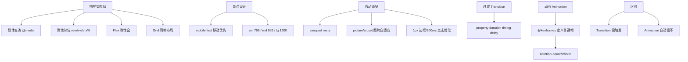

# 过渡与动画

### 过渡与动画

在前端开发中，实现动画效果主要有以下几种方式：JavaScript、CSS3 Transition/Animation、SVG、Canvas 以及 Web Animations API。

#### 1. JavaScript 动画

-   **原理**：通过 JS 定时器（如 `setInterval`、`setTimeout`）或 `requestAnimationFrame` 逐帧修改 DOM 元素的样式属性。
-   **优点**：控制力极强，可以暂停、回放、复杂逻辑控制，兼容性好。
-   **缺点**：频繁操作 DOM 容易导致浏览器重排和重绘，消耗性能。如果不使用 `requestAnimationFrame`，在后台标签页可能会浪费资源。

#### 2. CSS3 Transition (过渡)

-   **定义**：CSS 过渡允许 CSS 的属性值在一定的时间区间内平滑地过渡。
-   **限制**：过渡需要某个触发条件（如 `:hover`、JS 修改 class 或 style），不能自动执行，也无法定义中间状态。
-   **关键属性**：
    -   `transition-property`: 规定设置过渡效果的 CSS 属性的名称（如 `all`, `width`）。
    -   `transition-duration`: 规定完成过渡效果需要多少秒或毫秒。
    -   `transition-timing-function`: 规定速度效果的速度曲线（如 `linear`, `ease`）。
    -   `transition-delay`: 定义过渡效果何时开始。
-   **性能优化**：在移动端，优先使用 `transform` (如 `translate3d(0,0,0)`) 和 `opacity` 进行动画，因为它们可以触发 GPU 加速，避免引起重排。

#### 3. CSS3 Animation (动画)

-   **定义**：通过 `@keyframes` 定义关键帧，实现比 Transition 更复杂的动画序列，无需触发事件即可自动循环播放。
-   **关键属性**：
    -   `@keyframes`: 定义动画序列，如 `0% { ... } 100% { ... }` 或 `from { ... } to { ... }`。
    -   `animation-name`: 绑定 keyframes 名称。
    -   `animation-duration`: 动画周期时长。
    -   `animation-timing-function`: 速度曲线。
    -   `animation-delay`: 延迟时间。
    -   `animation-iteration-count`: 播放次数（`infinite` 为无限循环）。
    -   `animation-direction`: 播放方向（`normal`, `alternate` 往返）。
    -   `animation-fill-mode`: 动画播放之外的状态（`forwards` 停留在最后一帧，`backwards` 延迟期间应用第一帧样式）。
    -   `animation-play-state`: 暂停 (`paused`) 或运行 (`running`)。
-   **示例**：
    ```css
    @keyframes example {
      from { background-color: red; }
      to { background-color: yellow; }
    }
    div {
      animation-name: example;
      animation-duration: 4s;
    }
    ```

#### 4. requestAnimationFrame (rAF)

-   **原理**：浏览器专门为动画提供的 API，它会在下一次重绘之前调用指定的回调函数。
-   **优势**：
    -   **由系统决定回调时机**：通常与屏幕刷新率同步（如 60Hz 约为 16.7ms/帧），保证动画流畅。
    -   **节省资源**：当页面处于不可见或后台状态时，rAF 会自动暂停，节省 CPU/GPU 开销。
-   **对比**：`setInterval` 时间不准确且可能丢帧；`setTimeout` 会受主线程阻塞影响；rAF 则由浏览器优化调度。

#### 5. SVG 动画

-   **特点**：基于矢量图形，无损缩放。
-   **能力**：控制路径变形、颜色渐变、滤镜效果等。适合图形类的动画，而非布局动画。

#### 6. Canvas 动画

-   **特点**：基于像素的位图绘制，通过 JavaScript 操作 Canvas API 绘制每一帧。
-   **能力**：性能极高，适合大量粒子、游戏渲染等复杂场景。

#### 实战案例：无限滚动无缝衔接
在开发跑马灯或轮播图时，当动画播放到最后一张与第一张切换时，常出现“闪回”现象。实战中通常使用两张相同的图片/列表首尾相接，利用 `transition` 移动到复制版后，瞬间（无动画）重置回原始位置，欺骗人眼实现无缝循环。

#### 关键代码示例：高性能加载动画
```javascript
// 使用 rAF 实现进度条动画，保证流畅度
let progress = 0;
const bar = document.getElementById('progress-bar');

function updateProgress() {
  progress++;
  bar.style.transform = `translateX(${progress}%)`;
  if (progress < 100) {
    requestAnimationFrame(updateProgress);
  }
}
requestAnimationFrame(updateProgress);
```

#### 方案对比：Transition vs Animation vs JS

| 特性 | CSS Transition | CSS Animation | JavaScript (rAF) |
| :--- | :--- | :--- | :--- |
| **触发方式** | 需状态改变 | 自动加载或触发 | 完全代码控制 |
| **复杂度** | 简单（A到B） | 中等（多关键帧） | 高（可包含物理逻辑）
| **性能** | 好（合成层） | 好（合成层） | 取决于实现（差则重排）
| **控制能力** | 弱（无法暂停/回退） | 中（可暂停） | 极强（逐帧控制）
| **适用场景** | :hover 效果、简单的展开收起 | Loading 动画、关键帧动画 | 游戏、复杂交互、数据可视化 |


## 核心架构图



## 记忆要点

- 动画方式对比：Transition 需触发且无中间态，Animation 自动执行且能定关键帧
- 性能优化：因为 transform 和 opacity 只触发合成，所以推荐优先使用以开启 GPU 加速
- JS动画优选：因为 requestAnimationFrame 随屏幕刷新率执行且后台自动暂停，所以优于定时器
- 实战盲点：无缝滚动利用首尾复制元素，无动画重置位置来欺骗人眼

## 结构化回答

**30 秒电梯演讲：** CSS动画（Transition/Animation）比JS动画性能更好，利用GPU渲染实现流畅视觉效果。打个比方，像电影胶片播放（CSS）比人工手绘翻页（JS）更流畅且省力。

**展开框架：**
1. **动画方式对比** — Transition 需触发且无中间态，Animation 自动执行且能定关键帧
2. **性能优化** — 因为 transform 和 opacity 只触发合成，所以推荐优先使用以开启 GPU 加速
3. **JS动画优选** — 因为 requestAnimationFrame 随屏幕刷新率执行且后台自动暂停，所以优于定时器

**收尾：** 我在项目里踩过坑——在开发跑马灯或轮播图时，当动画播放到最后一张与第一张切换时，常出现“闪回”现象。您想深入聊哪一段：原理、避坑还是对比选型？

## 视频脚本

> 预计时长：4 分钟 | 由浅入深

| 时间 | 画面/字幕 | 口播台词 | 讲解要点 |
|------|----------|----------|----------|
| 0:00 | 标题卡：过渡与动画 | "过渡与动画？一句话——像电影胶片播放（CSS）比人工手绘翻页（JS）更流畅且省力。" | 开场钩子 |
| 0:48 | 概念动画/示意图 | "CSS动画（Transition/Animation）比JS动画性能更好，利用GPU渲染实现流畅视觉效果——像电影胶片播放（CSS）比人工手绘翻页（JS）更流畅且省力" | 核心定义 |
| 1:36 | 动画方式对比示意 | "Transition 需触发且无中间态，Animation 自动执行且能定关键帧" | 要点1 |
| 2:24 | 性能优化示意 | "因为 transform 和 opacity 只触发合成，所以推荐优先使用以开启 GPU 加速" | 要点2 |
| 3:12 | JS动画优选示意 | "因为 requestAnimationFrame 随屏幕刷新率执行且后台自动暂停，所以优于定时器" | 要点3 |
| 4:00 | 总结卡 | "记住这几条，面试不慌。下期讲进阶追问。" | 收尾 |
