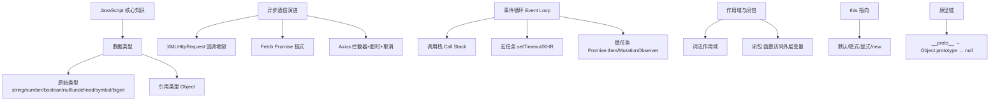

# JavaScript

JavaScript 是一种具有函数优先特性的轻量级，解释型或即时编译型的编程语言。主要特点包括：单线程、基于原型、动态类型。核心概念包含异步编程（Event Loop）、闭包、作用域链、原型继承等。

## 技术原理

- **单线程非阻塞，通过 Event Loop 处理异步**：JS 主线程只有一个，但通过 Event Loop（事件循环）配合任务队列（宏任务 setTimeout、微任务 Promise.then）实现非阻塞异步。I/O、定时器、网络请求交给宿主环境（浏览器/Node）的 Web API 异步处理，完成后回调进队列等主线程空闲时执行，所以单线程也能处理高并发 I/O。
- **基于原型的继承机制**：JS 没有 Java 那种类拷贝继承，对象通过原型链（`__proto__`）做属性查找委托——访问对象属性时，若自身没有就沿原型链向上找，直到 `Object.prototype`。`class` 语法（ES6）只是原型链的语法糖，本质仍是 prototype 委托。
- **函数是一等公民，支持高阶函数**：函数可以赋值给变量、作为参数传递、作为返回值，这让 `map/filter/reduce`、回调、Promise 链、柯里化等函数式编程成为可能。闭包（函数捕获其词法作用域的变量）是 JS 实现私有数据、模块化的核心机制。
- **动态类型，变量类型在运行时确定**：变量声明（`let`/`const`/`var`）不绑定类型，赋什么值就是什么类型，运行时可任意改变。灵活但易错（`"1" + 1 = "11"` 的隐式转换），TypeScript 应运而生做静态类型检查。

## 对比/选型

| 特性 | JavaScript | Java |
|------|------------|------|
| 类型系统 | 动态类型 | 静态强类型 |
| 线程模型 | 单线程 + Event Loop | 多线程 |
| 继承机制 | 原型链委托 | 类继承（拷贝） |
| 函数地位 | 一等公民 | 需接口/lambda |
| 编译方式 | 解释 + JIT | AOT/JIT（JVM） |

## 代码示例

Event Loop 与异步：

```javascript
console.log('1: 同步');
setTimeout(() => console.log('4: 宏任务'), 0);
Promise.resolve().then(() => console.log('3: 微任务'));
console.log('2: 同步');
// 输出顺序: 1 → 2 → 3 → 4（同步 → 微任务 → 宏任务）
```

原型链继承：

```javascript
function Animal(name) { this.name = name; }
Animal.prototype.speak = function() { return `${this.name} 叫`; };

function Dog(name) { Animal.call(this, name); }   // 借用构造函数
Dog.prototype = Object.create(Animal.prototype);  // 原型链委托
Dog.prototype.constructor = Dog;
Dog.prototype.bark = function() { return '汪汪'; };

const d = new Dog('旺财');
d.speak();   // "旺财 叫" —— 沿原型链找到 Animal.prototype.speak
d.bark();    // "汪汪"
```

闭包：

```javascript
function counter() {
    let count = 0;                                  // 被闭包捕获
    return () => ++count;                           // 内层函数引用外层变量
}
const inc = counter();
inc(); inc();   // 1, 2 —— count 私有，外部无法直接访问
```

## 常见坑/注意事项

- **`this` 指向易错**：`this` 在不同调用方式下指向不同（普通函数指向调用者、箭头函数继承外层、事件回调指向元素），初学者常因 `this` 丢失导致 bug。
- **`var`/`let`/`const` 作用域**：`var` 有变量提升和函数作用域，`let`/`const` 是块级作用域，现代代码统一用 `const`，需重新赋值才用 `let`，禁用 `var`。
- **隐式类型转换**：`==` 会做类型转换（`"0" == 0` 为 true），`===` 严格相等不转换，永远用 `===`。
- **异步异常难捕获**：Promise 链中未 catch 的 reject 会变成未处理拒绝，async/await 要 try/catch，否则报错被吞。
- **闭包导致内存泄漏**：闭包捕获的变量不会被 GC，长生命周期组件里闭包持有大对象会泄漏。


## 核心架构图


## 记忆要点

- 语言特性：单线程、动态类型、基于原型，兼具解释型与 JIT 即时编译
- 核心机制：Event Loop（事件循环）处理异步，靠闭包延伸作用域
- 继承本质：不同于类的拷贝，JS 基于原型链实现对象与属性的查找委托

## 结构化回答

**30 秒电梯演讲：** JS是网页的编程语言，负责处理逻辑、交互和动态内容更新。打个比方，像网页的大脑，决定用户点击后页面该怎么反应和思考。

**展开框架：**
1. **语言特性** — 单线程、动态类型、基于原型，兼具解释型与 JIT 即时编译
2. **核心机制** — Event Loop（事件循环）处理异步，靠闭包延伸作用域
3. **继承本质** — 不同于类的拷贝，JS 基于原型链实现对象与属性的查找委托

**收尾：** 这三点都能配合实战聊。您想深入聊原理、对比还是避坑？

## 视频脚本

> 预计时长：2 分钟 | 由浅入深

| 时间 | 画面/字幕 | 口播台词 | 讲解要点 |
|------|----------|----------|----------|
| 0:00 | 标题卡：JavaScript | "JavaScript？一句话——像网页的大脑，决定用户点击后页面该怎么反应和思考。" | 开场钩子 |
| 0:40 | 概念动画/示意图 | "JS是网页的编程语言，负责处理逻辑、交互和动态内容更新——像网页的大脑，决定用户点击后页面该怎么反应和思考" | 核心定义 |
| 1:20 | 语言特性示意 | "单线程、动态类型、基于原型，兼具解释型与 JIT 即时编译" | 要点1 |
| 2:00 | 总结卡 | "记住这几条，面试不慌。下期讲进阶追问。" | 收尾 |
