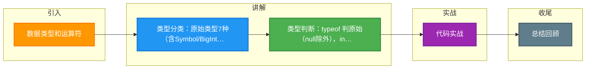

# 数据类型和运算符

### 数据类型

#### 原始类型
JavaScript 共有 7 种原始类型：
1.  **Undefined**：表示未定义，变量声明但未赋值时的默认值。
2.  **Null**：表示空对象指针，`typeof null` 返回 "object"（历史遗留Bug）。
3.  **Boolean**：true/false。
4.  **Number**：IEEE 754 双精度浮点数，有精度限制（如 `0.1 + 0.2 !== 0.3`）。
5.  **String**：字符串。
6.  **Symbol**（ES6）：表示独一无二的值，主要用于对象属性名，防止属性冲突。
7.  **BigInt**（ES10）：表示任意大小的整数，安全存储和操作大整数（数字后加 `n`，如 `10n`）。

#### 引用类型
统称为 Object 类型，具体包括：
*   **Object**：普通对象。
*   **Array**：数组。
*   **Date**：日期。
*   **RegExp**：正则表达式。
*   **Function**：函数（虽然 typeof 返回 function，但本质上也是对象）。

### 类型判断与转换

#### 1. 类型判断：typeof vs instanceof
*   **typeof**：用于判断原始类型（除 null 外）和函数。返回字符串。
    *   `typeof undefined // 'undefined'`
    *   `typeof null // 'object'` (历史Bug，底层 000 标志位)
    *   `typeof [] // 'object'`
    *   `typeof function(){}` // 'function'
*   **instanceof**：用于判断引用类型，基于原型链查找。`A instanceof B` 检查 `B.prototype` 是否在 `A` 的原型链上。
*   **通用判断**：`Object.prototype.toString.call()`。可准确判断所有类型。
    ```javascript
    Object.prototype.toString.call([]) // "[object Array]"
    Object.prototype.toString.call(null) // "[object Null]"
    ```

#### 2. 类型转换

**强制转换**：
*   **Number()**：整体转换。
    *   `Number(null)` -> 0
    *   `Number(undefined)` -> NaN
    *   `Number('123px')` -> NaN
*   **parseInt(string, radix)**：逐个字符解析，遇到非数字字符停止。
    *   `radix`：进制（2-36），默认非 0x 开头为 10。
    *   `parseInt('10px', 10)` -> 10
*   **String()**：转换为字符串。
*   **Boolean()**：只有 `false`, `0`, `''`, `null`, `undefined`, `NaN` 转为 false，其余均为 true。

**隐式转换**：
*   **==**：允许类型转换。
    *   `null == undefined` -> true
    *   `'1' == 1` -> true (字符串转数字)
    *   `true == 1` -> true (布尔转数字)
*   **+**：只要有一方是字符串，另一方就会转为字符串拼接；否则转为数字相加。
*   **-*/**：一律转为数字运算。

### 运算符细节
*   **Math**：
    *   `Math.floor(4.9)` -> 4 (向下取整)
    *   `Math.ceil(4.1)` -> 5 (向上取整)
    *   `Math.round(4.5)` -> 5 (四舍五入)
    *   `Math.abs(-1)` -> 1 (绝对值)
    *   `toFixed(2)`：保留两位小数，返回字符串（注意四舍五入和精度问题）。

#### 实战案例：精度丢失问题
在电商或金融场景计算金额时，直接使用 `0.1 + 0.2` 结果为 `0.30000000000000004`。实战中通常将金额转为“分”为单位进行整数运算，或使用第三方库（如 `decimal.js`）进行处理，避免浮点数精度导致的金额对账错误。

#### 关键代码示例：安全的类型判断函数
```javascript
// 封装通用的类型判断工具，比 typeof 更准确
function getType(value) {
  if (value === null) return 'Null';
  if (value === undefined) return 'Undefined';
  // 获取 [object Xxx] 中的 Xxx
  const typeStr = Object.prototype.toString.call(value);
  return typeStr.slice(8, -1);
}

getType([]); // "Array"
getType(new Map()); // "Map"
getType(() => {}); // "Function"
```

#### 类型判断方式对比

| 方法 | 返回值 | 判断对象 | 优点 | 缺点 |
| :--- | :--- | :--- | :--- | :--- |
| **typeof** | 字符串 | 原始类型、Function | 简单直接 | Null 判为 object，引用类型区分差 |
| **instanceof** | 布尔值 | 对象 | 能区分具体对象类型 | 跨 iframe/多环境失效，无法判断原始类型 |
| **toString.call** | 字符串 | 所有类型 | 最精准、最全面 | 写法稍繁琐，性能略低于 typeof |

## 常见考点
1.  **typeof null 为什么是 object？**（考察对底层存储机制的了解）
2.  **== 和 === 的区别，以及 implicit conversion 规则。**（考察隐式转换逻辑）


## 核心架构图

```mermaid
flowchart TD
    classDef start fill:#4CAF50,color:#fff
    classDef process fill:#2196F3,color:#fff
    classDef decision fill:#FF9800,color:#fff
    classDef special fill:#9C27B0,color:#fff
    classDef error fill:#f44336,color:#fff
    classDef info fill:#607D8B,color:#fff
    class A start
    class Axios process
    class B decision
    class C special
    class Call error
    class D info
    class E start
    class Event process
    class F decision
    class Fetch special
    class G error
    class H info
    class I start
    class J process
    class JavaScript decision
    class K special
    class L error
    class Loop info
    class M start
    class MutationObserver process
    class N decision
    class O special
    class Object error
    class P info
    class Promise start
    class Q process
    class R decision
    class S special
    class Stack error
    class XHR info
    class XMLHttpRequest start
    class bigint process
    class boolean decision
    class br special
    class new error
    class null info
    class number start
    class prototype process
    class setTimeout decision
    class string special
    class symbol error
    class then info
    class this start
    class undefined process
    A[JavaScript 核心知识] --> B[数据类型]
    B --> C[原始类型<br/>string/number/boolean/null/undefined/symbol/bigint]
    B --> D[引用类型 Object]
    E[异步通信演进] --> F[XMLHttpRequest 回调地狱]
    E --> G[Fetch Promise 链式]
    E --> H[Axios 拦截器+超时+取消]
    I[事件循环 Event Loop] --> J[调用栈 Call Stack]
    I --> K[宏任务 setTimeout/XHR]
    I --> L[微任务 Promise.then/MutationObserver]
    M[作用域与闭包] --> N[词法作用域]
    M --> O[闭包 函数访问外层变量]
    P[this 指向] --> Q[默认/隐式/显式/new]
    R[原型链] --> S[__proto__ → Object.prototype → null]
```



## 记忆要点

- 类型分类：原始类型7种（含Symbol/BigInt），引用类型统称Object
- 类型判断：typeof 判原始（null除外），instanceof 判引用，Object.prototype.toString 判所有
- 隐式转换：== 允许转换类型（null==undefined），+ 遇字符串转拼接，其余运算转数字
- 避坑指南：浮点数 0.1+0.2!=0.3，金额计算需转整数或用第三方库

## 结构化回答

**30 秒电梯演讲：** JS包含原始类型和引用类型，不同类型在进行运算和转换时有特定规则。打个比方，像积木（原始类型）和模型箱（引用类型），拼接和使用方式各不相同。

**展开框架：**
1. **类型分类** — 原始类型7种（含Symbol/BigInt），引用类型统称Object
2. **类型判断** — typeof 判原始（null除外），instanceof 判引用，Object.prototype.toString 判所有
3. **隐式转换** — == 允许转换类型（null==undefined），+ 遇字符串转拼接，其余运算转数字

**收尾：** 我在项目里踩过坑——在电商或金融场景计算金额时，直接使用 `0.1 + 0.2` 结果为 `0.30000000000000004`。您想深入聊哪一段：原理、避坑还是对比选型？

## 视频脚本

> 预计时长：4 分钟 | 由浅入深

| 时间 | 画面/字幕 | 口播台词 | 讲解要点 |
|------|----------|----------|----------|
| 0:00 | 标题卡：数据类型和运算符 | "数据类型和运算符？一句话——像积木（原始类型）和模型箱（引用类型），拼接和使用方式各不相同。" | 开场钩子 |
| 0:48 | 概念动画/示意图 | "JS包含原始类型和引用类型，不同类型在进行运算和转换时有特定规则——像积木（原始类型）和模型箱（引用类型），拼接和使用方式各不相同" | 核心定义 |
| 1:36 | 类型分类示意 | "原始类型7种（含Symbol/BigInt），引用类型统称Object" | 要点1 |
| 2:24 | 类型判断示意 | "typeof 判原始（null除外），instanceof 判引用，Object.prototype.toString 判所有" | 要点2 |
| 3:12 | 隐式转换示意 | "== 允许转换类型（null==undefined），+ 遇字符串转拼接，其余运算转数字" | 要点3 |
| 4:00 | 总结卡 | "记住这几条，面试不慌。下期讲进阶追问。" | 收尾 |

### 视频流程图



