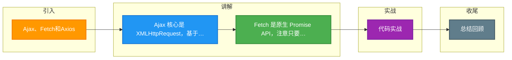

# Ajax、Fetch和Axios

### 三种 HTTP 请求方式的对比

#### 1. Ajax (Asynchronous JavaScript and XML)

**核心**：基于原生的 `XMLHttpRequest` (XHR) 对象实现。

**特点**：
*   **局部刷新**：不重新加载整个页面，只更新部分内容。
*   **回调地狱**：传统 XHR 使用回调函数，处理多层异步操作时代码难以维护。
*   **原生 API**：配置繁琐，需要手动处理状态码。

**基本流程**：
```javascript
const xhr = new XMLHttpRequest();
xhr.open('GET', '/api', true); // 方法, URL, 异步
xhr.setRequestHeader('Content-Type', 'application/x-www-form-urlencoded');
xhr.onreadystatechange = function() {
  if (xhr.readyState === 4) { // 请求完成
    if (xhr.status === 200 || xhr.status === 304) {
      console.log(xhr.responseText);
    }
  }
};
xhr.send(null);
```

#### 2. Fetch

**核心**：ES6 提出的 HTTP 请求 API，基于 Promise 设计，旨在替代 XHR。

**特点**：
*   **Promise 支持**：解决了回调地狱，支持 `async/await`，代码更简洁。
*   **语义化**：语法简单，数据在 body 中流式处理。
*   **底层 API**：
    *   **默认不带 Cookie**：需要配置 `credentials: 'include'`。
    *   **网络错误处理**：Fetch 只要服务器返回响应（即使是 400/500），Promise 都会 resolve，不会进入 catch。只有网络错误（断网）才 reject。需手动检查 `response.ok` 或 `status`。
    *   **不支持超时控制**：需配合 `AbortController` 实现。

**基本流程**：
```javascript
fetch('/api', {
  method: 'POST',
  body: JSON.stringify(data),
  headers: {'Content-Type': 'application/json'},
  credentials: 'include'
})
.then(response => {
  if (!response.ok) throw new Error('Network error');
  return response.json(); // 解析 JSON
})
.then(data => console.log(data))
.catch(err => console.error(err));
```

#### 3. Axios

**核心**：基于 Promise 封装的 HTTP 客户端库，可在浏览器和 Node.js 中运行。

**特点**：
*   **统一封装**：浏览器端封装 XHR，Node 端封装 `http` 模块。
*   **功能丰富**：
    *   自动转换 JSON 数据。
    *   支持请求/响应拦截器（Interceptors，用于 Token 处理、统一错误处理）。
    *   支持请求取消。
    *   自动防御 XSRF。
    *   更好的错误处理（HTTP 状态码错误会进 catch）。
*   **环境隔离**：可根据 `process.env.NODE_ENV` 自动设置 baseURL。

**架构简图**：
```text
  ┌───────────────────────────────────────┐
  │           Axios Instance               │
  │  (Request Config: BaseURL, Timeout)   │
  └─────────────────┬─────────────────────┘
                    │
                    ▼
  ┌───────────────────────────────────────┐
  │            Interceptors               │
  │   1. Request Interceptor (Add Token)  │
  │   2. Response Interceptor (Unwrap)    │
  └─────────────────┬─────────────────────┘
                    │
        ┌───────────┴───────────┐
        ▼                       ▼
   ┌─────────┐            ┌───────────┐
   │ Browser │            │  Node.js  │
   │   XHR   │            │ HTTP Lib  │
   └─────────┘            └───────────┘
```

## 常见考点
1.  **Fetch 和 Ajax (XHR) 的区别。**（重点在于 Promise 机制、错误处理、Cookie 携带）
2.  **Axios 拦截器的应用场景。**（考察项目实战经验，如登录鉴权）
3.  **如何实现一个 Axios 拦截器进行请求取消？**（考察高级 API 掌握）


## 核心架构图

```mermaid
flowchart TD
    classDef start fill:#4CAF50,color:#fff
    classDef process fill:#2196F3,color:#fff
    classDef decision fill:#FF9800,color:#fff
    classDef special fill:#9C27B0,color:#fff
    classDef error fill:#f44336,color:#fff
    classDef info fill:#607D8B,color:#fff
    class A start
    class Axios process
    class B decision
    class C special
    class Call error
    class D info
    class E start
    class Event process
    class F decision
    class Fetch special
    class G error
    class H info
    class I start
    class J process
    class JavaScript decision
    class K special
    class L error
    class Loop info
    class M start
    class MutationObserver process
    class N decision
    class O special
    class Object error
    class P info
    class Promise start
    class Q process
    class R decision
    class S special
    class Stack error
    class XHR info
    class XMLHttpRequest start
    class bigint process
    class boolean decision
    class br special
    class new error
    class null info
    class number start
    class prototype process
    class setTimeout decision
    class string special
    class symbol error
    class then info
    class this start
    class undefined process
    A[JavaScript 核心知识] --> B[数据类型]
    B --> C[原始类型<br/>string/number/boolean/null/undefined/symbol/bigint]
    B --> D[引用类型 Object]
    E[异步通信演进] --> F[XMLHttpRequest 回调地狱]
    E --> G[Fetch Promise 链式]
    E --> H[Axios 拦截器+超时+取消]
    I[事件循环 Event Loop] --> J[调用栈 Call Stack]
    I --> K[宏任务 setTimeout/XHR]
    I --> L[微任务 Promise.then/MutationObserver]
    M[作用域与闭包] --> N[词法作用域]
    M --> O[闭包 函数访问外层变量]
    P[this 指向] --> Q[默认/隐式/显式/new]
    R[原型链] --> S[__proto__ → Object.prototype → null]
```



## 记忆要点

- Ajax 核心是 XMLHttpRequest，基于回调函数，配置繁琐易生回调地狱
- Fetch 是原生 Promise API，注意只要服务器有响应就不进 catch（需检查 ok）
- Axios 是第三方库，支持拦截器、自动JSON转换、超时控制与错误拦截
- 差异避坑：Fetch 默认不带 Cookie（需配 include），且对 4xx/5xx 状态码不 reject

## 结构化回答

**30 秒电梯演讲：** Ajax/Fetch/Axios均用于前后端数据通信，分别代表了不同时代的实现方案。打个比方，Ajax是老式电话，Fetch是升级后的智能电话，Axios是加了增强功能的高级电话。

**展开框架：**
1. **Ajax 核心是 XMLHttpRequest** — 基于回调函数，配置繁琐易生回调地狱
2. **Fetch 是原生 Promise API** — 注意只要服务器有响应就不进 catch（需检查 ok）
3. **Axios 是第三方库** — 支持拦截器、自动JSON转换、超时控制与错误拦截

**收尾：** 这三点都能配合实战聊。您想深入聊原理、对比还是避坑？

## 视频脚本

> 预计时长：4 分钟 | 由浅入深

| 时间 | 画面/字幕 | 口播台词 | 讲解要点 |
|------|----------|----------|----------|
| 0:00 | 标题卡：Ajax、Fetch和Axios | "Ajax、Fetch和Axios？一句话——Ajax是老式电话，Fetch是升级后的智能电话，Axios是加了增强功能的高级电话。" | 开场钩子 |
| 0:48 | 概念动画/示意图 | "Ajax/Fetch/Axios均用于前后端数据通信，分别代表了不同时代的实现方案——Ajax是老式电话，Fetch是升级后的智能电话，Axios是加了增强功能的高级电话" | 核心定义 |
| 1:36 | 要点1图解示意 | "基于回调函数，配置繁琐易生回调地狱" | 要点1 |
| 2:24 | 要点2图解示意 | "注意只要服务器有响应就不进 catch（需检查 ok）" | 要点2 |
| 3:12 | Axios 是第三方库示意 | "支持拦截器、自动JSON转换、超时控制与错误拦截" | 要点3 |
| 4:00 | 总结卡 | "记住这几条，面试不慌。下期讲进阶追问。" | 收尾 |

### 视频流程图



