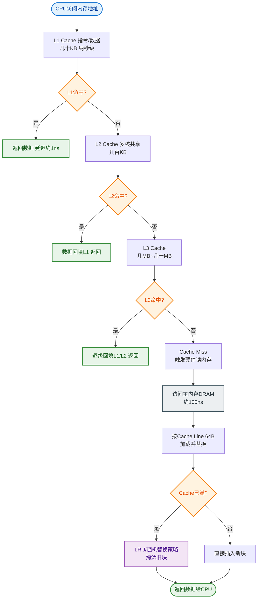

# 浏览器存储

### 浏览器存储

#### 1. Cookie
*   **作用**：主要用于维持客户端状态（如登录态），在浏览器和服务器间传递。
*   **特点**：
    *   大小限制约 4KB。
    *   每次请求都会自动携带在 HTTP 头中，影响性能。
    *   可设置 `HttpOnly` 防止 JS 脚本窃取，防御 XSS。
    *   可设置 `Secure` 仅在 HTTPS 下传输。
    *   可设置 `SameSite` (Strict/Lax/None) 防止 CSRF 攻击。
*   **字段**：`name=value; expires; path; domain; secure; HttpOnly`。
*   **安全细节**：
    *   `SameSite=Lax`（默认）：允许跨站 GET 请求携带 Cookie（如链接跳转），禁止 POST/图片等跨站请求携带，平衡了安全与体验。
    *   `SameSite=Strict`：完全禁止第三方网站请求携带 Cookie，最严格。
    *   `SameSite=None`：必须配合 `Secure` 使用，允许跨站携带（常用于 SSO 场景）。
    *   `Domain`：设置时包含子域（如 `.example.com`），不设置则仅对当前域有效。

#### 2. LocalStorage / SessionStorage
*   **LocalStorage**：
    *   永久存储（除非手动删除）。
    *   容量约 5MB。
    *   仅在客户端使用，不参与 HTTP 通信。
    *   **同步机制**：同源页面的 localStorage 是**同步共享**的（在一个页面修改，其他页面立刻触发 `storage` 事件），但同步操作可能会阻塞页面渲染。
*   **SessionStorage**：
    *   仅在当前会话窗口有效，关闭窗口即失效。
    *   容量约 5MB。
    *   **隔离性**：即使在同一浏览器打开两个相同的 URL，它们的 SessionStorage 也是独立的。

#### 3. IndexedDB
*   **特点**：运行在浏览器中的非关系型数据库（NoSQL）。
    *   理论存储容量无上限（通常硬盘剩余空间的 50%-60%，上限数百 MB 到数 GB）。
    *   支持异步操作，适合存储大量结构化数据。
    *   支持事务，保证数据一致性（要么全部成功，要么全部失败）。
    *   同源策略限制。
*   **数据结构**：基于对象存储，每个对象存储类似于一张 SQL 表，但结构灵活。使用索引加速查询。

#### 4. HTTP 缓存
*   **强缓存**：
    *   不向服务器发请求，直接从缓存读取（状态码 200 (from disk/memory)）。
    *   字段：`Cache-Control` (如 max-age=300), `Expires` (服务器时间，可能有时差)。
    *   **优先级**：`Cache-Control` > `Expires`。
*   **协商缓存**：
    *   向服务器发请求，若资源未改返回 304，使用本地缓存。
    *   字段：`Last-Modified` / `If-Modified-Since` (时间戳, 精度秒级), `ETag` / `If-None-Match` (文件指纹, 哈希值, 精度更高)。
    *   **优先级**：`ETag` > `Last-Modified`（ETag 能感知文件秒级内的修改及内容未改但时间变了的情况）。

#### 5. 缓存位置优先级
1.  **Service Worker**：独立线程，可自定义缓存策略，离线访问。
2.  **Memory Cache**：内存缓存，读取快，关闭 Tab 释放（如 base64 图片、小脚本）。
3.  **Disk Cache**：硬盘缓存，容量大，持久化（如大 CSS、JS 文件）。
4.  **Push Cache**：HTTP/2 推送缓存，会话结束即释放。

#### 6. 缓存决策流程图

```text
      浏览器请求资源
           │
           ▼
    ┌──────────────┐
    │ 检查 Cache   │
    │ Control/Exp  │
    └──────┬───────┘
           │
     ┌─────┴─────┐
     │  有效？   │
     └─────┬─────┘
      Yes/   \ No
       │      \
       │       ▼
       │  ┌──────────────┐
       │  │ 向服务器发   │
       │  │ 请求(带标识) │
       │  └──────┬───────┘
       │         │
       │         ▼
       │    ┌──────────┐
       │    │ 304未改? │
       │    └────┬─────┘
       │    Yes/  \ No
       │     │     \
       │     ▼      ▼
       │  用协商  200+资源
       │   缓存   (更新缓存)
       │     │
       └─────┘
```

## 常见考点
1.  **Cookie、SessionStorage、LocalStorage 的区别？**（考察点：生命周期、作用域、存储大小、与服务器交互）
2.  **强缓存和协商缓存的区别？**（考察点：Cache-Control 字段含义，ETag 和 Last-Modified 的优劣）
3.  **如何设置 Cookie 的安全性？**（考察点：HttpOnly、Secure、SameSite 属性的作用）
4.  **用户刷新浏览器（F5）和 Ctrl+F5 强制刷新，缓存策略有何不同？**（考察点：刷新通常会对强缓存失效，但协商缓存可能有效；强制刷新则全部跳过缓存直接请求服务器）。


## 核心流程图


## 记忆要点

- 容量与通信：Cookie 约 4KB 且每次通信必带头；Storage 约 5MB 且纯本地不参与通信
- 生命周期：LocalStorage 永久有效，SessionStorage 关闭标签即失效
- 安全防御：Cookie 设 HttpOnly 防 XSS，设 SameSite 防 CSRF
- IndexedDB：异步非关系型数据库，容量大且支持事务，适合大量结构化数据缓存
- 缓存决策：Service Worker > Memory > Disk > Push Cache，优先级递减

## 结构化回答

**30 秒电梯演讲：** 浏览器提供的数据存储与缓存机制。打个比方，Cookie是身份证，每次进出都要出示；LocalStorage是家里的储物柜，自己用；IndexedDB是私人仓库，存大家伙；HTTP缓存是快递驿站，常用的东西直接取。

**展开框架：**
1. **容量与通信** — Cookie 约 4KB 且每次通信必带头；Storage 约 5MB 且纯本地不参与通信
2. **生命周期** — LocalStorage 永久有效，SessionStorage 关闭标签即失效
3. **安全防御** — Cookie 设 HttpOnly 防 XSS，设 SameSite 防 CSRF

**收尾：** 这三点都能配合实战聊。您想深入聊原理、对比还是避坑？

## 视频脚本

> 预计时长：4 分钟 | 由浅入深

| 时间 | 画面/字幕 | 口播台词 | 讲解要点 |
|------|----------|----------|----------|
| 0:00 | 标题卡：浏览器存储 | "浏览器存储？一句话——Cookie是身份证，每次进出都要出示；LocalStorage是家里的储物柜，自己用；IndexedDB是私人仓库，存大家伙；HTTP缓存是快递驿站，常用的东西直接取。" | 开场钩子 |
| 0:48 | 概念动画/示意图 | "浏览器提供的数据存储与缓存机制——Cookie是身份证，每次进出都要出示；LocalStorage是家里的储物柜，自己用；IndexedDB是私人仓库，存大家伙；HTTP缓存是快递驿站，常用的东西直接取" | 核心定义 |
| 1:36 | 容量与通信示意 | "Cookie 约 4KB 且每次通信必带头；Storage 约 5MB 且纯本地不参与通信" | 要点1 |
| 2:24 | 生命周期示意 | "LocalStorage 永久有效，SessionStorage 关闭标签即失效" | 要点2 |
| 3:12 | 安全防御示意 | "Cookie 设 HttpOnly 防 XSS，设 SameSite 防 CSRF" | 要点3 |
| 4:00 | 总结卡 | "记住这几条，面试不慌。下期讲进阶追问。" | 收尾 |
