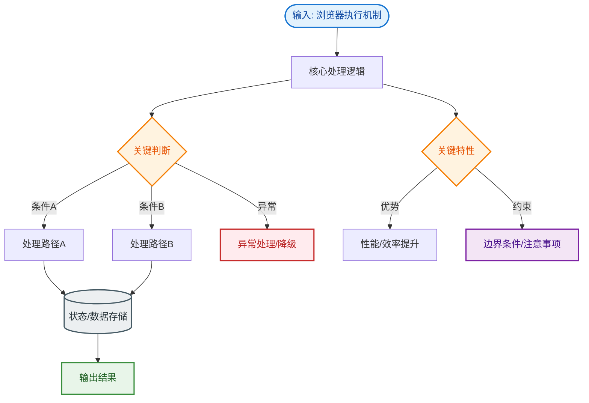

# 浏览器执行机制

### 浏览器执行机制

#### 1. JavaScript 代码执行流程
JS 代码执行前通常经过以下步骤：

*   **词法分析**：将代码字符串分解成有意义的词法单元。
*   **语法分析**：将词法单元流转换成抽象语法树 (AST)。
*   **代码生成**：将 AST 转换为可执行代码。
    *   早期：直接编译为机器码（内存占用大）。
    *   现代 (V8)：先编译为字节码，配合 **JIT (Just-In-Time)** 即时编译技术，将热点代码编译为高效的机器码。
        *   **Ignition**：解释器，快速启动，生成字节码。
        *   **TurboFan**：优化编译器，针对热点代码编译为优化后的机器码。
        *   **去优化**：如果假设失效（如类型突然改变），TurboFan 生成的代码会回退到字节码执行。

#### 2. 变量查找：LHS vs RHS
在引擎执行代码查找变量时：
*   **RHS (Right Hand Side)**：查询变量的值，等同于“取值”。例如 `console.log(a)`，查找 a 的值。
*   **LHS (Left Hand Side)**：查询变量的容器，为了赋值。例如 `a = 2`，查找 a 的内存位置以便赋值。

#### 3. 执行上下文与调用栈
*   **执行上下文**：评估和执行 JS 代码的环境。包含：
    *   **变量对象**：存储变量、函数声明。
    *   **作用域链**：确保对当前执行环境有权访问的变量和函数的有序访问。
    *   **this**。
*   **调用栈**：后进先出 (LIFO)，管理脚本中多个执行上下文的执行顺序。栈溢出通常由无限递归导致。

#### 4. 事件循环
*   **宏任务**：`script` (整体代码), `setTimeout`, `setInterval`, `setImmediate` (Node), I/O, UI Rendering。
*   **微任务**：`Promise.then`, `MutationObserver`, `process.nextTick` (Node)。
*   **执行顺序**：
    1.  执行同步代码（主线程）。
    2.  主线程为空时，检查微任务队列，**清空所有微任务**。
    3.  执行一个宏任务。
    4.  执行 UI 渲染（如果需要）。
    5.  重复步骤 2。

#### 5. 事件循环执行流程图

```text
      [Stack (调用栈)]
           │
           ▼ (执行完同步代码)
      ┌─────────────────┐
      │  Microtasks     │ ───> 全部执行完毕
      │  (微任务队列)    │
      └────────┬────────┘
               │
               ▼
      ┌─────────────────┐
      │  Macrotasks     │ ───> 取出一个执行
      │  (宏任务队列)    │
      └────────┬────────┘
               │
               ▼
       [是否有 UI 渲染?] ──是─> [Render] ─┐
               │ 否                        │
               └───────────────────────────┘
```

## 常见考点
1.  **V8 垃圾回收机制（GC）是怎样的？**（考察点：分代回收，新生代使用 Scavenge 算法，老生代使用标记-清除/标记-整理）
2.  **宏任务和微任务的区别，执行顺序是什么？**（考察点：Event Loop 机制，Promise 和 setTimeout 的执行顺序）
3.  **什么是闭包？闭包会导致什么问题？**（考察点：作用域链延伸，内存泄漏风险，以及实际应用场景）
4.  **async/await 的原理是什么？**（考察点：Generator 函数的语法糖，Promise 的自动执行器）。


## 核心流程图


## 记忆要点

- Event Loop 口诀：同步代码执行完 -> 清空所有微任务 -> 执行一个宏任务 -> UI渲染
- 任务归属：宏任务有定时器/I/O，微任务有 Promise.then/MutationObserver
- 执行机制：LHS 找容器赋值，RHS 取值查询，调用栈按 LIFO 后进先出
- V8引擎原理：Ignition 解释器生成字节码，配合 TurboFan 将热点代码 JIT 编译为机器码

## 结构化回答

**30 秒电梯演讲：** 代码从字符转换到机器执行的过程及作用域管理。打个比方，像翻译官工作：先把外文拆成词（词法），再理顺句子（语法），最后翻译出来（执行）；查找变量像查字典，分“抄写”（LHS）和“阅读”（RHS）。

**展开框架：**
1. **Event Loop 口诀** — 同步代码执行完 -> 清空所有微任务 -> 执行一个宏任务 -> UI渲染
2. **任务归属** — 宏任务有定时器/I/O，微任务有 Promise.then/MutationObserver
3. **执行机制** — LHS 找容器赋值，RHS 取值查询，调用栈按 LIFO 后进先出

**收尾：** 这三点都能配合实战聊。您想深入聊原理、对比还是避坑？

## 视频脚本

> 预计时长：4 分钟 | 由浅入深

| 时间 | 画面/字幕 | 口播台词 | 讲解要点 |
|------|----------|----------|----------|
| 0:00 | 标题卡：浏览器执行机制 | "浏览器执行机制？一句话——像翻译官工作：先把外文拆成词（词法），再理顺句子（语法），最后翻译出来（执行）；查找变量像查字典，分“抄写”（LHS）和“阅读”（RHS）。" | 开场钩子 |
| 0:48 | 概念动画/示意图 | "代码从字符转换到机器执行的过程及作用域管理——像翻译官工作：先把外文拆成词（词法），再理顺句子（语法），最后翻译出来（执行）；查找变量像查字典，分“抄写”（LHS）和“阅读”（RHS）" | 核心定义 |
| 1:36 | 要点1图解示意 | "同步代码执行完 -> 清空所有微任务 -> 执行一个宏任务 -> UI渲染" | 要点1 |
| 2:24 | 任务归属示意 | "宏任务有定时器/I/O，微任务有 Promise.then/MutationObserver" | 要点2 |
| 3:12 | 执行机制示意 | "LHS 找容器赋值，RHS 取值查询，调用栈按 LIFO 后进先出" | 要点3 |
| 4:00 | 总结卡 | "记住这几条，面试不慌。下期讲进阶追问。" | 收尾 |
