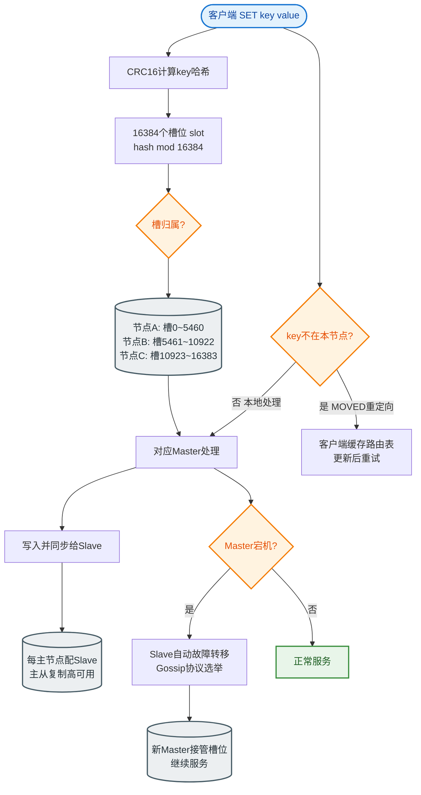

# Web Worker

### Web Worker

#### 1. 概念
Web Worker 是 HTML5 提供的技术，它为 JavaScript 创造了**多线程**环境。允许主线程创建 Worker 线程，将一些计算密集型或高延迟的任务分配给后者运行，主线程继续运行，两者互不干扰。

#### 2. 作用
*   解决单线程阻塞问题，避免复杂计算导致页面卡顿（假死）。
*   利用多核 CPU 的能力。

#### 3. 使用限制
*   **同源限制**：Worker 线程加载的脚本必须与主线程同源。
*   **DOM 限制**：Worker 线程所在的全局对象不是 `window`，而是 `DedicatedWorkerGlobalScope`。**无法读取主线程的 DOM 对象**，也无法使用 `document`、`window`、`parent` 对象。
*   **通信限制**：主线程和 Worker 线程不在同一个上下文，不能直接通信，必须通过消息传递 (`postMessage`)。数据是**拷贝**而非共享（除非使用 SharedArrayBuffer）。
*   **脚本限制**：Worker 不能执行 `alert()` 或 `confirm()`，但可以发出 Ajax 请求和访问 `navigator`、`location` 对象（只读部分）。

#### 4. 使用流程
1.  主线程通过 `new Worker(url)` 创建 Worker。
2.  主线程通过 `worker.postMessage(data)` 发送数据。
3.  Worker 内部通过 `onmessage` 接收数据，进行处理。
4.  Worker 处理完后通过 `postMessage(result)` 发回结果。
5.  主线程通过 `worker.onmessage` 接收结果。
6.  主线程通过 `worker.terminate()` 或 Worker 内部 `self.close()` 关闭线程。

#### 5. 数据通信模型

```text
      主线程               Web Worker
      (Main)                 (Thread)
       │  │                       │
       │  │  postMessage(data)    │
       │  │ ─────────────────────>│
       │  │    (序列化/拷贝)      │
       │  │                       │  onmessage
       │  │                       │  [计算处理...]
       │  │                       │
       │  │ postMessage(result)  │
       │  │ <─────────────────────│
       │  │    (反序列化)         │
       │  │                       │
```

*   **Transferable Objects**：为了解决大数据拷贝的性能问题，可以使用 `Transferable` 对象（如 ArrayBuffer），将数据的**所有权**转移而不是拷贝，实现零拷贝传输。

#### 6. Worker 类型
*   **Dedicated Workers**：专用 Worker，仅被创建它的页面使用。
*   **Shared Workers**：共享 Worker，可被多个同源页面共享（通过端口通信）。
*   **Service Workers**：用于网络代理和缓存，属于特殊的 Worker。

## 常见考点
1.  **Web Worker 为什么不能操作 DOM？**（考察点：线程安全，DOM 不是线程安全的，多线程操作会导致冲突）
2.  **主线程和 Worker 之间如何通信？大数据传输如何优化？**（考察点：postMessage，Transferable Objects 实现零拷贝）
3.  **Web Worker 和 SharedWorker 的区别？**（考察点：专用 vs 跨页面共享）
4.  **如何终止 Worker？**（考察点：terminate 方法和 self.close 的区别）。


## 核心流程图


## 记忆要点

- 本质是JS多线程环境，主线程分配计算密集任务，解决页面阻塞卡顿
- 因为DOM非线程安全，所以Worker被严禁操作DOM和window/document对象
- 主线程与Worker通过postMessage通信，数据默认被拷贝而非共享
- 大数据传输优化：使用Transferable对象转移所有权，实现零拷贝
- 主线程terminate()或内部self.close()均可终止Worker运行

## 结构化回答

**30 秒电梯演讲：** JS创建后台线程处理耗时任务的多线程方案。打个比方，主线程是大厨，负责炒菜（UI交互）；Worker是帮厨，负责洗菜切菜（计算），互不干扰，配合默契。

**展开框架：**
1. **本质是JS多线程环境** — 主线程分配计算密集任务，解决页面阻塞卡顿
2. **Worker被严禁操作DOM和window/do** — 因为DOM非线程安全，所以Worker被严禁操作DOM和window/document对象。
3. **主线程与Worker通过postMessage通** — 信，数据默认被拷贝而非共享
**收尾：** 这三点都能配合实战聊。您想深入聊原理、对比还是避坑？

## 视频脚本

> 预计时长：3 分钟 | 由浅入深

| 时间 | 画面/字幕 | 口播台词 | 讲解要点 |
|------|----------|----------|----------|
| 0:00 | 标题卡：Web Worker | "Web Worker？一句话——主线程是大厨，负责炒菜（UI交互）；Worker是帮厨，负责洗菜切菜（计算），互不干扰，配合默契。" | 开场钩子 |
| 0:45 | 概念动画/示意图 | "JS创建后台线程处理耗时任务的多线程方案——主线程是大厨，负责炒菜（UI交互）；Worker是帮厨，负责洗菜切菜（计算），互不干扰，配合默契" | 核心定义 |
| 1:30 | 本质是JS多线程环境示意 | "主线程分配计算密集任务，解决页面阻塞卡顿" | 要点1 |
| 2:15 | 要点2图解示意 | "因为DOM非线程安全，所以Worker被严禁操作DOM和window/document对象。" | 要点2 |
| 3:00 | 总结卡 | "记住这几条，面试不慌。下期讲进阶追问。" | 收尾 |
