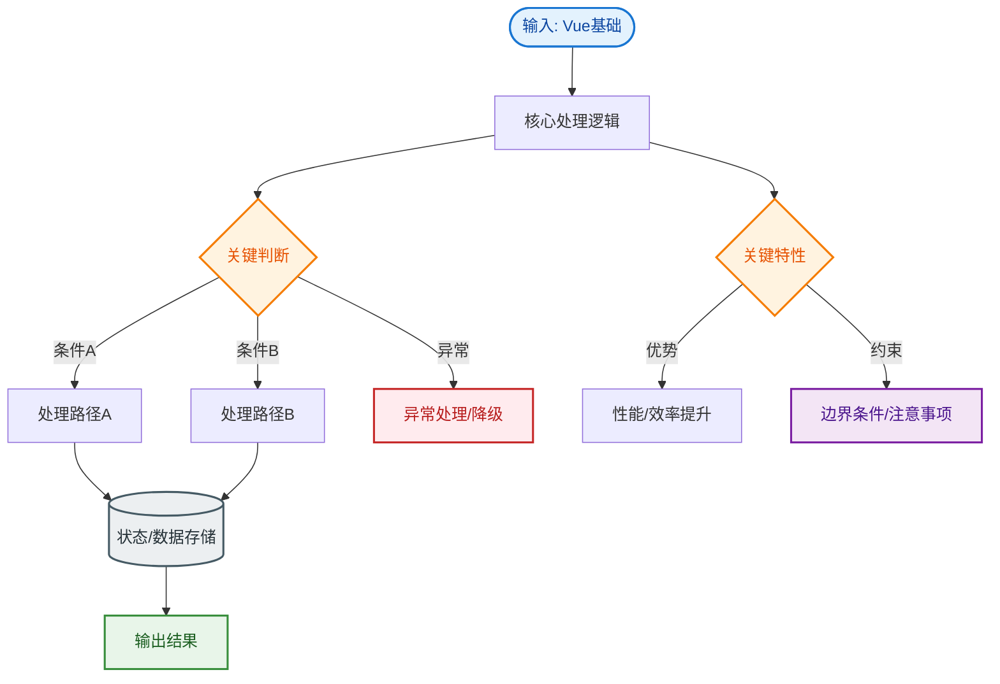

# Vue基础

### Vue 基础

#### 1. MVVM 模式
*   **Model**：数据模型。
*   **View**：UI 视图。
*   **ViewModel**：连接 Model 和 View 的桥梁。
    *   实现**双向数据绑定**：View 变化自动更新 Model，Model 变化自动更新 View。
    *   开发者只需关注业务逻辑，无需手动操作 DOM。

#### 2. Vue 核心特性
*   **响应式原理**：
    *   Vue 2.x：使用 `Object.defineProperty` 进行数据劫持。
        *   **局限性**：无法检测对象属性的添加/删除，无法监控数组下标的变化（需用 `Vue.set` / `$set`）。
    *   Vue 3.x：使用 `Proxy` 代理整个对象，性能更好，支持数组索引和对象新增属性的监听。
*   **虚拟 DOM (Virtual DOM)**：
    *   用 JS 对象模拟 DOM 树。
    *   通过 Diff 算法比较新旧虚拟 DOM，最小化真实 DOM 操作，提高性能。
*   **组件化**：将页面拆分为独立、可复用的组件。

#### 3. 常见指令

**v-if vs v-show**
*   **v-if**：真正的条件渲染。切换时会销毁/重建组件，**惰性**（初始为 false 不渲染），有更高的**切换消耗**。
*   **v-show**：通过 CSS `display: none` 控制显隐。无论初始真假都会渲染，有更高的**初始渲染消耗**。
*   **场景**：频繁切换用 `v-show`；条件很少改变用 `v-if`。

**v-if 与 v-for 的使用**
*   **Vue 2**：`v-for` 优先级高于 `v-if`。同时使用会导致每次循环都判断 `v-if`，浪费性能。
    *   *解决方案*：使用 `computed` 提前过滤数据，或使用 `<template>` 包裹 `v-for`。
*   **Vue 3**：`v-if` 优先级高于 `v-for`。同时使用会导致 `v-if` 无法访问 `v-for` 中的变量，编译会报错。

#### 4. Vue 优势与劣势
*   **优势**：
    *   双向绑定简化开发。
    *   中文文档完善，学习曲线平缓。
    *   虚拟 DOM 提升性能。
*   **劣势**：
    *   相比 React 生态，大型应用案例略少（但在国内主流）。

#### 5. Vue 2.x 响应式原理流程图

```text
     [Data Object]
          │
          ▼
  ┌───────────────────────┐
  │  Observer (数据劫持)   │
  │  Object.defineProperty │
  └───────────┬───────────┘
              │ getter/setter
              │
              ▼
     [Dep (依赖收集)]
      /       |       \
     /        |        \
    ▼         ▼         ▼
[Watcher1] [Watcher2] [Watcher...]
 (组件)     (计算属性)    (侦听器)
```

#### 6. Vue 3.x 响应式原理改进
*   使用 `Proxy` 替代 `Object.defineProperty`，解决了无法监听数组变化和对象新增属性的问题。
*   引入 `target` (weakMap) 来存储依赖，解决了内存泄漏问题（2.x 中如果组件销毁但依赖未清理可能导致泄漏）。

## 常见考点
1.  **Vue 2 和 Vue 3 响应式原理的区别？**（考察点：Object.defineProperty vs Proxy，Proxy 的优势）
2.  **nextTick 的作用和原理？**（考察点：DOM 更新是异步的，nextTick 用于在 DOM 更新后执行回调，原理利用微任务队列如 Promise.then）
3.  **computed 和 watch 的区别？**（考察点：computed 有缓存且必须是同步副作用，watch 适合执行异步或昂贵开销，无缓存）
4.  **组件生命周期（父子组件）的执行顺序？**（考察点：加载时父 beforeCreate -> 父 created -> 父 beforeMount -> 子 beforeCreate... -> 子 mounted -> 父 mounted；销毁时反之）。


## 核心流程图


## 记忆要点

- 核心理念MVVM：ViewModel双向绑定数据与视图，开发者无需手动操作DOM
- 响应式对比：Vue2用defineProperty(需重写数组方法)，Vue3用Proxy(直接监听增删)
- 指令对比：v-if真实销毁重建(适合不频繁切换)，v-show仅改display(适合频繁切换)
- Vue2的v-for优先级高于v-if，Vue3则反之，同时用极易报错或浪费性能
- 计算属性computed有缓存且同步，watch无缓存适合异步或开销大的操作

## 结构化回答

**30 秒电梯演讲：** 基于MVVM模式、采用虚拟DOM和响应式系统的渐进式前端框架。打个比方，Vue像个智能装修队，你说要改墙（数据变化），它自动计算并只动该动的地方（虚拟DOM+Diff），你不用自己搬砖（操作DOM）。

**展开框架：**
1. **核心理念MVVM** — ViewModel双向绑定数据与视图，开发者无需手动操作DOM
2. **响应式对比** — Vue2用defineProperty(需重写数组方法)，Vue3用Proxy(直接监听增删)
3. **指令对比** — v-if真实销毁重建(适合不频繁切换)，v-show仅改display(适合频繁切换)

**收尾：** 这三点都能配合实战聊。您想深入聊原理、对比还是避坑？

## 视频脚本

> 预计时长：4 分钟 | 由浅入深

| 时间 | 画面/字幕 | 口播台词 | 讲解要点 |
|------|----------|----------|----------|
| 0:00 | 标题卡：Vue基础 | "Vue基础？一句话——Vue像个智能装修队，你说要改墙（数据变化），它自动计算并只动该动的地方（虚拟DOM+Diff），你不用自己搬砖（操作DOM）。" | 开场钩子 |
| 0:48 | 概念动画/示意图 | "基于MVVM模式、采用虚拟DOM和响应式系统的渐进式前端框架——Vue像个智能装修队，你说要改墙（数据变化），它自动计算并只动该动的地方（虚拟DOM+Diff），你不用自己搬砖（操作DOM）" | 核心定义 |
| 1:36 | 核心理念示意 | "ViewModel双向绑定数据与视图，开发者无需手动操作DOM" | 要点1 |
| 2:24 | 响应式对比示意 | "Vue2用defineProperty(需重写数组方法)，Vue3用Proxy(直接监听增删)" | 要点2 |
| 3:12 | 指令对比示意 | "v-if真实销毁重建(适合不频繁切换)，v-show仅改display(适合频繁切换)" | 要点3 |
| 4:00 | 总结卡 | "记住这几条，面试不慌。下期讲进阶追问。" | 收尾 |
