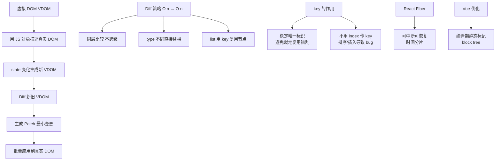

# 虚拟DOM

### 虚拟 DOM (Virtual DOM)

#### 1. 概念
虚拟 DOM 是一个用 JavaScript 对象来描述真实 DOM 树结构的抽象映射。它是一个轻量级的 JS 对象，包含了标签名、属性、子元素等信息。

```javascript
// 真实 DOM
<div id="app">
  <p class="text">hello</p>
</div>

// 虚拟 DOM (简化版)
{
  tag: 'div',
  props: { id: 'app' },
  children: [
    { tag: 'p', props: { class: 'text' }, children: ['hello'] }
  ]
}
```

#### 2. 作用与优势
*   **提升性能（Diff 算法 + 批量更新）**：
    *   DOM 操作昂贵（重排重绘）。直接频繁操作 DOM 性能差。
    *   虚拟 DOM 相当于 JS 缓存。当数据变化时，生成新的虚拟 DOM 树。
    *   通过 **Diff 算法** 计算出最小变更（Patch），然后将这些变更**批量**应用到真实 DOM，减少重绘和回流次数。
    *   **关键点**：直接操作 DOM 10 次可能引起 10 次回流，而虚拟 DOM 计算后可能只操作 DOM 1 次。
*   **跨平台能力**：
    *   虚拟 DOM 本质是 JS 对象，不依赖具体的 DOM API。
    *   ReactDOM 负责渲染成 DOM；React Native 负责渲染成原生组件；甚至可以渲染到 Canvas、终端等。
    *   实现了 "Learn Once, Write Anywhere"。
*   **开发体验**：声明式编程，开发者只需关注状态到视图的映射，无需手动操作 DOM。

#### 3. 劣势
*   **初始化开销**：初次渲染时，需要将 DOM 模板或 JSX 编译为虚拟 DOM，增加了初始化计算时间。
*   **极致场景性能**：对于极少量的一次性 DOM 操作（如只修改一个文本节点），直接操作 DOM 可能比虚拟 DOM 更快（省去了 Diff 计算和对象创建的过程）。
*   **内存占用**：维护虚拟 DOM 树需要额外的内存开销（双重缓存）。

#### 4. 虚拟 DOM 的创建流程

```text
JSX / Template
    │
    ▼ (Babel / Vue Compiler)

h() / createElement() 函数调用
    │
    ▼

VNode (虚拟节点树)
    │
    ▼

真实 DOM
```

---

## 常见考点
1.  **虚拟 DOM 一定比真实 DOM 快吗？**：答案是否定的。强调其优势在于批量操作后的整体性能，以及开发效率和跨平台能力。
2.  **key 的作用**：在虚拟 DOM Diff 过程中，key 是节点唯一标识，用于判断节点是否可复用（具体在 Diff 算法题中详述）。
3.  **Patch Flags（Vue 3 优化）**：Vue 3 在编译时会标记静态节点和动态节点，Diff 时跳过静态节点，进一步提升虚拟 DOM 的性能。


## 核心架构图


## 记忆要点

- 概念一句话：用轻量级JS对象描述真实DOM树结构的抽象映射
- 核心优势：通过Diff算法计算最小变更再批量更新真实DOM，减少回流重绘
- 跨平台能力：脱离浏览器API依赖，使一套代码可渲染DOM、移动原生或Canvas
- 辟谣：虚拟DOM不一定比直接操作原生DOM快(存在Diff计算和创建对象开销)
- Vue3编译优化：Patch Flags静态标记，Diff时直接跳过静态节点只比对动态节点

## 结构化回答

**30 秒电梯演讲：** 用JS对象模拟DOM树，通过Diff算法批量更新真实DOM。打个比方，修房子时，先在图纸上画好计划（虚拟DOM），对比新旧图纸算出差异（Diff），然后只派人去搬动需要动的砖块（真实DOM），而不是推倒重建。

**展开框架：**
1. **概念一句话** — 用轻量级JS对象描述真实DOM树结构的抽象映射
2. **核心优势** — 通过Diff算法计算最小变更再批量更新真实DOM，减少回流重绘
3. **跨平台能力** — 脱离浏览器API依赖，使一套代码可渲染DOM、移动原生或Canvas

**收尾：** 这三点都能配合实战聊。您想深入聊原理、对比还是避坑？

## 视频脚本

> 预计时长：4 分钟 | 由浅入深

| 时间 | 画面/字幕 | 口播台词 | 讲解要点 |
|------|----------|----------|----------|
| 0:00 | 标题卡：虚拟DOM | "虚拟DOM？一句话——修房子时，先在图纸上画好计划（虚拟DOM），对比新旧图纸算出差异（Diff），然后只派人去搬动需要动的砖块（真实DOM），而不是推倒重建。" | 开场钩子 |
| 0:48 | 概念动画/示意图 | "用JS对象模拟DOM树，通过Diff算法批量更新真实DOM——修房子时，先在图纸上画好计划（虚拟DOM），对比新旧图纸算出差异（Diff），然后只派人去搬动需要动的砖块（真实DOM），而不是推倒重建" | 核心定义 |
| 1:36 | 概念一句话示意 | "用轻量级JS对象描述真实DOM树结构的抽象映射" | 要点1 |
| 2:24 | 核心优势示意 | "通过Diff算法计算最小变更再批量更新真实DOM，减少回流重绘" | 要点2 |
| 3:12 | 跨平台能力示意 | "脱离浏览器API依赖，使一套代码可渲染DOM、移动原生或Canvas" | 要点3 |
| 4:00 | 总结卡 | "记住这几条，面试不慌。下期讲进阶追问。" | 收尾 |
