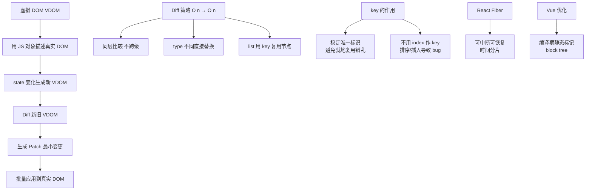

# DIFF 算法

### Diff 算法

#### 1. 作用
Diff 算法用于比较新旧两个虚拟 DOM 树，找出它们之间的差异，并生成补丁对象，最后高效地更新到真实 DOM。

#### 2. 核心优化策略（时间复杂度 O(n)）
传统的树 Diff 算法复杂度是 O(n^3)，对于前端动辄上千个节点的 DOM 不可接受。前端框架（Vue/React）通过以下**策略性假设**将复杂度降低到 O(n)：

1.  **只比较同层级节点**：
    *   不会跨层级比较。如果发现节点层级变了（如父节点变子节点），直接销毁旧节点及子节点，创建新节点。
    *   这保证了只需要遍历树的一层。

2.  **标签不同，直接删除重建**：
    *   如果两个节点的标签不同（如 `div` 变 `p`），则认为差异巨大，直接删除旧的及其子节点，插入新的，不比较子节点。

3.  **Key 的作用**：
    *   **有 Key**：如果标签和 Key 都相同，则认为是同一个节点，复用节点（DOM 节点复用，仅更新属性）并进行递归比较子节点。Key 最好是唯一且稳定的 ID（如数据 id），避免使用 index。
    *   **无 Key**：Vue (Vue 2) 会尽可能复用同类型的 DOM 节点，导致数据状态错位（如 Input 输入内容错乱）。React 会警告并销毁重建。

#### 3. Vue 2 与 Vue 3 的 Diff 算法区别

**Vue 2：双端 Diff**
*   **策略**：同时从新旧列表的「头头」、「尾尾」、「头尾」、「尾头」四个方向进行比较，寻找相同节点并移动。
*   **过程**：
    1.  OldStartIdx vs NewStartIdx (头头)
    2.  OldEndIdx vs NewEndIdx (尾尾)
    3.  OldStartIdx vs NewEndIdx (头尾)
    4.  OldEndIdx vs NewStartIdx (尾头)
*   如果以上四种都不匹配，则查找 Key。

**Vue 3：快速 Diff + 最长递增子序列**
*   **策略**：
    1.  先处理头部相同的节点。
    2.  再处理尾部相同的节点。
    3.  处理「新增」或「未知」的节点。
    4.  对于中间乱序的部分，计算**最长递增子序列 (LIS)**。
*   **优势**：最长递增子序列算法可以计算出最少移动次数，将需要移动的节点数量降到最低，性能优于双端比较。

#### 4. Diff 流程图解 (简化版)

```text
旧 VNode: [A, B, C, D]
新 VNode: [D, A, B, C]

步骤 1: 同层比较
步骤 2: 检查 Key 和 Tag
   ├─ 相同 -> 复用 DOM, 递归 Diff 子节点
   └─ 不同 -> 销毁旧 DOM, 创建新 DOM
```

---

## 常见考点
1.  **为什么不能用 index 做 key？**：若列表发生逆序、插入或删除操作，index 会变化，导致 Diff 算法误判为节点变化而复用错误的 DOM，且无法利用 Diff 算法的复用优势，导致性能下降甚至状态错误。
2.  **最长递增子序列在 Vue 3 Diff 中的意义**：用于确定中间乱序节点中哪些不需要移动，从而只需要移动剩余的节点。
3.  **React 的 Diff 策略**：React 仅进行同层比较，且默认只检查数组下标 0 的位置是否复用，对于无 Key 的列表通常会直接重新渲染子组件（虽然有 key 也会 Diff，但 React 的启发式算法更简单，主要是单指针遍历）。


## 核心架构图



## 记忆要点

- 因为传统树Diff是O(n³)，框架靠策略降至O(n)：仅同层比较、标签不同直接删建
- Key的核心作用：节点唯一标识，判断是否可复用，避免用index作为key导致状态错位
- Vue2双端Diff：头头、尾尾、头尾、尾头四面比较寻找可复用节点
- Vue3快速Diff：首尾预处理相同节点，中间乱序部分计算最长递增子序列(LIS)减少移动
- 采用LIS的目的：精准找到无需移动的节点，将DOM操作移动次数降至最低

## 结构化回答


**30 秒电梯演讲：** 像查重作业，只对比同一段落的句子（同层），如果标题变了直接换篇写（标签不同），如果每个人的名字（Key）对上了，就只改变动的字。

**展开框架：**
1. **时间复杂度O(n)** — 时间复杂度O(n)，只比较同层级节点
2. **标签不同直接** — 标签不同直接销毁重建
3. **Key** — Key是节点唯一标识，辅助高效复用

**收尾：** 这是我实战中的理解，您想深入哪一段？


## 视频脚本

> 预计时长：3 分钟 | 由浅入深

| 时间 | 画面/字幕 | 口播台词 | 讲解要点 |
|------|----------|----------|----------|
| 0:00 | 标题卡：DIFF 算法 | "DIFF 算法？一句话——像查重作业，只对比同一段落的句子（同层），如果标题变了直接换篇写（标签不同），如果每个人的名字（Key）对上了，就只改变动的字。" | 开场钩子 |
| 0:45 | 概念动画/示意图 | "高效比较新旧虚拟DOM差异的算法——像查重作业，只对比同一段落的句子（同层），如果标题变了直接换篇写（标签不同），如果每个人的名字（Key）对上了，就只改变动的字" | 核心定义 |
| 1:30 | 要点1图解示意 | "框架靠策略降至O(n)：仅同层比较、标签不同直接删建" | 要点1 |
| 2:15 | Key的核心作用示意 | "节点唯一标识，判断是否可复用，避免用index作为key导致状态错位" | 要点2 |
| 3:00 | 总结卡 | "记住这几条，面试不慌。下期讲进阶追问。" | 收尾 |
