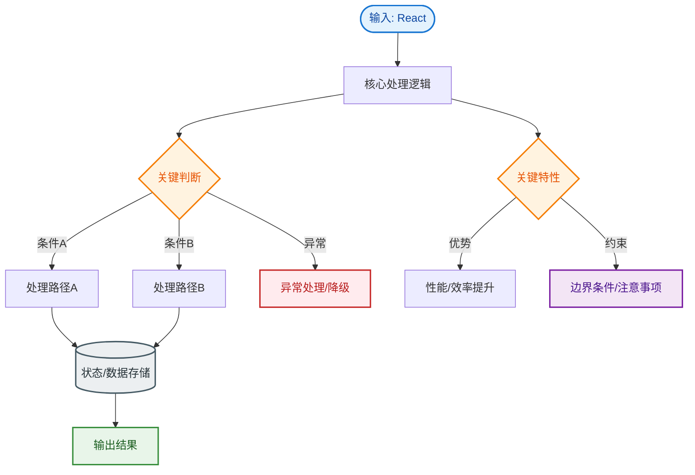
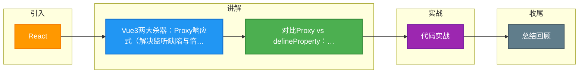

# React

### React & Vue 3 新特性与原理

#### 1. Vue 3 核心改进
*   **性能提升**：
    *   **响应式原理**：从 `Object.defineProperty` 改为 **`Proxy`**。
        *   **优势**：解决了无法监听数组索引变化、对象属性新增/删除的问题，且不需要初始化递归遍历，性能更好。
        *   **惰性代理**：只有访问到深层对象时才会进行代理，而非一开始就递归到底。
    *   **编译优化**：引入 Patch Flags（静态标记），Diff 算法只对比动态节点，跳过静态内容的比对。
*   **Composition API**：
    *   解决 Vue 2 Options API (`data`, `methods`, `computed` 分散) 导致的逻辑复用难、代码维护难问题。
    *   使用 `setup()`，将相关逻辑组合在一起，便于提取 Hooks 复用和 TypeScript 类型推断。
*   **TypeScript 支持**：源码使用 TypeScript 重写，提供完美的类型支持。
*   **Tree-shaking**：移除未使用的 API（如 `filter`, `inline-template`），打包体积更小。
*   **Fragments**：支持多个根节点（Template 允许多个标签）。
*   **Teleport**：允许组件将一部分模板传送到 DOM 的其他位置（如 `body` 下），常用于模态框。

#### 2. Vue 3 响应式原理：Proxy vs defineProperty
*   **Object.defineProperty (Vue 2)**：
    *   只能劫持对象属性，需遍历对象每个属性。
    *   无法监听数组索引变化和 `length` 变化（需重写数组方法 `push`, `pop` 等来 hack）。
    *   无法监听对象新增/删除属性（需用 `Vue.set` / `Vue.delete`）。
*   **Proxy (Vue 3)**：
    *   劫持整个对象，支持 13 种拦截操作（`get`, `set`, `has`, `deleteProperty` 等）。
    *   直接支持数组监听、对象属性增删监听，无需特殊处理。
    *   **WeakMap 依赖收集**：使用 WeakMap 存储目标对象与响应式数据的映射，垃圾回收更友好。

#### 3. React 基础与核心特性
*   **JSX**：JavaScript 的语法扩展，允许在 JS 中写类似 HTML 的结构。本质是 `React.createElement` 的语法糖。Babel 会将其编译为函数调用。
*   **Components**：函数组件和类组件。推荐使用函数组件 + Hooks。
*   **单向数据流**：数据从父组件流向子组件，子组件通过回调函数向父组件通信。
*   **Virtual DOM**：同样使用虚拟 DOM 和 Diff 算法。
    *   **Fiber 架构**：React 16 引入。将渲染任务拆分为小的单元，利用浏览器空闲时间调度，实现了**时间切片** 和 **可中断渲染**，解决了大型应用更新卡顿问题。
*   **Hooks**：React 16.8 引入，如 `useState`, `useEffect`。
    *   **目的**：在不编写类的情况下，让函数组件拥有状态管理和生命周期特性，解决逻辑复用难题。
    *   **规则**：只能在顶层调用，不能在循环/条件判断中调用。

#### 4. React Fiber 简要流程

```text
Input (setState/Props)
    │
    ▼
Schedule Reconciliation (调度阶段 - 可中断)
    │ 
    ├─> 生成/更新 Fiber Node Tree
    └─> 计算差异 (Diff)
    │
    ▼
Commit Phase (提交阶段 - 不可中断)
    │
    ├─> Before Mutation (执行 getSnapshotBeforeUpdate 等)
    ├─> Mutation (操作真实 DOM)
    └─> Layout (执行 useEffect / useLayoutEffect)
```

---

## 常见考点
1.  **Vue 3 的 Proxy 监听数组性能细节**：询问 Vue 2 为何重写数组方法，Vue 3 如何直接拦截数组操作。
2.  **Fiber 架构解决了什么问题？**：重点回答“递归导致的栈溢出风险”和“主线程阻塞”，引出时间切片和任务优先级。
3.  **React Hooks 的闭包陷阱**：`useEffect` 中引用旧的 state 问题，以及如何通过依赖数组或函数式更新解决。
4.  **Vue 3 编译时的优化**：解释什么是 Patch Flags，以及为什么静态提升可以减少 diff 压力。


## 核心流程图


## 记忆要点

- Vue3两大杀器：Proxy响应式(解决监听缺陷与惰性代理)与Composition API(逻辑聚合复用)
- 对比Proxy vs defineProperty：Proxy拦截整个对象支持13种操作，无需遍历即可监听增删改
- React Fiber架构：拆分渲染任务为小单元，实现时间切片与可中断渲染解决卡顿
- Hooks规则铁律：只能在顶层调用，因为React靠调用顺序(链表)对应state，切勿放进条件判断
- 单向数据流：父传子用Props(只读)，子改父用回调函数触发，拒绝双向绑定

## 结构化回答

**30 秒电梯演讲：** 现代前端框架的核心特性与性能优化机制。打个比方，Proxy比defineProperty像升级版监控器，能全方位无死角监听（数组增删）；Composition API像把零散的工具按功能分组打包，比乱放抽屉（Options API）好找。

**展开框架：**
1. **Vue3两大杀器** — Proxy响应式(解决监听缺陷与惰性代理)与Composition API(逻辑聚合复用)
2. **对比Proxy vs defineProperty：Proxy拦截整个对象支持13种操作，无** — 需遍历即可监听增删改
3. **React Fiber架构** — 拆分渲染任务为小单元，实现时间切片与可中断渲染解决卡顿

**收尾：** 这三点都能配合实战聊。您想深入聊原理、对比还是避坑？

## 视频脚本

> 预计时长：3 分钟 | 由浅入深

| 时间 | 画面/字幕 | 口播台词 | 讲解要点 |
|------|----------|----------|----------|
| 0:00 | 标题卡：React | "React？一句话——Proxy比defineProperty像升级版监控器，能全方位无死角监听（数组增删）；Composition API像把零散的工具按功能分组打包，比乱放抽屉（Options API）好找。" | 开场钩子 |
| 0:45 | 概念动画/示意图 | "现代前端框架的核心特性与性能优化机制——Proxy比defineProperty像升级版监控器，能全方位无死角监听（数组增删）；Composition API像把零散的工具按功能分组打包，比乱放抽屉（Options API）好找" | 核心定义 |
| 1:30 | Vue3两大杀器示意 | "Proxy响应式(解决监听缺陷与惰性代理)与Composition API(逻辑聚合复用)" | 要点1 |
| 2:15 | 要点2图解示意 | "对比Proxy vs defineProperty：Proxy拦截整个对象支持13种操作，无" | 要点2 |
| 3:00 | 总结卡 | "记住这几条，面试不慌。下期讲进阶追问。" | 收尾 |

### 视频流程图



