# 基础语法层面

### Vue 3 vs Vue 2 & React 基础语法

#### 一、Vue3 和 Vue2 的区别

**1. 核心变化**
*   **Tree-shaking**：构建时可以更轻松地剔除没有使⽤的代码（如 `v-model`, `transition`），使得整体体积变⼩。
*   **Composition API**：引⼊了 `setup`，使得组件的逻辑更容易组织和复⽤，解决了 Options API 逻辑分散的问题。
*   **TypeScript 支持**：Vue 3 源码使⽤ TS 重写，提供更准确的类型推断和更丰富的类型定义。
*   **响应式系统提升**：使⽤ **Proxy** 替代 Object.defineProperty。
    *   可监听动态新增/删除属性。
    *   可监听数组索引和 `length` 变化。
    *   惰性代理，性能更优。
*   **编译优化**：
    *   Vue 2 通过标记静态根节点优化 diff。
    *   Vue 3 标记和提升所有静态根节点，diff 的时候只需要对⽐动态节点。
*   **Fragments**：Vue 3 的 template 模板⽀持多个根标签。
*   **生命周期变化**：`setup` 代替了 `beforeCreate` 和 `created`。其他生命周期钩子加上了 `on` 前缀（如 `onMounted`）。

**2. API 差异**
*   **Vuex/Pinia**：状态管理创建实例的⽅式改变，Vue 2 为 `new Store`，Vue 3 (Pinia) 为 `createStore` / `defineStore`。
*   **路由获取**：Vue 2 通过 `this` 获取 router 实例，Vue 3 通过 `useRouter` 和 `useRoute` 组合式函数获取。
*   **Props 的使⽤**：Vue 2 通过 `this` 获取 props，Vue 3 `setup` 中直接作为第一个参数接收。
*   **自定义事件**：Vue 3 在向⽗组件传回数据时，如使用的自定义名称，需要在 `emits` 选项中定义，便于声明式检查。

#### 二、为什么使⽤ Proxy 替换 defineProperty
*   **Object.defineProperty 局限性**：
    1.  **数组监听**：无法直接监测数组索引的变化和 `length` 属性的变化（Vue 2 只能通过重写数组方法 hack）。
    2.  **属性增删**：添加或删除属性并不会触发属性的 get 或 set 操作，无法监听（需用 `Vue.set/$delete`）。
    3.  **性能问题**：如果存在深层的嵌套对象关系，需要⼀开始就递归遍历监听，有性能开销。
*   **Proxy 优势**：
    1.  **拦截丰富**：提供 13 种拦截操作（`get`, `set`, `has`, `deleteProperty` 等），可以直接劫持整个对象。
    2.  **监听数组**：轻松实现递归观察整个对象树的变化，准确拦截数组变化。
    3.  **惰性代理**：不需要一开始就递归遍历，只有访问属性时才进行递归代理。

#### 三、React 基础与机制

**1. 对 React 的理解**
*   用于构建⽤户界面的 JS 库，具有：**JSX 语法**、**单向数据绑定**、**组件化开发**、**虚拟 DOM**、**声明式编程**。

**2. State vs Props**
*   **State**：组件内部的状态，是私有的、可变的。`setState` 调用后会触发组件重新渲染（异步批量更新）。
*   **Props**：属性，⽤于⽗⼦通信，是只读的。子组件不应修改 props，遵循“单向数据流”原则。

**3. JSX 是什么**
*   React 中用 JSX 语法描述视图，是一个看起来很像 XML 的 JavaScript 语法扩展。
*   **本质**：是 `React.createElement` 的语法糖。编译后变为普通函数调用，返回 React 元素（JS 对象）。
*   **防止注入攻击**：React DOM 在渲染前会转义所有内容，确保应用永不会注入那些不是自己明确写的内容（防止 XSS）。

**4. React 事件机制**
*   **合成事件**：React 不是将 click 事件直接绑定到真实 DOM 上，而是在 `document` 处监听了所有的事件（事件委托）。
*   **流程**：
    1.  事件冒泡到 `document`。
    2.  React 将原生浏览器事件包装成 `SyntheticEvent`（合成事件对象）。
    3.  触发对应的 React 事件处理函数。
*   **优点**：
    1.  **兼容性**：抹平了不同浏览器之间的差异（IE/Chrome/Firefox 事件对象不同）。
    2.  **性能**：使用事件委托，减少了事件监听器的数量，节省内存。
    3.  **对象池**：React 17 之前使用事件对象池，避免频繁创建和销毁对象（17 后已移除）。

---

## 常见考点
1.  **Vue 3 Composition API 解决了什么具体问题？**：不仅仅是为了复用，更是为了解决逻辑分散导致代码难以阅读和维护的问题，以及更好的 TypeScript 推断。
2.  **React 合成事件的执行顺序**：在 React 中，`document` 上的监听器比原生 DOM 上的监听器更晚触发（React 17 变更前是先捕获分发再冒泡，17 后改为不再在 document 上捕获，而是挂载在根容器上，模拟了完整的事件流）。
3.  **Vue 3 中 `emits` 选项的作用**：除了声明，还能起到类似 props 校验的作用，并且有助于更好的代码提示和文档生成。
4.  **State 更新的批处理**：React 18 之前在事件处理函数中是自动批处理，但在 Promise、setTimeout 等异步回调中不会。React 18 引入了 Automatic Batching，所有状态更新都会默认批处理。

## 核心架构图

```mermaid
flowchart TD
    classDef start fill:#4CAF50,color:#fff
    classDef process fill:#2196F3,color:#fff
    classDef decision fill:#FF9800,color:#fff
    classDef special fill:#9C27B0,color:#fff
    classDef error fill:#f44336,color:#fff
    classDef info fill:#607D8B,color:#fff
    class A start
    class API process
    class B decision
    class C special
    class Composables error
    class Composition info
    class D start
    class E process
    class F decision
    class Fragment special
    class G error
    class H info
    class Hooks start
    class I process
    class J decision
    class JSX special
    class K error
    class L info
    class M start
    class N process
    class O decision
    class Object special
    class Options error
    class P info
    class Proxy start
    class Q process
    class R decision
    class React special
    class S error
    class T info
    class Template start
    class Tree process
    class TypeScript decision
    class U special
    class V error
    class Vue info
    class Vue2 start
    class Vue3 process
    class br decision
    class computed special
    class data error
    class defineProperty info
    class methods start
    class on process
    class onMounted decision
    class onUpdated special
    class setup error
    class shaking info
    class vs start
    A[Vue 3 vs Vue 2] --> B[响应式系统]
    B --> C[Vue2: Object.defineProperty]
    C --> D[无法监听数组索引]
    C --> E[无法监听属性增删]
    C --> F[深层对象递归 性能差]
    B --> G[Vue3: Proxy]
    G --> H[代理整个对象]
    G --> I[支持增删/数组]
    G --> J[惰性响应式 性能优]
    A --> K[API 风格]
    K --> L["Options API<br/>data/methods/computed 分散"]
    K --> M["Composition API setup<br/>按功能聚合 可复用"]
    A --> N[其他改进]
    N --> O[多根节点 Fragment]
    N --> P[Tree-shaking 体积小]
    N --> Q[TypeScript 全面重写]
    N --> R[生命周期加 on 前缀<br/>onMounted/onUpdated]
    S[对比 React] --> T[JSX vs Template]
    S --> U[Hooks vs Composables]
    S --> V[合成事件 vs 原生事件]
```

## 记忆要点

- API组织对比：Options API逻辑分散，Composition API(setup)按业务聚合更易复用
- 生命周期更名：废弃beforeCreate/created，全面改为加上on前缀的钩子(如onMounted)
- defineProperty三大缺陷：无法监听数组索引、无法监听增删属性、深层对象初始化递归性能差
- JSX本质：XML的JS扩展，是React.createElement的语法糖，编译后变为普通函数调用
- React合成事件：将事件委托挂在document上，抹平浏览器差异，减少监听器节省内存

## 结构化回答

**30 秒电梯演讲：** Vue3通过源码重构与API升级，解决了性能、类型支持及代码组织问题。打个比方，Vue2像旧手机能跑但卡顿，Vue3像换了新处理器（Proxy）和模块化系统，更快更易维护。

**展开框架：**
1. **API组织对比** — Options API逻辑分散，Composition API(setup)按业务聚合更易复用
2. **生命周期更名** — 废弃beforeCreate/created，全面改为加上on前缀的钩子(如onMounted)
3. **defineProperty三大缺陷** — 无法监听数组索引、无法监听增删属性、深层对象初始化递归性能差

**收尾：** 这三点都能配合实战聊。您想深入聊原理、对比还是避坑？

## 视频脚本

> 预计时长：4 分钟 | 由浅入深

| 时间 | 画面/字幕 | 口播台词 | 讲解要点 |
|------|----------|----------|----------|
| 0:00 | 标题卡：基础语法层面 | "基础语法层面？一句话——Vue2像旧手机能跑但卡顿，Vue3像换了新处理器（Proxy）和模块化系统，更快更易维护。" | 开场钩子 |
| 0:48 | 概念动画/示意图 | "Vue3通过源码重构与API升级，解决了性能、类型支持及代码组织问题——Vue2像旧手机能跑但卡顿，Vue3像换了新处理器（Proxy）和模块化系统，更快更易维护" | 核心定义 |
| 1:36 | API组织对比示意 | "Options API逻辑分散，Composition API(setup)按业务聚合更易复用" | 要点1 |
| 2:24 | 生命周期更名示意 | "废弃beforeCreate/created，全面改为加上on前缀的钩子(如onMounted)" | 要点2 |
| 3:12 | 要点3图解示意 | "无法监听数组索引、无法监听增删属性、深层对象初始化递归性能差" | 要点3 |
| 4:00 | 总结卡 | "记住这几条，面试不慌。下期讲进阶追问。" | 收尾 |
