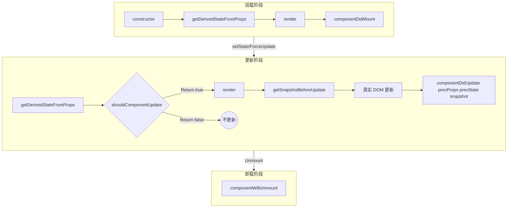

# React生命周期

React 生命周期主要分为挂载、更新和卸载三个阶段。React 16.3+ 引入了新的生命周期来替代旧的 Unsafe 生命周期，以适应异步渲染。

### 1. 挂载阶段

当组件实例被创建并插入到 DOM 中时，按顺序调用：

*   **constructor()**: 构造函数。用于初始化 state 或绑定方法。必须调用 `super(props)`。通常不在此处调用 `setState` 或进行副作用操作（如 AJAX 请求）。
*   **static getDerivedStateFromProps(props, state)**: 静态方法。在组件实例化及接收新 props 后调用。它应返回一个对象来更新 state，或者返回 null 不更新。**注意：** 此方法设计初衷极少使用，容易导致冗余代码，优先考虑派生状态。
*   **render()**: 纯函数。必须返回 React Element (JSX), Portal, null, boolean 或 string。不应在此处执行副作用。
*   **componentDidMount()**: 组件挂载完成后立即调用。**这是进行副作用操作的最佳时机**，如网络请求、订阅事件、DOM 操作（如初始化第三方库）。

### 2. 更新阶段

当组件的 props 或 state 发生变化时触发：

*   **static getDerivedStateFromProps(props, state)**: 同上。
*   **shouldComponentUpdate(nextProps, nextState)**: 在渲染前调用。默认返回 true。可通过返回 false 阻止组件更新，常用于性能优化（React.PureComponent 已内置浅比较）。
*   **render()**: 同上。
*   **getSnapshotBeforeUpdate(prevProps, prevState)**: 在最近一次渲染输出提交给 DOM 之前调用。它使得组件能在发生更改之前从 DOM 中捕获一些信息（例如滚动位置）。返回值将作为 `componentDidUpdate` 的第三个参数。
*   **componentDidUpdate(prevProps, prevState, snapshot)**: 组件更新后立即调用。在此处执行 DOM 操作或根据 props 变化发起网络请求（需注意比较条件防止死循环）。

### 3. 卸载阶段

*   **componentWillUnmount()**: 组件卸载及销毁之前调用。在此处执行必要的清理工作，如清除定时器、取消网络请求、移除事件监听器等。

### 生命周期架构图

### 4. 废弃的生命周期

以下生命周期在 React 17 中标记为 `UNSAFE_`，因为它们在异步渲染（Fiber）模式下可能导致数据一致性问题：

*   `componentWillMount` -> 被 `constructor` 或 `componentDidMount` 替代。
*   `componentWillReceiveProps` -> 被 `getDerivedStateFromProps` 或 `componentDidUpdate` 替代。
*   `componentWillUpdate` -> 被 `getSnapshotBeforeUpdate` 替代。

## 常见考点

1.  **`getDerivedStateFromProps` 的使用场景及陷阱？**
    *   **考点**：面试官会考察你是否知道它是一个静态方法（无法访问 `this`），以及派生 state 的反模式。正确的做法通常是完全受控组件或配合 `key` 重置组件，避免根据 props 复制到 state。
2.  **为什么请求要放在 `componentDidMount` 里？**
    *   **考点**：考察对渲染流程的理解。放在 `constructor` 或 `componentWillMount` 可能会导致阻塞首次渲染，且在服务端渲染（SSR）中 `componentWillMount` 会被调用两次（服务端一次，客户端一次），导致重复请求。`componentDidMount` 保证只有在客户端挂载后才执行一次。
3.  **`getSnapshotBeforeUpdate` 解决了什么问题？**
    *   **考点**：考察对异步渲染细节的理解。例如：在列表追加数据前获取当前的滚动高度，以便在 DOM 更新后恢复滚动位置，防止用户视觉上的跳动。

## 核心知识点图

## 记忆要点

- 三阶段速记：挂载、更新、卸载，每个阶段对应特定生命周期函数
- 挂载核心：constructor初始化 -> render -> 严禁在render产生副作用DOM操作
- 副作用时机：componentDidMount(挂载后)与componentDidUpdate(更新后)负责发请求/操作DOM
- 卸载必清场：componentWillUnmount必须清除定时器、解绑事件、取消请求防内存泄漏
- 性能优化点：shouldComponentUpdate返回false可阻断渲染，或直接用PureComponent浅比较

## 结构化回答

**30 秒电梯演讲：** 生命周期是组件从创建到销毁的各个阶段钩子，用于执行特定逻辑。打个比方，像产品从设计、生产、上架到下架的全过程，每个节点都有专门的处理任务。

**展开框架：**
1. **三阶段速记** — 挂载、更新、卸载，每个阶段对应特定生命周期函数
2. **挂载核心** — constructor初始化 -> render -> 严禁在render产生副作用DOM操作
3. **副作用时机** — componentDidMount(挂载后)与componentDidUpdate(更新后)负责发请求/操作DOM

**收尾：** 这三点都能配合实战聊。您想深入聊原理、对比还是避坑？

## 视频脚本

> 预计时长：4 分钟 | 由浅入深

| 时间 | 画面/字幕 | 口播台词 | 讲解要点 |
|------|----------|----------|----------|
| 0:00 | 标题卡：React生命周期 | "React生命周期？一句话——像产品从设计、生产、上架到下架的全过程，每个节点都有专门的处理任务。" | 开场钩子 |
| 0:48 | 概念动画/示意图 | "生命周期是组件从创建到销毁的各个阶段钩子，用于执行特定逻辑——像产品从设计、生产、上架到下架的全过程，每个节点都有专门的处理任务" | 核心定义 |
| 1:36 | 三阶段速记示意 | "挂载、更新、卸载，每个阶段对应特定生命周期函数" | 要点1 |
| 2:24 | 挂载核心示意 | "constructor初始化 -> render -> 严禁在render产生副作用DOM操作" | 要点2 |
| 3:12 | 副作用时机示意 | "componentDidMount(挂载后)与componentDidUpdate(更新后)负责发请求/操作DOM" | 要点3 |
| 4:00 | 总结卡 | "记住这几条，面试不慌。下期讲进阶追问。" | 收尾 |
