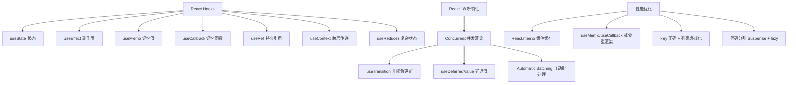

# React Hooks

React Hooks 是 React 16.8 引入的新特性，它允许你在不编写 class 的情况下使用 state 以及其他的 React 特性。

### 1. Hooks 的优势

*   **逻辑复用**：解决了 HOC（高阶组件）和 Render Props 导致的“嵌套地狱”问题，将关联逻辑拆分为独立的 Hook 函数。
*   **代码简洁**：函数组件写法更轻量，去除了 class 中繁琐的生命周期和 `this` 指向困扰。
*   **更好的关注点分离**：Class 组件中同一业务的逻辑往往分散在不同生命周期中（如订阅在 `componentDidMount`，取消订阅在 `componentWillUnmount`），而 Hook（如 `useEffect`）可以将相关逻辑聚合在一起。

### 2. 核心 Hooks 原理与细节

#### useState
*   **原理**：利用闭包和链表结构存储状态。React 根据 Hooks 调用顺序维护一个状态队列。
*   **返回数组的原因**：方便解构赋值自定义变量名。如果返回对象，用户必须使用 useState 内部定义的 key，使用别名会变得繁琐。

```javascript
const [count, setCount] = useState(0);
```

#### useEffect
*   **作用**：处理副作用（数据获取、订阅、DOM 操作）。相当于 `componentDidMount`, `componentDidUpdate` 和 `componentWillUnmount` 的组合。
*   **执行时机**：在浏览器完成绘制**之后**异步执行，不会阻塞页面渲染。
*   **依赖数组**：第二个参数为依赖项数组。空数组 `[]` 表示仅在挂载和卸载时执行；不传则每次渲染都执行。

#### useEffect 与 useLayoutEffect 的区别
*   **useEffect**：异步执行，不阻塞渲染。可能导致短暂闪烁（例如 DOM 更新前后的样式突变）。**优先使用**。
*   **useLayoutEffect**：**同步**执行，在 DOM 变更之后、浏览器绘制**之前**调用。会阻塞视觉更新，但可以避免闪烁。使用场景：读取 DOM 布局并同步重绘、避免闪烁的动画。

### 3. Hooks 的规则与实现机制

*   **只能在函数最外层调用**：不要在循环、条件判断或者子函数中调用。
    *   **原因**：React 是靠调用顺序来将 Hook 和组件状态关联的（链表结构）。如果在条件语句中调用，会导致顺序错乱，数据匹配错误。
*   **只能在 React 的函数组件中调用**：不要在普通 JS 函数中调用。

### Hooks 调用顺序示意图 (链表)

```text
组件实例
   │
   ▼
┌─────────────┐      ┌──────────────┐      ┌──────────────┐
│ Hook 1      │ ──► │ Hook 2       │ ──► │ Hook 3       │
│ (useState)  │      │ (useEffect)  │      │ (useMemo)    │
└─────────────┘      └──────────────┘      └──────────────┘
   ▲                    ▲                     ▲
   │                    │                     │
 索引 0               索引 1                 索引 2
```
如果第一次渲染顺序是 `[Hook1, Hook2]`，第二次渲染因为 `if` 条件跳过了 Hook1，React 会认为现在的 Hook1 是原来的 Hook2，导致状态错乱。

### 4. 常见性能优化 Hooks

*   **React.memo**：类似于 `PureComponent`，对 Props 进行浅比较，避免不必要的重新渲染。
*   **useMemo**：缓存计算结果。适用于昂贵的计算。
    ```javascript
    const memoizedValue = useMemo(() => computeExpensiveValue(a, b), [a, b]);
    ```
*   **useCallback**：缓存函数引用。通常用于传递给经过优化的子组件，防止子组件因父组件传

---

### 深化内容

#### 实战案例
在实际开发中，**旧版 React Class 组件的 `setState` 在 `setTimeout` 或异步回调中是同步更新的**，很容易导致“状态覆盖” Bug。而 Hooks 的 `setState`（即 `useState` 返回的 dispatch）始终是异步批处理的，**不需要**手动像 Class 那样写 `this.setState((prev) => prev + 1)` 回调形式来防止覆盖，代码心智负担更小，但在 DOM 操作时机上需更加注意 `useEffect` 的异步特性。

#### 代码示例：自定义 Hook 封装通用逻辑（防抖）
```javascript
import { useState, useEffect } from 'react';

function useDebounce(value, delay) {
  const [debouncedValue, setDebouncedValue] = useState(value);
  useEffect(() => {
    const handler = setTimeout(() => setDebouncedValue(value), delay);
    return () => clearTimeout(handler); // 清理上一次的定时器
  }, [value, delay]);
  return debouncedValue;
}
```

#### 对比表格：Class 组件 vs Hooks 组件

| 特性 | Class 组件 | Hooks (函数组件) |
| :--- | :--- | :--- |
| **逻辑复用** | HOC / Render Props (容易嵌套地狱) | 自定义 Hooks (扁平组合) |
| **逻辑聚合** | 分散在 componentDidMount/Update | 聚合在 useEffect / 自定义 Hook |
| **this 指向** | 需要手动 bind，容易出错 | 无 this，闭包陷阱是主要难点 |
| **代码量** | 冗余 (构造函数、render) | 简洁，逻辑密度高 |
| **性能优化** | PureComponent / shouldComponentUpdate | React.memo / useMemo / useCallback |
| **调试** | Stack trace 包含类名 | Stack trace 常显示匿名函数 (需用函数名解决) |


## 核心架构图


## 记忆要点

- 核心价值：解决HOC嵌套地狱，将分散的生命周期逻辑聚合，告别繁琐的this指向
- 执行时机对比：useEffect异步绘制后执行不卡顿，useLayoutEffect同步绘制前执行防闪烁
- 依赖数组规则：不传每次执行，传[]仅挂载执行，传具体变量[a,b]仅当它们改变时执行
- 铁律：绝不在循环或条件中调用Hook，因为React全靠调用顺序链表来匹配state状态
- 性能优化组件：React.memo拦截组件重渲染，useMemo缓存计算值，useCallback缓存函数引用

## 结构化回答

**30 秒电梯演讲：** Hooks 是函数组件中使用状态和副作用的机制，解决类组件逻辑复用难问题。打个比方，像给工具箱加装了插座（Hooks），函数组件不再只是展示，也能通电（状态）运作。

**展开框架：**
1. **核心价值** — 解决HOC嵌套地狱，将分散的生命周期逻辑聚合，告别繁琐的this指向
2. **执行时机对比** — useEffect异步绘制后执行不卡顿，useLayoutEffect同步绘制前执行防闪烁
3. **依赖数组规则** — 不传每次执行，传[]仅挂载执行，传具体变量[a,b]仅当它们改变时执行

**收尾：** 这三点都能配合实战聊。您想深入聊原理、对比还是避坑？

## 视频脚本

> 预计时长：3 分钟 | 由浅入深

| 时间 | 画面/字幕 | 口播台词 | 讲解要点 |
|------|----------|----------|----------|
| 0:00 | 标题卡：React Hooks | "React Hooks？一句话——像给工具箱加装了插座（Hooks），函数组件不再只是展示，也能通电（状态）运作。" | 开场钩子 |
| 0:45 | 概念动画/示意图 | "Hooks 是函数组件中使用状态和副作用的机制，解决类组件逻辑复用难问题——像给工具箱加装了插座（Hooks），函数组件不再只是展示，也能通电（状态）运作" | 核心定义 |
| 1:30 | 核心价值示意 | "解决HOC嵌套地狱，将分散的生命周期逻辑聚合，告别繁琐的this指向" | 要点1 |
| 2:15 | 执行时机对比示意 | "useEffect异步绘制后执行不卡顿，useLayoutEffect同步绘制前执行防闪烁" | 要点2 |
| 3:00 | 总结卡 | "记住这几条，面试不慌。下期讲进阶追问。" | 收尾 |
