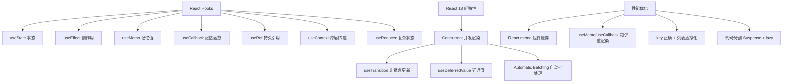

# React18新特性

React 18 带来了许多新特性，核心重点是并发渲染和更好的用户体验。

### 1. 并发渲染

*   **定义**：Concurrent Mode 并不是让 React 渲染变快，而是让 React 的渲染变得**可中断**。React 18 默认开启并发特性。
*   **核心机制**：React 可以在渲染过程中暂停、恢复甚至丢弃渲染工作，优先响应用户的高优先级交互（如输入、点击），然后再继续处理低优先级的渲染任务（如列表过滤计算）。
*   **API 变更**：使用 `createRoot` 替代 `ReactDOM.render`。

### 2. 自动批处理

*   **现象**：在 React 18 之前，只有在 React 事件处理函数中才会自动批处理 `setState`。在 Promise、setTimeout 或原生事件中，多次 `setState` 会导致多次渲染。
*   **改进**：React 18 将**所有**更新（包括 Promise、setTimeout、原生事件）都默认进行了批处理，减少了不必要的渲染。

```javascript
// React 18 之前：在 setTimeout 中会导致两次 render
setTimeout(() => {
  setCount(c => c + 1);
  setFlag(f => !f);
}, 0);

// React 18 之后：只会渲染一次
setTimeout(() => {
  setCount(c => c + 1);
  setFlag(f => !f);
}, 0);
```

*   **退出批处理**：如果某些场景下需要强制同步更新（例如立即读取 DOM），可以使用 `flushSync`。

### 3. Suspense

*   **作用**：允许组件在数据加载完成前“等待”，并显示加载状态。它不仅适用于代码分割，也适用于数据获取。
*   **配合使用**：常与 `lazy` (懒加载) 和 Relay 等数据获取库配合使用。

### 4. Transitions (过渡)

*   **用途**：区分“紧急”更新和“非紧急”更新。
*   **startTransition**：用于标记非紧急的 UI 更新（如输入搜索框后，筛选列表的操作是低优先级的，但输入框本身的字显示是高优先级的）。React 会优先处理紧急更新，保持界面流畅。

## 常见考点

1.  **React 18 的 setState 还是异步的吗？**
    *   **考点**：回答“是的，但更智能了”。React 18 引入了 Automatic Batching，在更多场景下是异步批处理的，以提升性能。但可以通过 `flushSync` 强制同步。
2.  **什么是并发模式？它解决了什么问题？**
    *   **考点**：解释可中断渲染。解决的问题是 CPU 密集型任务阻塞用户交互（掉帧、卡顿），通过时间切片和优先级调度，提升用户体验。
3.  **StrictMode 在 React 18 有什么变化？**
    *   **考点**：React 18 的 StrictMode 会**双重调用**组件的 `render`、`useState` 初始化器等（仅开发环境），目的是帮助开发者发现副作用问题，确保组件在并发环境下多次调用也能正常工作。

---

### 深化内容

#### 实战案例
在开发**搜索联想**功能时，输入框是高频触发更新（紧急），而后端接口请求和列表渲染耗时较长（非紧急）。如果直接在 `onChange` 中 `setList`，用户每敲一个字都会导致请求排队，造成输入卡顿。使用 `startTransition` 包裹列表更新，可以让输入框始终保持 60fps 流畅，而列表在 CPU 空闲时自动更新，且旧请求会被自动取消，极大提升体验。

#### 代码示例：startTransition 使用
```javascript
import { startTransition, useState } from 'react';

const SearchInput = () => {
  const [input, setInput] = useState('');
  const [list, setList] = useState([]);

  const handleChange = (e) => {
    const value = e.target.value;
    setInput(value); // 紧急更新：立即响应输入

    startTransition(() => {
      // 非紧急更新：标记为过渡，可被中断
      setList(filterLargeList(value)); 
    });
  };
  return <input onChange={handleChange} />;
};
```

#### 对比表格：React 17 vs React 18 批处理策略

| 场景 | React 17 行为 | React 18 行为 |
| :--- | :--- | :--- |
| React 事件 (onClick) | 自动批处理 | 自动批处理 |
| Promise / setTimeout | **不批处理** (多次 render) | **自动批处理** (一次 render) |
| 原生 DOM 事件 | **不批处理** (多次 render) | **自动批处理** (一次 render) |
| 强制同步更新 | 无 | `flushSync` (强制退出批处理) |


## 核心架构图


## 核心知识点图


## 记忆要点

- 并发可中断：渲染可暂停/恢复，优先响应交互，入口用createRoot替代render
- 全自动批处理：所有更新均批处理降渲染，遇强制同步需求用flushSync退出
- 区分轻重更新：startTransition标记搜索筛选等低优先级任务保流畅
- StrictMode查副作用：开发环境双重调用render以排查并发隐患

## 结构化回答

**30 秒电梯演讲：** React18 引入并发渲染与自动批处理，提升大流量下的用户体验与渲染性能。打个比方，以前是一个服务员（主线程）按顺序上菜，现在是一组服务员协作，优先处理重要请求，空闲时再做其他事。

**展开框架：**
1. **并发可中断** — 渲染可暂停/恢复，优先响应交互，入口用createRoot替代render
2. **全自动批处理** — 所有更新均批处理降渲染，遇强制同步需求用flushSync退出
3. **区分轻重更新** — startTransition标记搜索筛选等低优先级任务保流畅

**收尾：** 我在项目里踩过坑——在开发搜索联想功能时，输入框是高频触发更新（紧急），而后端接口请求和列表渲染耗时较长（非紧急）。您想深入聊哪一段：原理、避坑还是对比选型？

## 视频脚本

> 预计时长：4 分钟 | 由浅入深

| 时间 | 画面/字幕 | 口播台词 | 讲解要点 |
|------|----------|----------|----------|
| 0:00 | 标题卡：React18新特性 | "React18新特性？一句话——以前是一个服务员（主线程）按顺序上菜，现在是一组服务员协作，优先处理重要请求，空闲时再做其他事。" | 开场钩子 |
| 0:48 | 概念动画/示意图 | "React18 引入并发渲染与自动批处理，提升大流量下的用户体验与渲染性能——以前是一个服务员（主线程）按顺序上菜，现在是一组服务员协作，优先处理重要请求，空闲时再做其他事" | 核心定义 |
| 1:36 | 并发可中断示意 | "渲染可暂停/恢复，优先响应交互，入口用createRoot替代render" | 要点1 |
| 2:24 | 全自动批处理示意 | "所有更新均批处理降渲染，遇强制同步需求用flushSync退出" | 要点2 |
| 3:12 | 区分轻重更新示意 | "startTransition标记搜索筛选等低优先级任务保流畅" | 要点3 |
| 4:00 | 总结卡 | "记住这几条，面试不慌。下期讲进阶追问。" | 收尾 |
