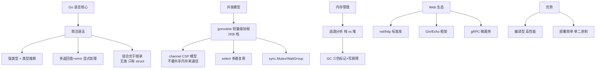

# Go语言基础

### Go 语言基础

#### 1. Go 语言特点与优势

Go 语言设计简洁，追求高性能与高开发效率的平衡：
- **语法简单**：关键字少，仅有 25 个关键字，无隐藏的「语法糖」，代码可读性高。
- **原生并发**：支持轻量级线程和通信，通过 CSP（Communicating Sequential Processes）模型实现高效并发。
- **垃圾回收（GC）**：内置非分代、并发标记清除的 GC，延迟低，无需手动管理内存。
- **编译速度快**：依赖管理简单，编译不依赖符号表，适合大型项目快速迭代。
- **静态链接**：编译后生成单一可执行文件，部署方便。

#### 2. Go vs Java

| 特性 | Go | Java |
| :--- | :--- | :--- |
| **并发模型** | Goroutine + Channel (CSP 模型)，轻量级，内存占用小。 | 线程 + 锁 (JMM 模型)，重量级，依赖 OS 线程。 |
| **运行效率** | 编译型，启动速度快，性能接近 C++。 | 编译+解释（JIT），启动稍慢，峰值性能高。 |
| **面向对象** | 组合优于继承，不支持类和继承，只有 struct 和 interface。 | 完整的 OOP 支持，支持类、继承、多态。 |
| **泛型** | 1.18 版本开始支持，设计较为简洁。 | 支持完善的泛型（Java 5 引入）。 |
| **应用场景** | 云原生、微服务、中间件、高并发后端。 | 企业级应用、大数据生态、Android 开发。 |

#### 3. string vs []byte

- **不可变性**：`string` 是只读的字节切片，不可修改；`[]byte` 是可变的。
- **内存结构**：`string` 底层包含指向字节数组的指针和长度；`[]byte` 包含指针、长度、容量。
- **转换开销**：`string` 和 `[]byte` 互转会发生数据拷贝（重新分配内存），在大数据量场景下有性能损耗（但 Go 编译器对部分场景做了优化）。
- **使用场景**：文本处理用 `string`，二进制数据（网络包、图片）或需频繁修改内容用 `[]byte`。

**实战案例**：在处理大文件上传（如 1GB 日志文件）的读取校验时，不要直接用 `string(byteData)` 转换，这会导致 double memory（内存翻倍）。应使用 `reflect` 包的 `StringHeader` 强制转换或直接操作 `[]byte`，避免内存拷贝引起的 OOM。

**代码示例**：
```go
// 零拷贝转换（仅用于只读场景，严禁修改！）
func BytesToString(b []byte) string {
    return *(*string)(unsafe.Pointer(&b))
}
```

#### 4. make vs new

- **new(T)**：用于分配内存。它初始化为 0 值，并返回指向该类型的指针 `*T`。主要用于值类型（如 struct, basic types）。
- **make(T)**：用于创建、初始化内建的引用类型：**slice、map、channel**。它返回的是初始化后的（非 nil）类型 `T` 本身，而不是指针。

#### 5. 数组 vs 切片

- **数组**：值类型，长度固定，长度是类型的一部分（如 `[3]int` 和 `[4]int` 是不同类型），赋值或传参会发生拷贝。
- **切片**：引用类型，动态长度，底层引用一个数组。切片包含 `ptr`（指向底层数组的指针）、`len`（长度）、`cap`（容量）。

#### 6. 切片扩容机制

当 `append` 元素超过切片容量时，Go 会进行扩容：
1. **计算新容量**：通常策略是按旧容量的 2 倍增长（指数增长），但当元素个数超过一定阈值（如 1024）后，增长因子会变为 1.25 倍左右。
2. **内存分配**：分配一块更大的连续内存区域。
3. **数据拷贝**：将旧数据拷贝到新内存中。
4. **更新指针**：将切片的底层数组指针指向新内存。

> **注意**：扩容后地址会改变，若其他切片或指针引用了原底层数组，需注意数据一致性。

**实战案例**：曾遇因切片扩容导致旧数据被意外覆盖的 Bug。在处理大数据分页时，若持有 `oldSlice := slice[0:5]`，随后对 `slice` 进行 `append` 导致扩容，`oldSlice` 的底层数组可能被回收或修改，导致 `oldSlice` 数据失效。

**代码示例**：
```go
s := make([]int, 3, 5) // len=3, cap=5
fmt.Printf("%p\n", s)    // 0xc0000b2000
s = append(s, 1, 2, 3) // 触发扩容 cap > 5
fmt.Printf("%p\n", s)    // 0xc0000b6000 (地址已变)
```

## 常见考点
1. **Goroutine 为什么轻量？**
   - Goroutine 是用户态线程，由 Go Runtime 调度，初始栈大小仅为 2KB（动态伸缩），而 OS 线程通常需要 MB 级别的栈空间。
2. **Slice 扩容一定翻倍吗？**
   - 不一定。Go 1.18 之前对 int 基本上是翻倍，之后引入了更平滑的增长策略，且不同元素类型的扩容策略略有差异。
3. **Channel 的底层原理是什么？**
   - Channel 底层通过环形缓冲区实现，包含锁、发送队列、接收队列等，用于协程间的同步和通信。


## 核心架构图



## 记忆要点

- 并发与静态链接：原生CSP并发模型(Goroutine+Channel)，编译单一二进制部署极快
- 数组定切片动：数组是值类型(长度属类型)，切片是引用(含ptr/len/cap)动态扩容
- 切片扩容机制：小容量2倍扩容，超阈值平滑增长，扩容分配新内存致地址变更
- make与new对比：new仅分配内存返回指针(零值)，make专用于初始化slice/map/chan返回对象

## 结构化回答

**30 秒电梯演讲：** Go 语言设计追求简洁高效，原生支持高并发，适合构建云原生与网络服务。打个比方，像瑞士军刀，虽然功能看起来没 Java 全，但开合速度快（编译），还自带轻便螺丝刀（Goroutine）。

**展开框架：**
1. **并发与静态链接** — 原生CSP并发模型(Goroutine+Channel)，编译单一二进制部署极快
2. **数组定切片动** — 数组是值类型(长度属类型)，切片是引用(含ptr/len/cap)动态扩容
3. **切片扩容机制** — 小容量2倍扩容，超阈值平滑增长，扩容分配新内存致地址变更

**收尾：** 我在项目里踩过坑——在处理大文件上传（如 1GB 日志文件）的读取校验时，不要直接用 `string(byteData)` 转换，这会导致 double memory（内存翻倍）。您想深入聊哪一段：原理、避坑还是对比选型？

## 视频脚本

> 预计时长：4 分钟 | 由浅入深

| 时间 | 画面/字幕 | 口播台词 | 讲解要点 |
|------|----------|----------|----------|
| 0:00 | 标题卡：Go语言基础 | "Go语言基础？一句话——像瑞士军刀，虽然功能看起来没 Java 全，但开合速度快（编译），还自带轻便螺丝刀（Goroutine）。" | 开场钩子 |
| 0:48 | 概念动画/示意图 | "Go 语言设计追求简洁高效，原生支持高并发，适合构建云原生与网络服务——像瑞士军刀，虽然功能看起来没 Java 全，但开合速度快（编译），还自带轻便螺丝刀（Goroutine）" | 核心定义 |
| 1:36 | 并发与静态链接示意 | "原生CSP并发模型(Goroutine+Channel)，编译单一二进制部署极快" | 要点1 |
| 2:24 | 数组定切片动示意 | "数组是值类型(长度属类型)，切片是引用(含ptr/len/cap)动态扩容" | 要点2 |
| 3:12 | 切片扩容机制示意 | "小容量2倍扩容，超阈值平滑增长，扩容分配新内存致地址变更" | 要点3 |
| 4:00 | 总结卡 | "记住这几条，面试不慌。下期讲进阶追问。" | 收尾 |
