# Go Web

### Go Web & Gin 框架

#### CAP 理论

在分布式系统中，C（一致性）、A（可用性）、P（分区容错性）三者不可兼得，最多同时满足两点。由于分布式系统中网络分区（P）是必然存在的，因此架构设计通常是在 **CP**（保证一致性，牺牲可用性）和 **AP**（保证可用性，牺牲一致性）之间做权衡。

- **CP**：例如 ZooKeeper，强一致性，但网络故障时可能导致服务不可用。
- **AP**：例如 Cassandra/Dynamo，保证高可用，但允许数据在短时间内不一致（最终一致性）。

**实战案例**：在设计秒杀系统库存扣减时，选择了 AP 架构（Redis + Lua），允许极端情况下的少卖，而不是 CP 架构（分布式锁），因为后者的高响应延迟会导致用户大量请求超时，牺牲可用性得不偿失。

| 架构选择 | 一致性保证 | 可用性 | 适用场景 |
| :--- | :--- | :--- | :--- |
| **CP** | 强一致性（数据实时一致） | 低（故障时部分服务不可用） | 金融转账、库存核心校验 |
| **AP** | 最终一致性（短时间内允许不一致） | 高（故障时服务仍可写） | 社交动态、点赞数、非核心计数 |

#### Gin Web 框架

Gin 是一个高性能的 Go Web 框架，类似于 Java 的 Spring MVC 或 Node.js 的 Express。核心特点：
- 基于 **HttpRouter**（Radix Tree 压缩前缀树）实现高性能路由匹配。
- 支持中间件机制，方便处理日志、鉴权、Recovery 等。
- JSON/XML 验证与渲染极其便捷。

#### Gin 中间件原理

Gin 的中间件本质上是一个处理 `gin.Context` 的函数。其执行流程采用「**洋葱模型**」（Onion Model）或责任链模式。

**实战案例**：在业务代码中抛出 panic 导致进程全挂。通过自定义 Recovery 中间件捕获 panic，记录堆栈到 Sentry 并返回 500 JSON，防止服务直接崩溃。

**代码示例**：
```go
func CustomRecovery() gin.HandlerFunc {
    return func(c *gin.Context) {
        defer func() {
            if err := recover(); err != nil {
                log.Printf("Panic recovered: %v", err)
                c.JSON(500, gin.H{"error": "Internal Server Error"})
                c.Abort()
            }
        }()
        c.Next()
    }
}
```

**执行流程图：**

```text
                    Request
                       ↓
             ┌─────────────────────┐
             │  Middleware 1       │ ── c.Next() ─→
             │  (Before Handler)   │               ↓
             └─────────────────────┘      ┌─────────────────────┐
                       ↓                 │  Middleware 2       │ ── c.Next() ─→
             ┌─────────────────────┐      │  (Before Handler)   │               ↓
             │  Middleware 3       │      └─────────────────────┐      ┌───────────────────┐
             │  (Before Handler)   │                    ↓      │  Final Handler     │
             └─────────────────────┘           ┌───────────────────┐  (Business Logic) │
                       ↑                      │  Middleware 2     │  └───────────────────┘
             ┌─────────────────────┐          │  (After Handler)  │           ↑
             │  Middleware 3       │ ←──────── └─────────────────────┘           ↓
             │  (After Handler)    │                     ↑             ┌───────────────────┐
             └─────────────────────┘          ┌─────────────────────┐     │  Middleware 1    │
                       ↑                      │  Middleware 3       │     │  (After Handler) │
             ┌─────────────────────┐          │  (After Handler)   │     └───────────────────┘
             │  Middleware 2       │ ←──────── └─────────────────────┘
             │  (After Handler)    │       
```


## 核心架构图

```mermaid
flowchart TD
    classDef start fill:#4CAF50,color:#fff
    classDef process fill:#2196F3,color:#fff
    classDef decision fill:#FF9800,color:#fff
    classDef special fill:#9C27B0,color:#fff
    classDef error fill:#f44336,color:#fff
    classDef info fill:#607D8B,color:#fff
    class A start
    class B process
    class C decision
    class CSP special
    class D error
    class E info
    class Echo start
    class F process
    class G decision
    class GC special
    class Gin error
    class Go info
    class H start
    class I process
    class J decision
    class K special
    class L error
    class M info
    class Mutex start
    class N process
    class O decision
    class P special
    class Q error
    class R info
    class S start
    class T process
    class WaitGroup decision
    class Web special
    class br error
    class channel info
    class error start
    class gRPC process
    class goroutine decision
    class http special
    class net error
    class select info
    class struct start
    class sync process
    class vs decision
    A[Go 语言核心] --> B[简洁语法]
    B --> C[强类型 + 类型推断]
    B --> D[多返回值+error 显式处理]
    B --> E[组合优于继承<br/>无类 只有 struct]
    F[并发模型] --> G[goroutine 轻量级协程<br/>2KB 栈]
    G --> H[channel CSP 模型<br/>不要共享内存来通信]
    G --> I[select 多路复用]
    G --> J[sync.Mutex/WaitGroup]
    K[内存管理] --> L[逃逸分析 栈 vs 堆]
    L --> M[GC 三色标记+写屏障]
    N[Web 生态] --> O[net/http 标准库]
    N --> P[Gin/Echo 框架]
    N --> Q[gRPC 微服务]
    R[优势] --> S[编译型 高性能]
    R --> T[部署简单 单二进制]
```



## 记忆要点

- CAP三角权衡：网络分区必存，架构设计在CP强一致与AP高可用间做取舍选型
- 高性能路由树：Gin基于HttpRouter压缩前缀树实现极速路由匹配
- 洋葱模型中间件：请求像穿洋葱层层进入并返回，通过c.Next()控制责任链流转
- Recovery防崩溃：核心利用defer+recover机制捕获panic，保证Web服务高可用

## 结构化回答

**30 秒电梯演讲：** Gin 是基于 HttpRouter 的高性能 Go Web 框架，通过中间件链处理请求。打个比方，像一条流水线，请求（原料）经过一个个工人（中间件）的加工，最后变成产品（响应）。

**展开框架：**
1. **CAP三角权衡** — 网络分区必存，架构设计在CP强一致与AP高可用间做取舍选型
2. **高性能路由树** — Gin基于HttpRouter压缩前缀树实现极速路由匹配
3. **洋葱模型中间件** — 请求像穿洋葱层层进入并返回，通过c.Next()控制责任链流转

**收尾：** 这三点都能配合实战聊。您想深入聊原理、对比还是避坑？

## 视频脚本

> 预计时长：4 分钟 | 由浅入深

| 时间 | 画面/字幕 | 口播台词 | 讲解要点 |
|------|----------|----------|----------|
| 0:00 | 标题卡：Go Web | "Go Web？一句话——像一条流水线，请求（原料）经过一个个工人（中间件）的加工，最后变成产品（响应）。" | 开场钩子 |
| 0:48 | 概念动画/示意图 | "Gin 是基于 HttpRouter 的高性能 Go Web 框架，通过中间件链处理请求——像一条流水线，请求（原料）经过一个个工人（中间件）的加工，最后变成产品（响应）" | 核心定义 |
| 1:36 | CAP三角权衡示意 | "网络分区必存，架构设计在CP强一致与AP高可用间做取舍选型" | 要点1 |
| 2:24 | 高性能路由树示意 | "Gin基于HttpRouter压缩前缀树实现极速路由匹配" | 要点2 |
| 3:12 | 洋葱模型中间件示意 | "请求像穿洋葱层层进入并返回，通过c.Next()控制责任链流转" | 要点3 |
| 4:00 | 总结卡 | "记住这几条，面试不慌。下期讲进阶追问。" | 收尾 |
