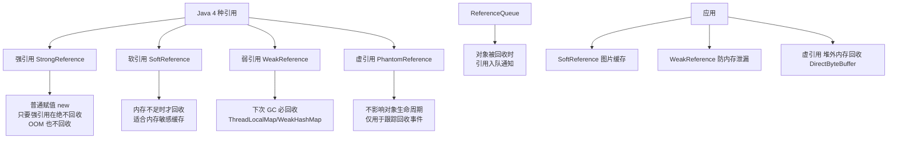

# JAVA 四中引用类型

### Java 四种引用类型

Java 中引用的强度依次递减，决定了垃圾回收器（GC）回收对象的时机。

#### 1. 强引用
- **描述**：最普遍的引用，如 `Object obj = new Object()`。
- **GC 行为**：只要对象存在强引用，GC 就永远不会回收该对象，即使发生 OOM 也不会回收。
- **内存泄漏风险**：如果强引用链未被断开（如静态集合未清理），会导致对象无法回收从而引发内存泄漏。

#### 2. 软引用
- **描述**：使用 `SoftReference` 类实现。
- **GC 行为**：内存**足够**时，GC 不会回收；内存**不足**时（即将发生 OOM），GC 会回收软引用对象。
- **应用场景**：适合做**缓存**（如图片缓存、网页缓存），在内存紧张时释放资源，保证系统运行。

**实战案例**：在开发 Android App 图片加载器时，使用软引用缓存 Bitmap。当 App 切换到后台且系统内存紧张时，GC 回收了缓存导致列表滑动时图片重新闪烁加载，最终改为 LruCache（强引用+LRU淘汰策略）来保证用户体验。

#### 3. 弱引用
- **描述**：使用 `WeakReference` 类实现。
- **GC 行为**：无论内存是否足够，**只要 GC 运行**，发现对象仅有弱引用时，**立即回收**。
- **应用场景**：`ThreadLocal` 中的 Key 使用弱引用，防止 ThreadLocalMap 内存泄漏；`WeakHashMap`。

**代码示例**：
```java
Object obj = new Object();
WeakReference<Object> weakRef = new WeakReference<>(obj);
obj = null; // 断开强引用
System.gc(); // 建议 JVM 进行 GC
if (weakRef.get() == null) {
    System.out.println("对象已被回收");
}
```

#### 4. 虚引用
- **描述**：使用 `PhantomReference` 类实现，**必须配合引用队列** 使用。
- **GC 行为**：无法通过虚引用获取对象实例（`get()` 永远返回 `null`）。唯一作用是**跟踪对象被 GC 回收的状态**。
- **应用场景**：用于在对象被回收时收到系统通知，执行资源释放（如堆外内存管理，Netty 中利用虚引用回收 Native 内存）。

#### GC 分代收集算法

为了提高 GC 效率，JVM 根据对象存活周期将堆内存划分为不同区域，采用不同算法。

```text
┌─────────────────────────────────────────────┐
│                  Heap Memory                 │
├──────────────────┬──────────────────────────┤
│    Young Gen     │        Old Gen           │
│  (Eden + S0+S1)  │  (Tenured Generation)    │
├──────────────────┴──────────────────────────┤
│  1. 新生代：对象生命周期短，采用「复制算法」  │
│     - Eden:Survivor = 8:1                   │
│     - 优点：只需复制少量存活对象，无碎片    │
│                                              │
│  2. 老年代：生命周期长，采用「标记-整理」    │
│     或「标记-清除」                          │
│     - 优点：无需额外空间做担保              │
└─────────────────────────────────────────────┘
```

- **新生代**：绝大多数对象朝生夕死。每次 Minor GC 将存活对象复制到一块 Survivor 区，清理 Eden 和另一块 Survivor。效率高。
- **老年代**：经过多次 Minor GC 仍然存活的对象进入老年代。对象存活率高，采用标记-整理（Mark-Compact）算法，消除内存碎片。

**对比表格**：GC 算法选型

| 算法 | 区域 | 优点 | 缺点 |
| :--- | :--- | :--- | :--- |
| **标记-清除** | 老年代 | 无需额外空间 | 产生大量内存碎片 |
| **复制算法** | 新生代 | 性能高，无碎片 | 内存利用率低（浪费一半空间） |
| **标记-整理** | 老年代 | 无碎片，利用率高 | 效率低于复制算法（需移动对象） |

## 常见考点
1. **WeakHashMap 的作用机制是什么？**
   - WeakHashMap 的 Key 是弱引用。当 Key 没有被外部强引用时，GC 会回收 Key，随后 WeakHashMap 会自动移除对应的 Entry。
2. **对象在什么情况下会进入老年代？**
   - 大对象直接进入老年代（参数配置）；
   - 长期存活的对象（默认经历 15 次 Minor GC）；
   - 动态年龄判定（Survivor 区相同年龄所有对象大小总和 > Survivor 空间一半）。


## 核心架构图


## 核心知识点图


## 记忆要点

- 强引用不回收：最普遍引用，宁可抛OOM异常也绝不回收强引用对象
- 软引用看内存：内存不足即将OOM时才回收，常用于网页或图片等缓存场景
- 弱引用看GC：只要发生垃圾回收立即清理，常用于ThreadLocal防内存泄漏
- 虚引用纯通知：无法get获取对象，专用于跟踪回收状态配合队列管理Native资源

## 结构化回答

**30 秒电梯演讲：** Java 四种引用强度不同，决定了垃圾回收器回收对象的时机与方式。打个比方，像东西的重要性等级：必需品（强）坚决不扔，备用品（软）没地了才扔，赠品（弱）随时清理，幽灵（虚）只留个名。

**展开框架：**
1. **强引用不回收** — 最普遍引用，宁可抛OOM异常也绝不回收强引用对象
2. **软引用看内存** — 内存不足即将OOM时才回收，常用于网页或图片等缓存场景
3. **弱引用看GC** — 只要发生垃圾回收立即清理，常用于ThreadLocal防内存泄漏

**收尾：** 我在项目里踩过坑——在开发 Android App 图片加载器时，使用软引用缓存 Bitmap。您想深入聊哪一段：原理、避坑还是对比选型？

## 视频脚本

> 预计时长：2 分钟 | 由浅入深

| 时间 | 画面/字幕 | 口播台词 | 讲解要点 |
|------|----------|----------|----------|
| 0:00 | 标题卡：JAVA 四中引用类型 | "JAVA 四中引用类型？一句话——像东西的重要性等级：必需品（强）坚决不扔，备用品（软）没地了才扔，赠品（弱）随时清理，幽灵（虚）只留个名。" | 开场钩子 |
| 0:40 | 概念动画/示意图 | "Java 四种引用强度不同，决定了垃圾回收器回收对象的时机与方式——像东西的重要性等级：必需品（强）坚决不扔，备用品（软）没地了才扔，赠品（弱）随时清理，幽灵（虚）只留个名" | 核心定义 |
| 1:20 | 强引用不回收示意 | "最普遍引用，宁可抛OOM异常也绝不回收强引用对象" | 要点1 |
| 2:00 | 总结卡 | "记住这几条，面试不慌。下期讲进阶追问。" | 收尾 |
