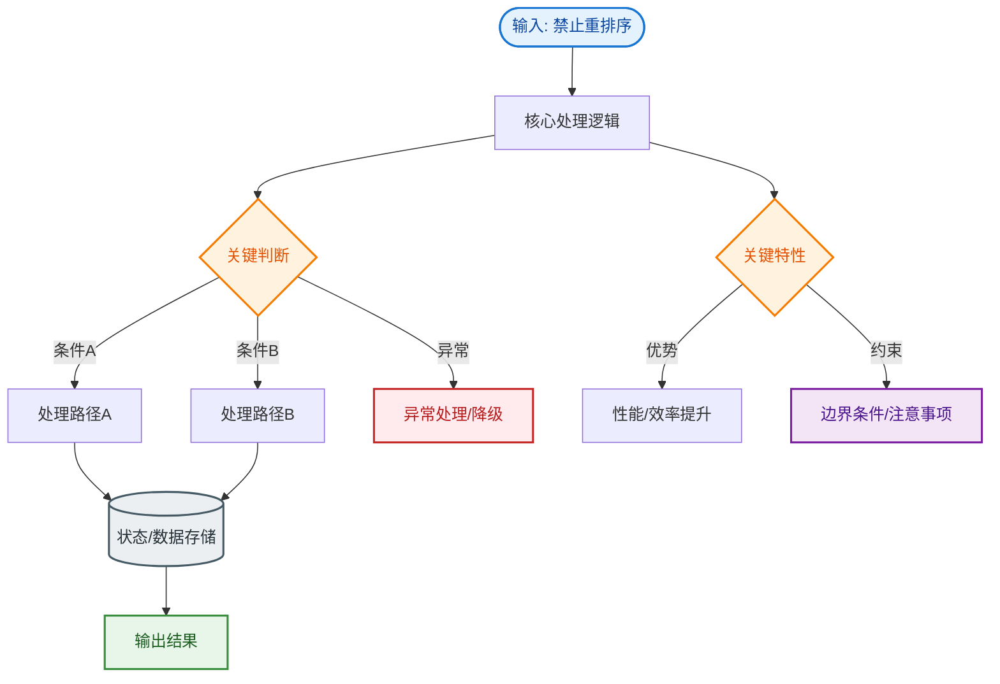

# 禁止重排序

volatile 关键字禁止重排序是通过“内存屏障”来实现的。

**1. 重排序问题**
在编译器和处理器为了优化性能，会对指令序列进行重排序。在单线程下这种优化是安全的（遵循 as-if-serial 语义），但在多线程下可能会导致逻辑错误（如初始化未完成的对象被引用）。

**2. volatile 的禁止策略**
JMM 会在 volatile 变量的读写操作前后插入内存屏障，强制禁止特定的重排序类型。具体规则如下（基于 JMM 规范）：
- **volatile 写**：在 volatile 写操作**之前**插入 StoreStore 屏障，禁止上面的普通写和下面的 volatile 写重排序；在 volatile 写操作**之后**插入 StoreLoad 屏障，禁止上面的 volatile 写和下面的读写（普通或 volatile）重排序。
- **volatile 读**：在 volatile 读操作**之后**插入 LoadLoad 屏障，禁止下面的普通读和上面的 volatile 读重排序；在 volatile 读操作**之后**插入 LoadStore 屏障，禁止下面的普通写和上面的 volatile 读重排序。

**内存屏障示意**
```
┌─────────────────────────────────────────────────────────────────────┐
│                        CPU 指令执行序列                               │
├─────────────────────────────────────────────────────────────────────┤
│  Normal Write/Sh      StoreStore        Volatile Write               │
│   (普通写)             (屏障1)             (volatile写)               │
│                                             │                         │
│                                             ▼                         │
│                                         StoreLoad (屏障2)            │
│                                             │                         │
│  Normal Read/Sh      LoadLoad/LoadStore  Volatile Read               │
│   (普通读)              (屏障3/4)           (volatile读)              │
└─────────────────────────────────────────────────────────────────────┘
```

**实战案例**：著名的单例模式“双重检查锁”漏洞。若不加 `volatile`，`instance = new Singleton()` 可能被重排序为「分配内存 -> 指针赋值 -> 初始化对象」。若线程 A 执行完指针赋值被挂起，线程 B 判断 `instance != null` 直接拿去使用，此时对象还未初始化，导致空指针异常。

**代码示例**：
```java
public class Singleton {
    // 必须加 volatile 禁止指令重排序
    private static volatile Singleton instance;
    
    private Singleton() {}

    public static Singleton getInstance() {
        if (instance == null) { // 第一次检查
            synchronized (Singleton.class) {
                if (instance == null) { // 第二次检查
                    // 1.分配内存 2.初始化对象 3.将instance指向内存
                    // volatile 保证 2 和 3 不会被重排序
                    instance = new Singleton();
                }
            }
        }
        return instance;
    }
}
```

**3. happens-before 原则**
volatile 变量的写操作 happens-before 后续对该变量的读操作。这保证了写操作的结果对读操作一定是可见的。

**## 常见考点**
1. **双重检查锁定**：为什么单例 DCL 写法中 instance 变量必须加 volatile？（防止对象初始化过程中的指令重排序，导致其他线程获取到未初始化完全的对象）。
2. **内存屏障的 CPU 指令**：了解不同硬件架构如何实现内存屏障（如 LFENCE, SFENCE, MFENCE）。
3. **volatile 的可见性与原子性**：volatile 能保证可见性，为什么不能保证 i++ 的原子性？


## 核心流程图


## 记忆要点

- 为何禁重排：多线程下编译器/CPU重排会导致逻辑错乱，如单例DCL拿到半初始化对象
- 内存屏障实现：写前插StoreStore写后插StoreLoad，读后插LoadLoad与LoadStore屏障
- happens-before：规则规定volatile写操作必定先行发生于后续对该变量的读操作

## 结构化回答

**30 秒电梯演讲：** 通过内存屏障强行规定指令执行顺序，防止优化导致乱序。打个比方，设立红绿灯，强制要求车子按顺序通过路口，不能随意变道插队。

**展开框架：**
1. **为何禁重排** — 多线程下编译器/CPU重排会导致逻辑错乱，如单例DCL拿到半初始化对象
2. **内存屏障实现** — 写前插StoreStore写后插StoreLoad，读后插LoadLoad与LoadStore屏障
3. **happens-before** — 规则规定volatile写操作必定先行发生于后续对该变量的读操作

**收尾：** 我在项目里踩过坑——著名的单例模式“双重检查锁”漏洞。您想深入聊哪一段：原理、避坑还是对比选型？

## 视频脚本

> 预计时长：3 分钟 | 由浅入深

| 时间 | 画面/字幕 | 口播台词 | 讲解要点 |
|------|----------|----------|----------|
| 0:00 | 标题卡：禁止重排序 | "禁止重排序？一句话——设立红绿灯，强制要求车子按顺序通过路口，不能随意变道插队。" | 开场钩子 |
| 0:45 | 概念动画/示意图 | "通过内存屏障强行规定指令执行顺序，防止优化导致乱序——设立红绿灯，强制要求车子按顺序通过路口，不能随意变道插队" | 核心定义 |
| 1:30 | 为何禁重排示意 | "多线程下编译器/CPU重排会导致逻辑错乱，如单例DCL拿到半初始化对象" | 要点1 |
| 2:15 | 内存屏障实现示意 | "写前插StoreStore写后插StoreLoad，读后插LoadLoad与LoadStore屏障" | 要点2 |
| 3:00 | 总结卡 | "记住这几条，面试不慌。下期讲进阶追问。" | 收尾 |
