# 将数据抽象成一个类，并将数据的操作作为这个类的方法

在 Java 多线程中，当多个线程需要操作同一份数据时，为了保证线程安全，常用的设计模式是将数据抽象成一个类，并将数据的操作封装为该类的方法。

**实现方式**
1. 定义一个专门的类（如 `MyData`）封装共享数据。
2. 将修改该数据的方法（如 `add`、`dec`）使用 `synchronized` 关键字修饰。
3. 多个线程通过调用同一个 `MyData` 实例的方法来操作数据。

**实战案例**
在高并发电商场景中，曾遇到库存扣减服务未对“剩余库存”字段封装，导致在“扣减”和“校验”之间存在竞态条件（超卖）。将库存对象封装为 `Stock` 类并同步 `decrease` 方法后解决了该问题。

**代码示例**
```java
public class MyData {
    private int j = 0;
    // 使用 synchronized 修饰方法，保证原子性和可见性
    public synchronized void add() {
        j++; 
        System.out.println(Thread.currentThread().getName() + " inc: " + j);
    }
    public synchronized void dec() {
        j--; 
        System.out.println(Thread.currentThread().getName() + " dec: " + j);
    }
    public synchronized int get() { return j; }
}
```

**架构示意图**
```
    ┌─────────────┐      invoke      ┌──────────────────────┐
    │  Thread A   │ ───────────────> │                      │
    └─────────────┘                   │                      │
                                      │   MyData Instance    │
    ┌─────────────┐      invoke      │  (Synchronized Methods)│
    │  Thread B   │ ───────────────> │                      │
    └─────────────┘                   │                      │
                                      │  private int j = 0;  │
    ┌─────────────┐                   └──────────────────────┘
    │  Thread C   │ ────────────────>  ▲
    └─────────────┘                     │
                                       Lock (Monitor)
```

**优势**
这种设计模式将数据的同步逻辑封装在数据类内部，调用方无需关心锁的具体实现，符合高内聚低耦合的设计原则。

## 常见考点
1. **锁的范围**：为什么要锁住整个方法而不是只锁 `j++` 这一行代码？（防止 JVM 重排序导致逻辑错误，且代码更清晰）。
2. **锁的对象**：`synchronized` 修饰普通方法时，锁对象是什么？（是 `this`，即当前的 `MyData` 实例，必须保证多线程访问的是同一个实例）。
3. **死锁风险**：如果类中有多个 synchronized 方法，线程 A 持有锁调用方法 A 时能否调用方法 B？（可以，因为支持可重入）。


## 核心架构图

```mermaid
flowchart TD
    classDef start fill:#4CAF50,color:#fff
    classDef process fill:#2196F3,color:#fff
    classDef decision fill:#FF9800,color:#fff
    classDef special fill:#9C27B0,color:#fff
    classDef error fill:#f44336,color:#fff
    classDef info fill:#607D8B,color:#fff
    class A start
    class ArrayList process
    class B decision
    class BlockingQueue special
    class C error
    class CAS info
    class Collections start
    class ConcurrentHashMap process
    class ConcurrentLinkedQueue decision
    class ConcurrentModificationException special
    class CopyOnWriteArrayList error
    class D info
    class E start
    class F process
    class G decision
    class H special
    class HashMap error
    class Hashtable info
    class I start
    class J process
    class K decision
    class L special
    class M error
    class N info
    class Vector start
    class br process
    class concurrent decision
    class java special
    class synchronizedXxx error
    class util info
    A[集合线程安全] --> B[早期同步]
    A --> C[并发包 java.util.concurrent]
    B --> D[Vector 元素同步]
    B --> E[Hashtable 同步]
    B --> F[Collections.synchronizedXxx<br/>装饰器]
    C --> G[CopyOnWriteArrayList<br/>读多写少]
    C --> H[ConcurrentHashMap<br/>分段锁/CAS]
    C --> I[ConcurrentLinkedQueue<br/>CAS 无锁]
    C --> J[BlockingQueue<br/>阻塞队列]
    K[不安全集合] --> L[HashMap 并发死链/数据覆盖]
    K --> M[ArrayList 迭代 ConcurrentModificationException]
    K --> N[非线程安全原因<br/>非原子/指令重排/可见性]
```



## 记忆要点

- 数据面向对象：将共享变量及操作方法内聚封装在同一个数据类中解耦
- 方法级synchronized：在操作数据的方法上加锁，以当前实例this保证原子与可见
- 天然支持可重入：持有同一把锁的线程调用类内其他同步方法时，不会引发死锁

## 结构化回答

**30 秒电梯演讲：** 将共享数据及其操作封装在一起，通过内部锁控制并发。打个比方，把公共账本和账本锁都交给一个会计保管，别人要记账必须找会计按规矩来。

**展开框架：**
1. **数据面向对象** — 将共享变量及操作方法内聚封装在同一个数据类中解耦
2. **方法级synchronized** — 在操作数据的方法上加锁，以当前实例this保证原子与可见
3. **天然支持可重入** — 持有同一把锁的线程调用类内其他同步方法时，不会引发死锁

**收尾：** 我在项目里踩过坑——在高并发电商场景中，曾遇到库存扣减服务未对“剩余库存”字段封装，导致在“扣减”和“校验”之间存在竞态条件（超卖）。您想深入聊哪一段：原理、避坑还是对比选型？

## 视频脚本

> 预计时长：3 分钟 | 由浅入深

| 时间 | 画面/字幕 | 口播台词 | 讲解要点 |
|------|----------|----------|----------|
| 0:00 | 标题卡：将数据抽象成一个类，并将数据的操作作… | "将数据抽象成一个类，并将数据的操作作为这个类的方法？一句话——把公共账本和账本锁都交给一个会计保管，别人要记账必须找会计按规矩来。" | 开场钩子 |
| 0:45 | 概念动画/示意图 | "将共享数据及其操作封装在一起，通过内部锁控制并发——把公共账本和账本锁都交给一个会计保管，别人要记账必须找会计按规矩来" | 核心定义 |
| 1:30 | 数据面向对象示意 | "将共享变量及操作方法内聚封装在同一个数据类中解耦" | 要点1 |
| 2:15 | 要点2图解示意 | "在操作数据的方法上加锁，以当前实例this保证原子与可见" | 要点2 |
| 3:00 | 总结卡 | "记住这几条，面试不慌。下期讲进阶追问。" | 收尾 |
