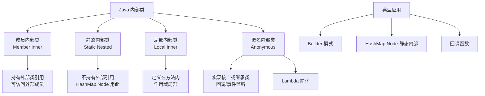

# Runnable对象作为一个类的内部类

另一种常见的多线程共享数据方式是将 `Runnable` 对象作为一个类的内部类，并将共享数据作为该外部类的成员变量。

**实现方式**
1. 定义一个外部类，其中包含共享数据和操作这些数据的 `synchronized` 方法。
2. 在外部类中定义多个 `Runnable` 内部类，这些内部类的 `run` 方法调用外部类的同步方法。
3. 每个线程持有 `Runnable` 内部类的实例，并访问同一个外部类实例的数据。

**实战案例**
在实际的批量数据清洗任务中，我使用内部类模式将“数据读取”和“数据写入”定义为不同的 Runnable 任务，提交给同一个线程池处理，利用外部类统一管理 `successCount` 和 `failCount`，避免了复杂的传参和锁竞争。

**代码示例**
```java
public class DataProcessor {
    private int count = 0;
    
    public synchronized void increment() { count++; }
    
    // 内部类持有外部类引用，可直接访问共享数据
    class Worker implements Runnable {
        @Override
        public void run() {
            // 执行业务逻辑...
            increment(); // 调用外部类同步方法
        }
    }
    
    public void start() {
        new Thread(new Worker()).start();
    }
}
```

**架构示意图**
```
┌─────────────────────────────────────────────────────────────┐
│                      Outer Class (MyData)                    │
│  ┌──────────────────────────────────────────────────────┐   │
│  │  Shared Data: int j                                 │   │
│  └──────────────────────────────────────────────────────┘   │
│  ┌─────────────────────┐  ┌─────────────────────┐           │
│  │  Inner Class:       │  │  Inner Class:       │           │
│  │  AddRunnable        │  │  DecRunnable        │           │
│  │  run() -> add()     │  │  run() -> dec()     │           │
│  └─────────┬───────────┘  └─────────┬───────────┘           │
└────────────┼──────────────────────────┼───────────────────────┘
             │                          │
             ▼                          ▼
      ┌──────────┐              ┌──────────┐
      │ Thread A │              │ Thread B │
      │ (Add)    │              │ (Dec)    │
      └──────────┘              └──────────┘
```

**优势**
这种方式结构清晰，可以将不同的业务逻辑（如增加和减少）拆分为不同的 Runnable 任务，同时利用外部类统一管理共享数据的同步访问。这是“命令模式”的一种变体，适合需要将任务提交给线程池的场景。

## 常见考点
1. **内部类的类型**：使用成员内部类和静态内部类有什么区别？（成员内部类持有外部类引用，可以直接访问共享数据；静态内部类需要显式持有外部类实例引用）。
2. **内存泄漏**：如果内部类实例的生命周期长于外部类（例如将内部类对象提交给长期存在的线程池），会导致什么问题？（可能导致外部类无法被 GC 回收，造成内存泄漏）。


## 核心架构图



## 记忆要点

- 核心设计：共享数据作为外部类成员，Runnable作为内部类，通过同步方法保证安全。
- 直接访问：成员内部类天然持有外部类引用，可直接操作共享数据。
- 对比内部类：成员内部类直接访问共享数据，而静态内部类需显式持有外部实例。
- 内存陷阱：因为内部类隐式持有外部类引用，所以提交给线程池可能引发内存泄漏。

## 结构化回答

**30 秒电梯演讲：** 利用内部类访问外部类成员特性，共享数据源并封装操作逻辑。打个比方，大家都要用同一个保险箱，每个人拿着不同的任务卡（内部类），但操作都由保险箱管理员（外部类）执行。

**展开框架：**
1. **核心设计** — 共享数据作为外部类成员，Runnable作为内部类，通过同步方法保证安全。
2. **直接访问** — 成员内部类天然持有外部类引用，可直接操作共享数据。
3. **对比内部类** — 成员内部类直接访问共享数据，而静态内部类需显式持有外部实例。

**收尾：** 我在项目里踩过坑——在实际的批量数据清洗任务中，我使用内部类模式将“数据读取”和“数据写入”定义为不同的 Runnable 任务，提交给同一个线程池处理，利用外部类统一管理 `successCount` 和 `failCount`，避免了复杂的传参和锁竞争。您想深入聊哪一段：原理、避坑还是对比选型？

## 视频脚本

> 预计时长：3 分钟 | 由浅入深

| 时间 | 画面/字幕 | 口播台词 | 讲解要点 |
|------|----------|----------|----------|
| 0:00 | 标题卡：Runnable对象作为一个类的内部… | "Runnable对象作为一个类的内部类？一句话——大家都要用同一个保险箱，每个人拿着不同的任务卡（内部类），但操作都由保险箱管理员（外部类）执行。" | 开场钩子 |
| 0:45 | 概念动画/示意图 | "利用内部类访问外部类成员特性，共享数据源并封装操作逻辑——大家都要用同一个保险箱，每个人拿着不同的任务卡（内部类），但操作都由保险箱管理员（外部类）执行" | 核心定义 |
| 1:30 | 核心设计示意 | "共享数据作为外部类成员，Runnable作为内部类，通过同步方法保证安全。" | 要点1 |
| 2:15 | 直接访问示意 | "成员内部类天然持有外部类引用，可直接操作共享数据。" | 要点2 |
| 3:00 | 总结卡 | "记住这几条，面试不慌。下期讲进阶追问。" | 收尾 |
