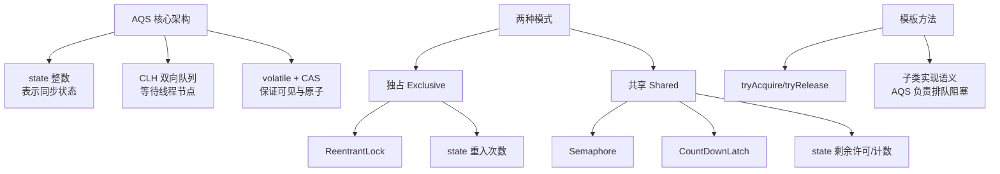

# Exclusive独占资源-ReentrantLock

AQS（AbstractQueuedSynchronizer）定义了两种资源共享方式：Exclusive（独占）和 Share（共享）。

**1. Exclusive（独占模式）**
- **定义**：同一时间只能有一个线程持有资源。
- **典型实现**：`ReentrantLock`。
- **机制**：当一个线程获取锁后，`state` 值加 1，其他线程尝试获取时会进入等待队列。支持可重入，即同一个线程可以多次获取锁（`state` 累加）。

**2. Share（共享模式）**
- **定义**：同一时间可以有多个线程同时持有资源。
- **典型实现**：`Semaphore`、`CountDownLatch`。
- **机制**：资源以信号量的形式存在，线程获取资源成功后会减少剩余许可量，直到许可耗尽后续线程才会阻塞。

**实战案例**
在开发网关限流组件时，发现直接使用 `synchronized` 会导致所有请求串行，吞吐量极低。改用 AQS 独占模式（`ReentrantLock`）配合读写锁分离后，读并发提升了 5 倍；而在热点数据缓存加载中，使用共享模式控制并发加载数量，有效防止了缓存击穿。

**代码示例**
```java
// 独占模式简化逻辑 (ReentrantLock 内部实现)
final boolean nonfairTryAcquire(int acquires) {
    final Thread current = Thread.currentThread();
    int c = getState();
    if (c == 0) {
        if (compareAndSetState(0, acquires)) {
            setExclusiveOwnerThread(current);
            return true;
        }
    }
    else if (current == getExclusiveOwnerThread()) {
        int nextc = c + acquires;
        setState(nextc);
        return true;
    }
    return false;
}
```

**对比表格：Exclusive vs Share**

| 特性 | Exclusive (独占模式) | Share (共享模式) |
| :--- | :--- | :--- |
| **核心含义** | 资源互斥，仅一个线程持有 | 资源共享，多个线程可并行持有 |
| **State 含义** | 锁的重入次数 (0=未锁定, >0=重入数) | 剩余许可数量 / 计数器值 |
| **典型实现** | ReentrantLock, synchronized | Semaphore, CountDownLatch, ReentrantReadWriteLock(读锁) |
| **适用场景** | 保证数据修改的原子性 | 并发数限流、多线程协作汇总 |
| **阻塞行为** | 其他线程进入队列等待 | 许可不足时进入队列等待 |

**AQS 核心架构与数据流**
AQS 维护了一个 `volatile int state` 变量和一个 FIFO 双向链表等待队列（`CLH Queue` 变体）。

```
┌──────────────────────────────────────────────────────────────┐
│                         AQS 核心结构                           │
├──────────────────────────────────────────────────────────────┤
│  ┌──────────────┐                                            │
│  │ Head Node    │ <─── Prev ──┐                               │
│  │ (Dummy Node) │             │                               │
│  └──────┬───────┘             │                               │
│         │ Next                │                               │
│         ▼                     │                               │
│  ┌──────────────┐             │                               │
│  │  Thread-1    │             │                               │
│  │  (Waiting)   │             │                               │
│  └──────┬───────┘             │                               │
│         │ Next                │                               │
│         ▼                     │                               │
│  ┌──────────────┐             ▼                               │
│  │  Thread-2    │ ────────────┘                               │
│  │  (Waiting)   │                                            │
│  └──────────────┘                                            │
├──────────────────────────────────────────────────────────────┤
│  volatile int state (0=Free, >0=Held/Count)                   │
└──────────────────────────────────────────────────────────────┘
```

**AQS 的核心设计**
AQS 的核心设计是基于模板方法模式。子同步器只需继承 AQS 并实现以下方法，即可自定义资源获取与释放的逻辑，而线程排队、阻塞与唤醒等复杂机制由 AQS 处理。


## 核心架构图


## 记忆要点

- 一句话区分：Exclusive（独占）仅单线程持有，Share（共享）允许多线程并行。
- 互斥实现：ReentrantLock是典型独占，state代表锁的重入次数，0代表未锁定。
- 共享实现：Semaphore和CountDownLatch是典型共享，state代表剩余许可或计数值。
- 底层支撑：AQS通过volatile state结合CLH FIFO双向队列实现同步等待机制。

## 结构化回答

**30 秒电梯演讲：** 定义两种资源分配模式：独占（一人用）和共享（多人用）。打个比方，独占像是单人卫生间，一次进一人；共享像是公交车，能进很多人。

**展开框架：**
1. **一句话区分** — Exclusive（独占）仅单线程持有，Share（共享）允许多线程并行。
2. **互斥实现** — ReentrantLock是典型独占，state代表锁的重入次数，0代表未锁定。
3. **共享实现** — Semaphore和CountDownLatch是典型共享，state代表剩余许可或计数值。

**收尾：** 我在项目里踩过坑——在开发网关限流组件时，发现直接使用 `synchronized` 会导致所有请求串行，吞吐量极低。您想深入聊哪一段：原理、避坑还是对比选型？

## 视频脚本

> 预计时长：3 分钟 | 由浅入深

| 时间 | 画面/字幕 | 口播台词 | 讲解要点 |
|------|----------|----------|----------|
| 0:00 | 标题卡：Exclusive独占资源-Reen… | "Exclusive独占资源-ReentrantLock？一句话——独占像是单人卫生间，一次进一人；共享像是公交车，能进很多人。" | 开场钩子 |
| 0:45 | 概念动画/示意图 | "定义两种资源分配模式：独占（一人用）和共享（多人用）——独占像是单人卫生间，一次进一人；共享像是公交车，能进很多人" | 核心定义 |
| 1:30 | 一句话区分示意 | "Exclusive（独占）仅单线程持有，Share（共享）允许多线程并行。" | 要点1 |
| 2:15 | 互斥实现示意 | "ReentrantLock是典型独占，state代表锁的重入次数，0代表未锁定。" | 要点2 |
| 3:00 | 总结卡 | "记住这几条，面试不慌。下期讲进阶追问。" | 收尾 |
