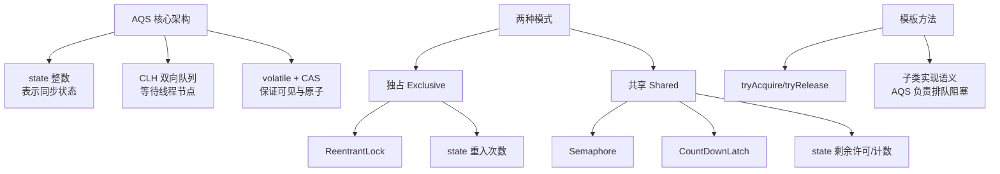
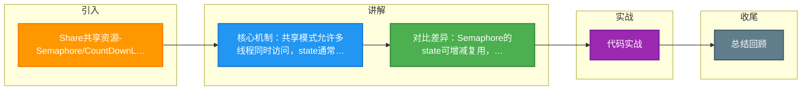

# Share共享资源-Semaphore/CountDownLatch

AQS 的共享模式允许多个线程同时访问资源，主要用于控制并发数量或协同多个线程。

**1. Share（共享模式）核心**
在共享模式下，资源被多个线程共同持有。AQS 的 `state` 变量通常代表剩余资源的数量。获取资源的线程之间不会互斥，但获取与释放之间需要保证原子性（通常使用 CAS）。

**2. 典型应用场景**

- **Semaphore（信号量）**：
  `state` 初始化为许可证数量。`acquire()` 时尝试 CAS 减少值，如果大于 0 则成功；否则阻塞。`release()` 时增加值并唤醒等待线程。用于限流，控制同时访问资源的线程数。

- **CountDownLatch（倒计时门闩）**：
  `state` 初始化为计数值 N。多个线程调用 `countDown()` 会将 `state` CAS 减 1。当 `state` 变为 0 时，所有因调用 `await()` 而阻塞的线程会被唤醒。用于并行任务汇总。

**实战案例**
在微服务离线对账系统中，曾使用 `Semaphore` 限制对下游数据库的并发查询数为 10，防止压垮数据库；同时使用 `CountDownLatch` 等待 10 个分片任务全部完成后，再汇总生成对账报告，避免了轮询检查的 CPU 浪费。

**代码示例**
```java
// Semaphore 限流逻辑示意
public void accessResource(Semaphore semaphore) {
    if (semaphore.tryAcquire()) { // 尝试获取许可，非阻塞
        try {
            // 访问临界资源
            doCriticalWork();
        } finally {
            semaphore.release(); // 释放许可
        }
    } else {
        // 降级处理或快速失败
        fallback();
    }
}
```

**对比表格：Semaphore vs CountDownLatch**

| 维度 | Semaphore (信号量) | CountDownLatch (倒计时门闩) |
| :--- | :--- | :--- |
| **核心功能** | 控制并发访问数量 | 多线程协作，等待一组线程完成 |
| **State 变化** | acquire 减少，release 增加 (可来回波动) | countDown 减少 (单调递减至 0) |
| **重用性** | 可循环使用 (释放后 acquire 可再次获取) | 不可重用 (计数归零后失效，除非新建) |
| **持有者** | 获取许可的线程 (可能不同) | 主线程 等待，工作线程 countdown |
| **典型应用** | 数据库连接池限流、令牌桶 | 并行计算、服务启动等待依赖就绪 |

**共享模式唤醒传播机制**
在共享模式下，当头部节点（或释放资源的节点）被唤醒时，它会检查状态是否允许共享。如果允许，它会继续唤醒后继节点，形成“传播”唤醒链。

```
┌─────────────────────────────────────────────────────────────┐
│           AQS Shared Mode Wakeup Propagation                │
├─────────────────────────────────────────────────────────────┤
│                                                             │
│  State > 0 (Available)                                      │
│       │                                                     │
│       ├──> Node A (Acquire Success) ──> Running             │
│       │                                                     │
│       ├──> Node B (Acquire Success) ──> Running             │
│       │                                                     │
│       └──> Node C (Acquire Success) ──> Running             │
│                                                             │
│  State = 0 (Blocked)                                        │
│       │                                                     │
│       └──> Node D (Parking)                                 │
│                                                             │
└─────────────────────────────────────────────────────────────┘
```

**3. 实现接口**
共享模式同步器需实现：
- `tryAcquireShared(int)`：尝试获取资源。负数失败；0 成功但无剩余；正数成功且有剩余。
- `tryReleaseShared(int)`：尝试释放资源，若允许唤醒后续等待节点则返回 true。

## 常见考点
1. **返回值含义**：`tryAcquireShared` 返回正数、0、负数分别代表什么？（正数：剩余资源充足；0：成功但后续获取线程可能阻塞；负数：失败）。
2. **Semaphore 与 ReentrantLock 的区别**：前者是共享锁（用于限流），后者是独占锁（用于安全互斥）。
3. **CountDownLatch 不可重用**：为什么 CountDownLatch 计数归零后不能重置？（如果需要重置，应使用 `CyclicBarrier`）。


## 核心架构图



## 记忆要点

- 核心机制：共享模式允许多线程同时访问，state通常代表剩余资源数。
- 对比差异：Semaphore的state可增减复用，而CountDownLatch的state单调递减至0不可复用。
- 应用场景：Semaphore用于限流控制并发数，CountDownLatch用于等待多线程任务汇总。
- 唤醒机制：共享模式下资源充足时，会触发唤醒节点的传播链（连续唤醒后继节点）。

## 结构化回答

**30 秒电梯演讲：** 多个线程并发获取共享资源，通过计数器控制并发数。打个比方，像景区限流，门票发完（资源耗尽）就在门口排队，有人出来还票才能进。

**展开框架：**
1. **核心机制** — 共享模式允许多线程同时访问，state通常代表剩余资源数。
2. **对比差异** — Semaphore的state可增减复用，而CountDownLatch的state单调递减至0不可复用。
3. **应用场景** — Semaphore用于限流控制并发数，CountDownLatch用于等待多线程任务汇总。

**收尾：** 我在项目里踩过坑——在微服务离线对账系统中，曾使用 `Semaphore` 限制对下游数据库的并发查询数为 10，防止压垮数据库；同时使用 `CountDownLatch` 等待 10 个分片任务全部完成后，再汇总生成对账报告，避免了轮询检查的 CPU 浪费。您想深入聊哪一段：原理、避坑还是对比选型？

## 视频脚本

> 预计时长：3 分钟 | 由浅入深

| 时间 | 画面/字幕 | 口播台词 | 讲解要点 |
|------|----------|----------|----------|
| 0:00 | 标题卡：Share共享资源-Semaphor… | "Share共享资源-Semaphore/CountDownLatch？一句话——像景区限流，门票发完（资源耗尽）就在门口排队，有人出来还票才能进。" | 开场钩子 |
| 0:45 | 概念动画/示意图 | "多个线程并发获取共享资源，通过计数器控制并发数——像景区限流，门票发完（资源耗尽）就在门口排队，有人出来还票才能进" | 核心定义 |
| 1:30 | 核心机制示意 | "共享模式允许多线程同时访问，state通常代表剩余资源数。" | 要点1 |
| 2:15 | 对比差异示意 | "Semaphore的state可增减复用，而CountDownLatch的state单调递减至0不可复用。" | 要点2 |
| 3:00 | 总结卡 | "记住这几条，面试不慌。下期讲进阶追问。" | 收尾 |

### 视频流程图



