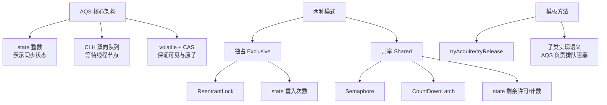

# 同步器的实现是ABS核心（state资源状态计数）

同步器的实现核心在于 AQS 维护的 `volatile int state` 变量，配合 CLH 队列变种管理等待线程，它代表了资源的当前状态（如锁被持有的次数、剩余许可数量）。

**1. state 的核心作用**
AQS 使用 `state` 来实现同步逻辑：
- **值为 0**：通常表示资源可用（无锁）。
- **值大于 0**：通常表示资源被占用或剩余资源数量。
- **值的修改**：通过 `getState()`, `setState()`, `compareAndSetState()`（CAS）进行原子操作，确保线程安全。
- **内存语义**：`volatile` 修饰保证了 state 变量的可见性，即一个线程修改了 state，其他线程能立即看到。

**实战案例**
在一次故障排查中，发现自定义的熔断器组件状态不同步。原因是在修改 state 标志位时直接使用了 `=` 赋值而非 CAS，导致高并发下状态回滚。修复为 `compareAndSetState` 后，状态变更保证了原子性，问题解决。

**代码示例**
```java
// 自定义互斥锁中的 state 使用
protected final boolean tryAcquire(int acquires) {
    return nonfairTryAcquire(acquires);
}

// CAS 更新 state 的关键逻辑
if (compareAndSetState(expect, update)) {
    setExclusiveOwnerThread(Thread.currentThread());
    return true;
}
```

**对比表格：state 在不同同步器中的含义**

| 同步器 | state = 0 | state > 0 | state 含义与操作 |
| :--- | :--- | :--- | :--- |
| **ReentrantLock** | 未锁定 | 已锁定 (重入次数) | CAS 竞争 0->1，重入时 +1，释放时 -1 |
| **Semaphore** | 无剩余许可 | 有 N 个剩余许可 | 初始化设为 N，acquire CAS 减，release CAS 加 |
| **CountDownLatch** | 任务全部完成 | 剩余任务数 | 初始化设为 N，countDown CAS 减至 0 触发唤醒 |
| **FutureTask** | 初始/完成中 | 运行中/已完成 | 1 表示正在运行，其他状态表示结果 (Normal/Exceptional) |

**2. AQS 同步队列架构**
AQS 内部维护了一个双向链表（FIFO 队列）来管理获取资源失败的线程。`state` 是核心判断依据。

```text
      Head (持有锁的线程节点)                       Tail (最新等待的线程节点)
      ┌─────────────┐ next ──────────────────────>  ┌─────────────┐
      │ Node: 0     │                              │ Node: N     │
      │ Thread: T1  │ <─ prev                       │ Thread: Tn  │
      │ waitStatus: │                              │ waitStatus: │
      │   0/SIGNAL  │                              │   0/CANCEL  │
      └─────────────┘                              └─────────────┘
             ▲                                             ▲
             │                                             │
        Release(state)                                  TryAcquire(state)
             │                                             │
             └──────────────> 唤醒后继节点 <──────────────────┘
```

**3. 实现案例细节**

- **ReentrantLock（独占式）**：
  - `state=0`：未锁定。
  - `state>0`：已锁定。数值表示重入次数（持有锁的线程每 lock 一次加 1，unlock 一次减 1）。
  - *边界条件*：重入次数必须与 lock 次数严格匹配，否则无法完全释放锁。

- **CountDownLatch（共享式）**：
  - `state=N`：初始计数值（需完成的工作数）。
  - `state=0`：所有工作完成，触发唤醒所有等待线程。
  - *边界条件*：一旦 state 减为 0，不可重置（除非重新实例化）。

通过自定义 `state` 的含义（是作为计数还是标志位）和修改逻辑（tryAcquire/tryRelease），AQS 框架可以灵活支持各种不同的同步器。

## 常见考点
1. **AQS 对公平锁和非公平锁的支持**：公平锁在获取锁前会检查队列是否有前驱节点，非公平锁直接尝试 CAS 抢占，这直接体现在 `tryAcquire` 的实现差异上。
2. **waitStatus 的状态含义**：面试官常问节点中 `waitStatus` 的具体值（1: CANCELLED, -1: SIGNAL, -2: CONDITION, -3: PROPAGATE）及其作用。
3. **自旋锁优化**：在获取锁失败入队前，AQS 是否有自旋逻辑？（JDK 1.6 后引入了适应性自旋，虽然 AQS 本身更多依赖队列挂起，但在尝试获取锁阶段有相关优化）。


## 核心架构图


## 核心知识点图


## 记忆要点

- 核心定义：AQS依赖volatile int state代表资源状态，配合CAS保证原子修改。
- 独占含义：ReentrantLock中，state=0代表无锁，state>0代表锁的重入次数。
- 共享含义：Semaphore中代表剩余许可数，CountDownLatch中代表剩余任务计数。
- 关键机制：volatile保证state可见性，CAS保证原子性，避免高并发状态回滚。

## 结构化回答

**30 秒电梯演讲：** 利用一个原子整数state标记资源状态，控制资源的获取与释放。打个比方，用牌子上的数字表示还剩几把钥匙，拿一把数字减一，还一把数字加一。

**展开框架：**
1. **核心定义** — AQS依赖volatile int state代表资源状态，配合CAS保证原子修改。
2. **独占含义** — ReentrantLock中，state=0代表无锁，state>0代表锁的重入次数。
3. **共享含义** — Semaphore中代表剩余许可数，CountDownLatch中代表剩余任务计数。

**收尾：** 我在项目里踩过坑——在一次故障排查中，发现自定义的熔断器组件状态不同步。您想深入聊哪一段：原理、避坑还是对比选型？

## 视频脚本

> 预计时长：2 分钟 | 由浅入深

| 时间 | 画面/字幕 | 口播台词 | 讲解要点 |
|------|----------|----------|----------|
| 0:00 | 标题卡：同步器的实现是ABS核心（state… | "同步器的实现是ABS核心（state资源状态计数）？一句话——用牌子上的数字表示还剩几把钥匙，拿一把数字减一，还一把数字加一。" | 开场钩子 |
| 0:40 | 概念动画/示意图 | "利用一个原子整数state标记资源状态，控制资源的获取与释放——用牌子上的数字表示还剩几把钥匙，拿一把数字减一，还一把数字加一" | 核心定义 |
| 1:20 | 核心定义示意 | "AQS依赖volatile int state代表资源状态，配合CAS保证原子修改。" | 要点1 |
| 2:00 | 总结卡 | "记住这几条，面试不慌。下期讲进阶追问。" | 收尾 |
