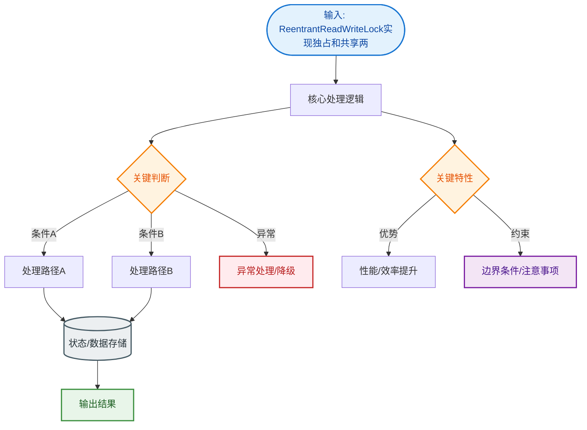
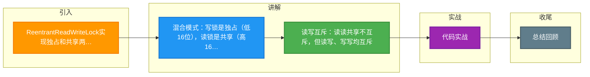

# ReentrantReadWriteLock实现独占和共享两种方式

`ReentrantReadWriteLock` 是 AQS 同时实现独占和共享两种方式的典型代表，它将锁分为读锁（共享）和写锁（独占），适用于读多写少场景。

**1. 混合模式设计**
通常自定义同步器要么是独占要么是共享，但 `ReentrantReadWriteLock` 为了优化读多写少的场景，在一个同步器中同时实现了两种模式：
- **写锁**：独占模式，同一时间只能有一个写线程。使用 `acquire/release` 流程。
- **读锁**：共享模式，同一时间可以有多个读线程。使用 `acquireShared/releaseShared` 流程。

**2. state 的高效切分（位运算）**
AQS 的 `int` 类型 `state` 变量（32位）被按位切分使用，通过位运算避免额外内存开销：

```text
  int state (32 bits)
  ┌───────────────┬───────────────┐
  │   High 16     │    Low 16     │
  │   (Read)      │   (Write)     │
  └───────────────┴───────────────┘
```

- **高 16 位**：保存“读锁”（共享锁）的持有次数。实际上由于读锁可被多线程共享，高16位记录的是所有线程获取读锁的总重入次数。
- **低 16 位**：保存“写锁”（独占锁）的重入次数。

**获取与释放逻辑**：
- 获取写锁：`state + 1`，直接操作低 16 位。
- 获取读锁：`state + (1 << 16)`，即 `state + 65536`。
- 读锁计数计算：`state >>> 16`（无符号右移）。
- 写锁计数计算：`state & 0xFFFF`。

**3. 锁降级与规则**
- **读-读**：可以共存（共享）。
- **读-写、写-读、写-写**：互斥（独占）。
- **锁降级**：支持从写锁降级为读锁（先获取写锁，再获取读锁，最后释放写锁），但不支持从读锁升级为写锁（会导致死锁）。

这种设计极大地提升了并发读的性能，同时通过位运算保证了状态变更的原子性。

**4. 实战对比与代码**

| 特性 | ReentrantReadWriteLock (RW锁) | ReentrantLock (普通锁) | synchronized (关键字) |
| :--- | :--- | :--- | :--- |
| **锁类型** | 悲观锁，支持共享/独占 | 悲观锁，仅独占 | 悲观锁，仅独占 |
| **并发读性能** | **极高** (无竞争) | 低 (串行) | 低 (串行) |
| **写饥饿** | 可能发生 (需关注公平策略) | 公平/非公平可选 | 非公平，可能饥饿 |
| **锁降级** | **支持** (写 -> 读) | 不支持 | 不支持 |
| **复杂度** | 较高 (需注意死锁) | 中等 | 低 |

```java
// 实战场景：缓存系统（读多写少），利用锁降级保证数据一致性
ReentrantReadWriteLock rwLock = new ReentrantReadWriteLock();
ReentrantReadWriteLock.ReadLock readLock = rwLock.readLock();
ReentrantReadWriteLock.WriteLock writeLock = rwLock.writeLock();

public Object getData(String key) {
    // 1. 先获取读锁查询缓存
    readLock.lock();
    Object value = cache.get(key);
    if (value == null) {
        // 2. 缓存未命中，需释放读锁获取写锁（锁升级不支持，必须先释放）
        readLock.unlock();
        writeLock.lock();
        try {
            // 3. 再次检查（防止其他线程已经更新）
            if (cache.get(key) == null) {
                value = database.query(key); // 耗时操作
                cache.put(key, value);
            }
            // 4. 锁降级：在释放写锁前获取读锁，保证当前线程能继续读取数据，且其他写线程无法插入
            readLock.lock(); 
        } finally {
            writeLock.unlock(); // 释放写锁，降级完成
        }
    }
    try {
        return value;
    } finally {
        readLock.unlock();
    }
}
```

## 常见考点
1. **锁升级/降级问题**：为什么支持锁降级而不支持锁升级？（升级会导致两个读线程同时在等待写锁，互相持有读锁不释放，造成死锁）。
2. **HoldCounter 计数**：由于读锁是共享的，AQS 如何记录每个线程的重入次数？（使用 `ThreadLocal` 配合 `HoldCounter` 来记录每个线程的读锁重入数）。
3. **写锁饥饿**：如果读线程很多，写锁可能一直获取不到，ReentrantReadWriteLock 有什么机制解决？（默认是非公平锁，写锁可以直接尝试插队；但在公平锁模式下，写锁必须严格按照队列顺序）。


## 核心流程图


## 记忆要点

- 混合模式：写锁是独占（低16位），读锁是共享（高16位），通过位运算切分state。
- 读写互斥：读读共享不互斥，但读写、写写均互斥。
- 锁降级特性：支持写锁降级为读锁（保证可见性），但严禁读锁升级为写锁（会死锁）。
- 重入计数：因为读锁被多线程共享，使用ThreadLocal配合HoldCounter记录读锁重入次数。

## 结构化回答

**30 秒电梯演讲：** 将state拆分高位和低位，同时支持读共享与写独占。打个比方，这房间写文章时锁门（独占），多人看书时开门（共享），但不能一边写一边看。

**展开框架：**
1. **混合模式** — 写锁是独占（低16位），读锁是共享（高16位），通过位运算切分state。
2. **读写互斥** — 读读共享不互斥，但读写、写写均互斥。
3. **锁降级特性** — 支持写锁降级为读锁（保证可见性），但严禁读锁升级为写锁（会死锁）。

**收尾：** 这三点都能配合实战聊。您想深入聊原理、对比还是避坑？

## 视频脚本

> 预计时长：2 分钟 | 由浅入深

| 时间 | 画面/字幕 | 口播台词 | 讲解要点 |
|------|----------|----------|----------|
| 0:00 | 标题卡：ReentrantReadWrite… | "ReentrantReadWriteLock实现独占和共享两种方式？一句话——这房间写文章时锁门（独占），多人看书时开门（共享），但不能一边写一边看。" | 开场钩子 |
| 0:40 | 概念动画/示意图 | "将state拆分高位和低位，同时支持读共享与写独占——这房间写文章时锁门（独占），多人看书时开门（共享），但不能一边写一边看" | 核心定义 |
| 1:20 | 混合模式示意 | "写锁是独占（低16位），读锁是共享（高16位），通过位运算切分state。" | 要点1 |
| 2:00 | 总结卡 | "记住这几条，面试不慌。下期讲进阶追问。" | 收尾 |

### 视频流程图



