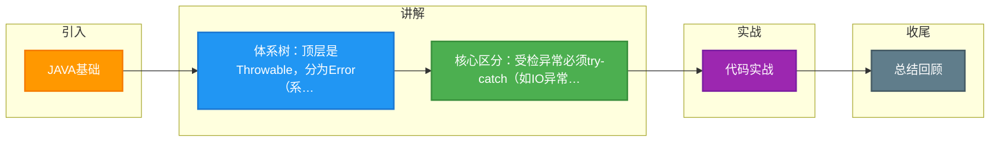

# JAVA基础

Java 异常体系是 Java 程序错误处理机制的核心，所有异常和错误的基类是 `Throwable`。

**1. 异常分类层次**

```text
              Throwable
            /          \
          Error        Exception
                        /        \
            CheckedException  RuntimeException
```

- **Error**：表示 JVM 内部错误或资源耗尽等严重问题（如 `StackOverflowError`, `OutOfMemoryError`）。应用程序无法捕获或处理这类错误，只能尽量终止。
- **Exception**：表示程序本身可以处理的异常。

**2. Exception 的细分**
- **RuntimeException（运行时异常/未检查异常）**：
  - 如 `NullPointerException`、`ClassCastException`、`ArrayIndexOutOfBoundsException`。
  - 特点：编译器不强制要求捕获或声明，通常是由于编程逻辑错误导致。
- **CheckedException（检查异常）**：
  - 如 `IOException`、`SQLException`。
  - 特点：编译器强制要求要么使用 `try-catch` 捕获，要么在方法签名上使用 `throws` 声明，强制程序员处理可能的异常情况。

**3. 处理机制细节**
- **try-catch-finally**：`finally` 块无论如何都会执行（除了 `System.exit(0)` 或物理断电），通常用于资源释放。
- **try-with-resources**：Java 7 引入语法糖，自动实现了 `AutoCloseable` 接口的资源关闭，替代繁琐的 `finally` 关闭流操作。

**4. 实战对比与代码**

| 异常类型 | 是否编译期检查 | 典型场景 | 处理建议 |
| :--- | :--- | :--- | :--- |
| **Error** | 否 | JVM 崩溃、内存溢出 | 不建议捕获，记录日志并终止 |
| **RuntimeException** | 否 | 空指针、类型转换、越界 | 修正代码逻辑，预检查（如 `if (obj != null)`）|
| **Checked Exception** | 是 | 文件读写、网络连接、SQL | 必须捕获或抛出，使用 Try-with-Resources |

```java
// 实战场景：文件读取的异常处理最佳实践
// 1. 必须处理 CheckedException (FileNotFoundException)
// 2. 使用 try-with-resources 自动关闭流，替代 finally
// 3. 捕获最具体的异常，而非直接 catch Exception
public String readFileContent(String path) throws IOException {
    StringBuilder content = new StringBuilder();
    // 资源在 try() 中声明，执行完自动调用 close()
    try (BufferedReader reader = new BufferedReader(new FileReader(path))) {
        String line;
        while ((line = reader.readLine()) != null) {
            content.append(line);
        }
    } // finally { reader.close(); } 编译器自动生成
    return content.toString();
}

// 踩坑经验：在多线程环境中，Thread.run() 内部的异常无法被主线程 try-catch 捕获。
// 解决方案：在 ExecutorService 中使用 Future.get() 或重写 Thread.uncaughtExceptionHandler。
```

## 常见考点
1. **finally 中的 return**：如果 try 和 finally 中都有 return，最终会返回哪个？（会覆盖 try 中的返回值，finally 中的 return 会生效，且会导致 try 块中的异常被吞掉，这是不推荐的写法）。
2. **异常链**：如何处理捕获一个异常后抛出另一个异常？（使用 `initCause()` 或带 Throwable 参数的构造函数，保留原始异常信息）。
3. **常见运行时异常**：面试官可能列举具体代码问会抛出什么异常，需熟悉 `NPE`、`ConcurrentModificationException` 等触发场景。


## 核心架构图

```mermaid
flowchart TD
    classDef start fill:#4CAF50,color:#fff
    classDef process fill:#2196F3,color:#fff
    classDef decision fill:#FF9800,color:#fff
    classDef special fill:#9C27B0,color:#fff
    classDef error fill:#f44336,color:#fff
    classDef info fill:#607D8B,color:#fff
    class A start
    class AQS process
    class B decision
    class B1 special
    class B2 error
    class B3 info
    class C start
    class C1 process
    class C2 decision
    class C3 special
    class D error
    class D1 info
    class D2 start
    class E process
    class E1 decision
    class E2 special
    class E3 error
    class F info
    class G start
    class GC process
    class IO decision
    class JIT special
    class JMM error
    class JUC info
    class JVM start
    class Java process
    class Lambda decision
    class NIO special
    class Optional error
    class Pattern info
    class Records start
    class Sealed process
    class Stream decision
    class Thread special
    class Virtual error
    class ZGC info
    A[Java 核心知识体系] --> B[基础语法]
    B --> B1[面向对象/接口/枚举]
    B --> B2[集合/泛型/反射/注解]
    B --> B3[IO/NIO/异常/序列化]
    A --> C[并发]
    C --> C1[线程/锁/AQS/JUC]
    C --> C2[内存模型 JMM]
    C --> C3[线程池/并发容器]
    A --> D[JVM]
    D --> D1[内存结构/GC/类加载]
    D --> D2[JIT/逃逸分析/调优]
    A --> E[新特性]
    E --> E1[Lambda/Stream/Optional]
    E --> E2[Records/Sealed/Pattern]
    E --> E3[Virtual Thread/ZGC]
    F[设计模式] --> G[创建/结构/行为 23 种]
```



## 记忆要点

- 体系树：顶层是Throwable，分为Error（系统错误）和Exception（程序异常）。
- 核心区分：受检异常必须try-catch（如IO异常），非受检异常可不处理（如空指针）。
- 异常处理：推荐使用try-with-resources语法糖，自动调用AutoCloseable关闭资源。
- 多线程坑：因为子线程无法向外抛异常，所以Thread内部异常主线程无法直接捕获。

## 结构化回答

**30 秒电梯演讲：** 将程序问题分为不可恢复的Error和可处理的Exception。打个比方，Error是地震，房子塌了只能重建；Exception是感冒，有的（Checked）必须治，有的（Runtime）是自己穿太少导致的。

**展开框架：**
1. **体系树** — 顶层是Throwable，分为Error（系统错误）和Exception（程序异常）。
2. **核心区分** — 受检异常必须try-catch（如IO异常），非受检异常可不处理（如空指针）。
3. **异常处理** — 推荐使用try-with-resources语法糖，自动调用AutoCloseable关闭资源。

**收尾：** 这三点都能配合实战聊。您想深入聊原理、对比还是避坑？

## 视频脚本

> 预计时长：2 分钟 | 由浅入深

| 时间 | 画面/字幕 | 口播台词 | 讲解要点 |
|------|----------|----------|----------|
| 0:00 | 标题卡：JAVA基础 | "JAVA基础？一句话——Error是地震，房子塌了只能重建；Exception是感冒，有的（Checked）必须治，有的（Runtime）是自己穿太少导致的。" | 开场钩子 |
| 0:40 | 概念动画/示意图 | "将程序问题分为不可恢复的Error和可处理的Exception——Error是地震，房子塌了只能重建；Exception是感冒，有的（Checked）必须治，有的（Runtime）是自己穿太少导致的" | 核心定义 |
| 1:20 | 体系树示意 | "顶层是Throwable，分为Error（系统错误）和Exception（程序异常）。" | 要点1 |
| 2:00 | 总结卡 | "记住这几条，面试不慌。下期讲进阶追问。" | 收尾 |

### 视频流程图



