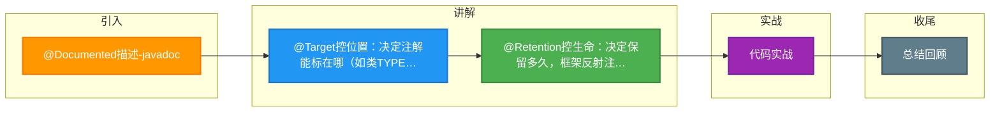

# @Documented描述-javadoc

Java 提供了四种标准的元注解（Meta-Annotation），用于对其他注解进行说明和配置。

**1. @Target**
- **作用**：指定被修饰的注解可以用于哪些程序元素。
- **范围**：如 `TYPE`（类/接口）、`FIELD`（成员变量）、`METHOD`（方法）、`PARAMETER`（参数）等。
- **细节**：如果不指定，注解可用于任何地方。

**2. @Retention**
- **作用**：定义被修饰的注解的生命周期（保留时间）。
- **策略**：
  - `SOURCE`：仅保留在源码中，编译时丢弃（如 `@Override`, `@SuppressWarnings`）。
  - `CLASS`：保留在 class 文件中，JVM 运行时丢弃（默认行为）。
  - `RUNTIME`：保留至运行时，可通过反射获取（如 `@Component`, `@Autowired`，是框架做注解驱动开发的关键）。

**3. @Documented**
- **作用**：标记该注解会被 javadoc 等工具提取到文档中。
- **细节**：如果使用了 `@Documented`，则该注解标注的类在生成 API 文档时，会保留该注解信息。

**4. @Inherited**
- **作用**：标记该注解具有继承性。如果一个类使用了该注解，其子类也会自动继承该注解。
- **边界**：仅作用于类继承，对接口实现无效，且注解只对类本身生效，对接口和类中的方法/字段继承不生效。

**5. 实战代码与注意**

```java
import java.lang.annotation.*;

// 定义一个用于运行时反射的注解
@Retention(RetentionPolicy.RUNTIME) // 必须指定RUNTIME，否则反射获取不到
@Target({ElementType.TYPE, ElementType.METHOD}) // 限制只能用在类和方法上
@Documented // 生成 javadoc 时包含此注解信息
public @interface MyLog {
    String value() default "";
}

// 使用案例
@MyLog("UserService")
public class UserService {
    @MyLog("login")
    public void login() { }
}

// 踩坑经验：@Retention 默认是 CLASS 级别。
// 如果忘记显式指定 RetentionPolicy.RUNTIME，在 Spring AOP 或反射扫描时将无法获取该注解，导致切面失效。
```

## 常见考点
1. **@Retention(RetentionPolicy.RUNTIME) 的意义**：为什么 Spring 等框架的注解都是 RUNTIME 级别的？（因为需要在运行时通过反射扫描注解来控制逻辑）。
2. **@Inherited 的局限性**：@Inherited 注解在接口上声明，实现类会继承吗？（不会）。注解在父类方法上，子类重写该方法会继承注解吗？（不会）。
3. **注解的本质**：注解在编译后是什么？（继承自 `java.lang.annotation.Annotation` 接口的接口，JDK 动态代理生成实例）。


## 核心架构图

```mermaid
flowchart TD
    classDef start fill:#4CAF50,color:#fff
    classDef process fill:#2196F3,color:#fff
    classDef decision fill:#FF9800,color:#fff
    classDef special fill:#9C27B0,color:#fff
    classDef error fill:#f44336,color:#fff
    classDef info fill:#607D8B,color:#fff
    class A start
    class ANNOTATION_TYPE process
    class Annotation decision
    class B special
    class C error
    class CLASS info
    class CONSTRUCTOR start
    class D process
    class Documented decision
    class E special
    class ElementType error
    class F info
    class FIELD start
    class G process
    class H decision
    class I special
    class Inherited error
    class J info
    class Java start
    class Javadoc process
    class K decision
    class L special
    class M error
    class METHOD info
    class Meta start
    class N process
    class O decision
    class Override special
    class P error
    class PARAMETER info
    class Q start
    class R process
    class RUNTIME decision
    class Repeatable special
    class Retention error
    class RetentionPolicy info
    class SOURCE start
    class TYPE process
    class Target decision
    class br special
    A[Java 元注解 Meta-Annotation] --> B[标注在其他注解上]
    C["@Target 目标"] --> D[ElementType 枚举]
    D --> E[TYPE/FIELD/METHOD]
    D --> F[PARAMETER/CONSTRUCTOR]
    D --> G[ANNOTATION_TYPE]
    H["@Retention 保留期"] --> I[RetentionPolicy]
    I --> J[SOURCE 源码丢弃 如 Override]
    I --> K[CLASS 字节码 默认]
    I --> L[RUNTIME 运行时 反射可见]
    M["@Documented"] --> N[出现在 Javadoc 中]
    O["@Inherited"] --> P["子类自动继承该注解<br/>仅对类有效"]
    Q["@Repeatable"] --> R["同一位置可重复使用<br/>Java 8+"]
```



## 记忆要点

- @Target控位置：决定注解能标在哪（如类TYPE、方法METHOD、字段FIELD）。
- @Retention控生命：决定保留多久，框架反射注解必须显式指定为RUNTIME级别。
- @Documented生文档：标记此注解会被Javadoc工具提取并写入API文档中。
- 四大元注解记忆：Target定位置，Retention定周期，Documented出文档，Inherited能继承。

## 结构化回答

**30 秒电梯演讲：** 定义注解的适用范围、生命周期及继承特性。打个比方，像贴标签的规则：@Target规定贴哪，@Retention规定贴多久，@Documented写进说明书，@Inherited随血缘传给下一代。

**展开框架：**
1. **@Target控位置** — 决定注解能标在哪（如类TYPE、方法METHOD、字段FIELD）。
2. **@Retention控生命** — 决定保留多久，框架反射注解必须显式指定为RUNTIME级别。
3. **@Documented生文档** — 标记此注解会被Javadoc工具提取并写入API文档中。

**收尾：** 这三点都能配合实战聊。您想深入聊原理、对比还是避坑？

## 视频脚本

> 预计时长：3 分钟 | 由浅入深

| 时间 | 画面/字幕 | 口播台词 | 讲解要点 |
|------|----------|----------|----------|
| 0:00 | 标题卡：@Documented描述-java… | "@Documented描述-javadoc？一句话——像贴标签的规则：@Target规定贴哪，@Retention规定贴多久，@Documented写进说明书，@Inherited随血缘传给下一代。" | 开场钩子 |
| 0:45 | 概念动画/示意图 | "定义注解的适用范围、生命周期及继承特性——像贴标签的规则：@Target规定贴哪，@Retention规定贴多久，@Documented写进说明书，@Inherited随血缘传给下一代" | 核心定义 |
| 1:30 | @Target控位置示意 | "决定注解能标在哪（如类TYPE、方法METHOD、字段FIELD）。" | 要点1 |
| 2:15 | 要点2图解示意 | "决定保留多久，框架反射注解必须显式指定为RUNTIME级别。" | 要点2 |
| 3:00 | 总结卡 | "记住这几条，面试不慌。下期讲进阶追问。" | 收尾 |

### 视频流程图



