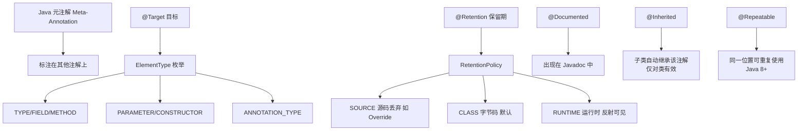

# @Inherited阐述了某个被标注的类型是被继承的

@Inherited 是一个元注解，用于修饰其他注解。它的作用是允许被修饰的注解具有继承性。

**1. 基本原理**
具体来说，如果一个类 ClassA 被使用了 @Inherited 修饰的注解 @MyAnnotation 标注，那么该类的子类 ClassB 也会自动继承该注解（即子类也相当于被该注解标注）。

**2. 继承机制示意图**

```text
@Inherited
@interface MyAnnotation { }

@MyAnnotation      ───> 注解存在
class Parent { }
     △
     │ 继承
     │
class Child extends Parent { } ───> 子类自动拥有 @MyAnnotation
```

**3. 关键边界条件与限制**
- **类继承**：仅对类继承有效。子类会自动带有父类的注解（通过 `getAnnotation` 查询时能找到）。
- **接口无效**：如果父接口使用了 @Inherited 注解，实现类并不会继承该注解。
- **方法/字段不继承**：该注解只作用于类类型。如果父类的方法使用了 @Inherited 注解的元注解，子类重写该方法时并不会继承该注解。
- **注解生效时机**：这是在反射（`Class.getAnnotations()`）时体现的特性，JVM 类加载时并不会把注解物理复制到子类的 Class 对象结构中，而是通过逻辑查找父类。

**4. 实战代码与陷阱**

| 继承场景 | @Inherited 是否生效 | 说明 |
| :--- | :--- | :--- |
| Class extends Class | **是** | 子类 Class 对象 getAnnotation 可查到 |
| Interface implements Interface | **否** | 即使接口注解加了 @Inherited，实现类也查不到 |
| Class implements Interface | **否** | 实现类不会继承接口上的注解 |
| Method Override | **否** | 子类重写父类方法，不会继承方法上的注解 |

```java
import java.lang.annotation.*;

@Inherited // 标记为可继承
@Retention(RetentionPolicy.RUNTIME)
@interface MyAuth { }

@MyAuth
class BaseService { }

class UserService extends BaseService { }

class OrderService implements BaseService { } // 注意：这里是实现，不是继承

// 测试输出
System.out.println(UserService.class.isAnnotationPresent(MyAuth.class)); // 输出 true
// 踩坑经验：很多人误以为实现类也能继承，实际上 OrderService 输出 false，
// 这在开发通用权限框架（如标注在基类接口上）时容易导致鉴权遗漏。
```

## 常见考点
1. **接口继承问题**：@Inherited 修饰的注解标注在接口上，实现类能获取到吗？（不能，这是高频坑点）。
2. **反射行为**：子类继承注解后，`isAnnotationPresent` 和 `getAnnotation` 的行为是怎样的？（可以直接在子类 Class 对象上查到）。
3. **Spring 中的应用**：Spring 事务注解 `@Transactional` 有继承性吗？（没有，因为 `@Transactional` 没有被 `@Inherited` 修饰，但 Spring 内部在事务切面逻辑中额外处理了父类方法的事务配置查找，属于框架层面的增强）。


## 核心架构图


## 核心知识点图


## 记忆要点

- 作用域限制：@Inherited修饰的注解仅对类继承有效，子类自动带有父类注解。
- 接口失效陷阱：注解标在父接口上，无论子接口还是实现类都不会继承此注解。
- 方法字段失效：父类方法或字段的注解，子类重写或覆盖时无法继承。
- 框架避坑：因为@Transactional无@Inherited，所以父类的事务注解子类继承无效。

## 结构化回答

**30 秒电梯演讲：** 标记注解可被子类继承。打个比方，就像家族徽章，父亲有了，儿子生下来也就有了。

**展开框架：**
1. **作用域限制** — @Inherited修饰的注解仅对类继承有效，子类自动带有父类注解。
2. **接口失效陷阱** — 注解标在父接口上，无论子接口还是实现类都不会继承此注解。
3. **方法字段失效** — 父类方法或字段的注解，子类重写或覆盖时无法继承。

**收尾：** 这三点都能配合实战聊。您想深入聊原理、对比还是避坑？

## 视频脚本

> 预计时长：3 分钟 | 由浅入深

| 时间 | 画面/字幕 | 口播台词 | 讲解要点 |
|------|----------|----------|----------|
| 0:00 | 标题卡：@Inherited阐述了某个被标注… | "@Inherited阐述了某个被标注的类型是被继承的？一句话——就像家族徽章，父亲有了，儿子生下来也就有了。" | 开场钩子 |
| 0:45 | 概念动画/示意图 | "标记注解可被子类继承——就像家族徽章，父亲有了，儿子生下来也就有了" | 核心定义 |
| 1:30 | 作用域限制示意 | "@Inherited修饰的注解仅对类继承有效，子类自动带有父类注解。" | 要点1 |
| 2:15 | 接口失效陷阱示意 | "注解标在父接口上，无论子接口还是实现类都不会继承此注解。" | 要点2 |
| 3:00 | 总结卡 | "记住这几条，面试不慌。下期讲进阶追问。" | 收尾 |
