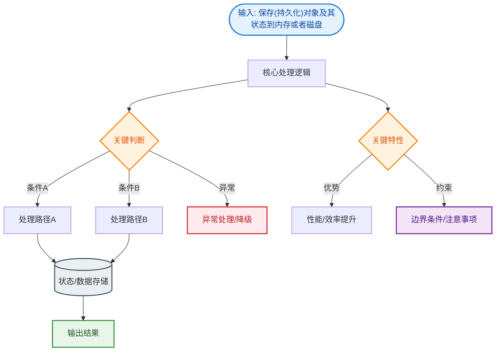
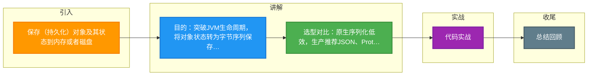

# 保存(持久化)对象及其状态到内存或者磁盘

Java 序列化是指将 Java 对象转换为字节序列的过程，以便将对象的状态保存到存储介质（如磁盘）或在网络中传输。反序列化则是将字节序列恢复为 Java 对象的过程。

**核心要点：**
1. **持久化**：将内存中的对象状态保存到磁盘或数据库，突破 JVM 生命周期的限制。
2. **传输**：在 RMI 或网络传输中，通过序列化将对象转换为字节流进行发送。
3. **静态成员**：序列化保存的是对象的实例变量（状态），属于类的静态变量不会被序列化。
4. **实现方式**：类需实现 `java.io.Serializable` 接口。
5. **序列化 ID**：`serialVersionUID` 用于版本控制，确保反序列化时类的一致性。

**增强细节与原理：**
*   **序列化算法细节**：Java 序列化协议是一种自定义的二进制格式，包含类元数据（描述符）和对象实例数据。当序列化一个对象时，JVM 不仅写入对象的实例数据，还会递归序列化其父类的数据（直到父类未实现 Serializable 为止）以及其引用的其他对象（构成对象图）。
*   **关键字 transient**：如果实例变量不希望被序列化（如敏感信息密码），可以使用 `transient` 关键字修饰。反序列化时，该变量会被恢复为类型的默认值（如 null, 0, false）。
*   **构造函数调用**：反序列化过程中，JVM 不会调用对象的构造函数。它是通过从字节流中读取数据直接在内存中重构对象。然而，对于父类如果未实现 Serializable 接口，则必须调用父类的无参构造函数来初始化父类字段。
*   **性能与安全**：原生 Java 序列化效率较低（字节流体积大），且存在安全风险（如反序列化漏洞）。生产环境通常推荐使用 JSON、Protobuf 或 Kryo 等替代方案。

**流程图：**
```text
内存对象          序列化过程              磁盘/网络字节流
┌─────────┐                       ┌───────────────────────┐
│ Object  │──> writeObject() ────>│ 01 AC ED (Magic Header)│
│ (State) │   (ObjectOutputStream) │ Class Metadata Desc   │
└─────────┘                       │ Object Data Values    │
                                  └───────────────────────┘
```

**4. 实战代码与选型**

| 方案 | 优点 | 缺点 | 适用场景 |
| :--- | :--- | :--- | :--- |
| **Java Native** | JDK 原生支持，无需依赖 | 效率低，体积大，不安全 | RMI 通信，本地简单缓存 |
| **JSON (Jackson)** | 可读性强，跨语言 | 体积大，解析慢 | HTTP API 接口交互 |
| **Protobuf** | 极致压缩，高性能，跨语言 | 需编写 .proto 文件 | 微服务内部 RPC 通信 |
| **Kryo** | 极快，Java 优化好 | 不支持跨语言 | 大数据计算，Spark/Hadoop |

```java
import java.io.*;

public class SerializationDemo implements Serializable {
    private static final long serialVersionUID = 1L; // 必须显式指定
    
    private String username;
    
    // 踩坑经验：敏感信息（如密码）不应序列化，使用 transient 修饰
    // 避免反序列化攻击或日志泄露
    private transient String password;

    public SerializationDemo(String username, String password) {
        this.username = username;
        this.password = password;
    }

    // 序列化工具方法
    public byte[] serialize() throws IOException {
        try (ByteArrayOutputStream bos = new ByteArrayOutputStream();
             ObjectOutputStream oos = new ObjectOutputStream(bos)) {
            oos.writeObject(this);
            return bos.toByteArray();
        }
    }

    // 反序列化工具方法
    public static SerializationDemo deserialize(byte[] data) throws IOException, ClassNotFoundException {
        try (ByteArrayInputStream bis = new ByteArrayInputStream(data);
             ObjectInputStream ois = new ObjectInputStream(bis)) {
            return (SerializationDemo) ois.readObject();
        }
    }
}
```

## 常见考点
1.  **serialVersionUID 的作用**：如果未显式定义，JVM 会根据类信息自动生成。修改类结构（如增删字段）会导致 ID 变化，从而在反序列化时抛出 `InvalidClassException`。显式定义可保证版本兼容性。
2.  **深拷贝与序列化**：利用序列化（将对象写入字节数组流再读出）可以实现深拷贝，前提是对象图中的所有对象都实现了 Serializable。
3.  **Externalizable 接口**：与 Serializable 的区别。Externalizable 继承自 Serializable，强制实现 `writeExternal` 和 `readExternal` 方法，由开发者完全控制序列化逻辑，性能更高但代码量大。


## 核心流程图


## 记忆要点

- 目的：突破JVM生命周期，将对象状态转为字节序列保存到磁盘或网络传输。
- 选型对比：原生序列化低效，生产推荐JSON、Protobuf（RPC）或Kryo（大数据）。
- 关键字transient：阻止敏感实例变量被序列化，反序列化时恢复为类型默认值。
- 构造调用：反序列化不调用类构造器，但父类未实现Serializable时需调用父类无参构造。

## 结构化回答

**30 秒电梯演讲：** 把对象存硬盘或发网络。打个比方，把乐高模型拆散装盒，寄给朋友，朋友拼好还原。

**展开框架：**
1. **目的** — 突破JVM生命周期，将对象状态转为字节序列保存到磁盘或网络传输。
2. **选型对比** — 原生序列化低效，生产推荐JSON、Protobuf（RPC）或Kryo（大数据）。
3. **关键字transient** — 阻止敏感实例变量被序列化，反序列化时恢复为类型默认值。

**收尾：** 这三点都能配合实战聊。您想深入聊原理、对比还是避坑？

## 视频脚本

> 预计时长：3 分钟 | 由浅入深

| 时间 | 画面/字幕 | 口播台词 | 讲解要点 |
|------|----------|----------|----------|
| 0:00 | 标题卡：保存(持久化)对象及其状态到内存或者… | "保存(持久化)对象及其状态到内存或者磁盘？一句话——把乐高模型拆散装盒，寄给朋友，朋友拼好还原。" | 开场钩子 |
| 0:45 | 概念动画/示意图 | "把对象存硬盘或发网络——把乐高模型拆散装盒，寄给朋友，朋友拼好还原" | 核心定义 |
| 1:30 | 目的示意 | "突破JVM生命周期，将对象状态转为字节序列保存到磁盘或网络传输。" | 要点1 |
| 2:15 | 选型对比示意 | "原生序列化低效，生产推荐JSON、Protobuf（RPC）或Kryo（大数据）。" | 要点2 |
| 3:00 | 总结卡 | "记住这几条，面试不慌。下期讲进阶追问。" | 收尾 |

### 视频流程图



