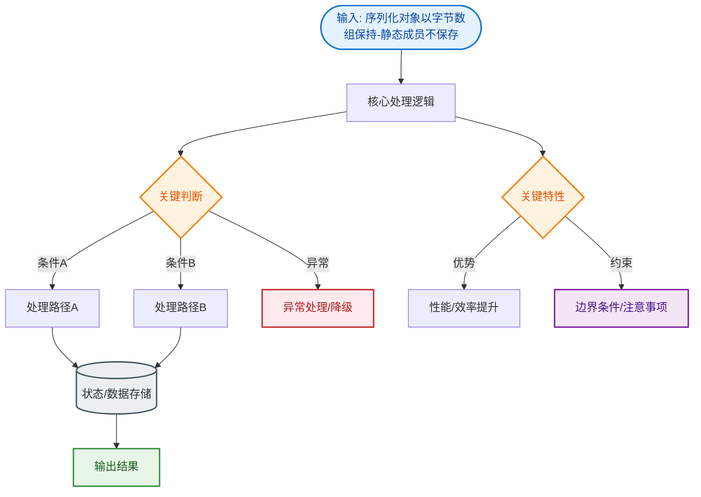

# 序列化对象以字节数组保持-静态成员不保存

Java 序列化机制在保存对象时，会将对象的状态（即非静态的成员变量）转换为一组字节。**静态变量（static）属于类属性，而不是对象的具体状态**，因此它们不会被包含在序列化的字节流中。当对象被反序列化时，静态变量的值取决于当前 JVM 中该类的静态变量值，而非序列化时的值。

**增强细节与原理**：
*   **原理分析**：静态变量在 JVM 中存储在方法区，是所有该类实例共享的数据。序列化的目的是保存“对象”的特定状态，而静态变量属于“类”的元数据。因此，序列化字节流中仅包含对象的堆内存数据及类描述符，不包含静态变量域。
*   **反序列化时的行为**：当从磁盘读取对象并恢复到 JVM 时，JVM 会加载类（如果未加载）。此时静态变量会被初始化为类中定义的初始值或当前 JVM 中已有的值。如果序列化时静态变量 `count=10`，反序列化时该类在 JVM 中 `count=5`，则恢复后的对象看到的静态值将是 5。
*   **内存结构视角**：
    ```text
    JVM Memory Layout
    ┌─────────────────────────────────┐
    │        Heap (堆内存)            │  <-- 序列化保存的部分
    │  ┌───────────────────────────┐  │
    │  │ Object Instance Data       │  │
    │  │ (non-static fields)       │  │
    │  └───────────────────────────┘  │
    ├─────────────────────────────────┤
    │    Method Area (方法区)         │  <-- 序列化忽略的部分
    │  ┌───────────────────────────┐  │
    │  │ Class Metadata            │  │
    │  │ static Variable (Class)   │  │
    │  └───────────────────────────┘  │
    └─────────────────────────────────┘
    ```

### 实战案例
在分布式任务调度系统中，曾尝试用序列化保存任务执行器的全局计数器（`static int counter`）。重启服务恢复状态后，发现计数器归零而非持久化时的值，导致任务ID冲突。这是因为反序列化读取了新JVM中类初始化后的静态值（0），而非快照中的值。

### 代码示例 (Java)
```java
// 序列化时刻
Config.counter = 100; // 静态变量
oos.writeObject(configInstance);

// 反序列化后 (假设此时JVM中Config.counter被初始化为0或被其他线程改为5)
Config loaded = (Config) ois.readObject();
System.out.println(loaded.counter); // 输出结果取决于当前JVM，而非100
```

## 常见考点
1.  **如何序列化静态变量？**：Java 原生序列化无法直接序列化静态变量。如需保存静态状态，需手动将其赋值给实例变量（临时包装）或自定义 `writeObject` 和 `readObject` 方法显式写入静态值（但反序列化后需手动设置回类，因为 readObject 仅作用于实例）。
2.  **final 修饰的静态变量**：如果是编译期常量（`static final`），值在编译时嵌入字节码，反序列化后直接取常量值；如果是运行时赋值的 `static final`，表现同普通静态变量。


## 核心流程图


## 记忆要点

- 核心结论：因为静态变量属于类元数据，所以序列化时不保存静态变量。
- 内存视角：序列化只存堆内存的对象实例状态，而静态变量存于方法区被忽略。
- 反序列化表现：静态变量的值取决于当前JVM中该类的最新状态，而非持久化时的快照。
- 常量特例：编译期常量（static final）会被嵌入字节码，反序列化直接取常量值。

## 结构化回答

**30 秒电梯演讲：** 序列化只存对象状态不存类属性。打个比方，拍照存档只拍你的样子，不拍你头顶的蓝天。

**展开框架：**
1. **核心结论** — 因为静态变量属于类元数据，所以序列化时不保存静态变量。
2. **内存视角** — 序列化只存堆内存的对象实例状态，而静态变量存于方法区被忽略。
3. **反序列化表现** — 静态变量的值取决于当前JVM中该类的最新状态，而非持久化时的快照。

**收尾：** 我在项目里踩过坑——在分布式任务调度系统中，曾尝试用序列化保存任务执行器的全局计数器（`static int counter`）。您想深入聊哪一段：原理、避坑还是对比选型？

## 视频脚本

> 预计时长：3 分钟 | 由浅入深

| 时间 | 画面/字幕 | 口播台词 | 讲解要点 |
|------|----------|----------|----------|
| 0:00 | 标题卡：序列化对象以字节数组保持-静态成员不… | "序列化对象以字节数组保持-静态成员不保存？一句话——拍照存档只拍你的样子，不拍你头顶的蓝天。" | 开场钩子 |
| 0:45 | 概念动画/示意图 | "序列化只存对象状态不存类属性——拍照存档只拍你的样子，不拍你头顶的蓝天" | 核心定义 |
| 1:30 | 核心结论示意 | "因为静态变量属于类元数据，所以序列化时不保存静态变量。" | 要点1 |
| 2:15 | 内存视角示意 | "序列化只存堆内存的对象实例状态，而静态变量存于方法区被忽略。" | 要点2 |
| 3:00 | 总结卡 | "记住这几条，面试不慌。下期讲进阶追问。" | 收尾 |
