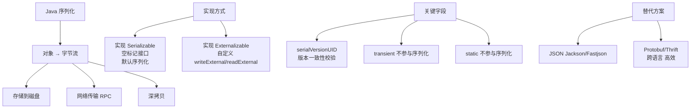
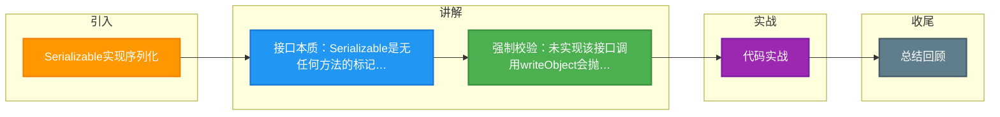

# Serializable实现序列化

在 Java 中，如果希望一个类的对象能够被序列化，该类必须实现 `java.io.Serializable` 接口。这是一个标记接口（Marker Interface），接口内没有任何方法。实现该接口仅仅是告诉 JVM 该对象是可序列化的，JVM 会通过特殊机制（如反射）自动处理其序列化过程。

**增强细节与原理**：
*   **标记接口模式**：`Serializable` 是一种标记接口，类似于 `Cloneable`。JVM 在进行运行时类型检查时，如果对象未实现该接口，调用 `ObjectOutputStream.writeObject()` 会抛出 `NotSerializableException`。
*   **序列化过程控制**：虽然接口无方法，但开发者可以通过在类中定义特定签名的方法来干预序列化逻辑（这就是“特殊机制”的一部分）：
    *   `private void writeObject(java.io.ObjectOutputStream out)`：自定义序列化逻辑。
    *   `private void readObject(java.io.ObjectInputStream in)`：自定义反序列化逻辑。
    *   `private Object writeReplace()`：在序列化前替换对象（常用于单例模式保护）。
    *   `private Object readResolve()`：在反序列化后替换对象（用于反序列化时保持单例属性或枚举）。
*   **父类序列化**：如果父类实现了 Serializable，子类自动可序列化。如果父类未实现，子类实现 Serializable 时，父类的字段必须有无参构造函数才能正确恢复（通过构造函数初始化父类字段），否则父类字段无法保留。

### 实战案例
在使用单例模式管理的数据库连接池类中，若仅实现 `Serializable` 而未加保护，反序列化操作会直接创建一个新的连接池实例，破坏了单例约束导致连接数超限。这是面试中考察序列化对设计模式影响的经典场景。

### 代码示例 (Java - 单例保护)
```java
public class DatabasePool implements Serializable {
    private static final DatabasePool INSTANCE = new DatabasePool();
    private DatabasePool() {}

    // 防止反序列化破坏单例
    private Object readResolve() {
        return INSTANCE; // 直接返回现有的单例实例，丢弃反序列化创建的新对象
    }
}
```

### 接口对比
| 接口 | 类型 | 方法 | 适用场景 | 性能 |
| :--- | :--- | :--- | :--- | :--- |
| **Serializable** | 标记接口 | 无 | 默认序列化，开发简单 | 较低 (反射开销) |
| **Externalizable** | 普通接口 | writeExternal, readExternal | 需高性能或完全自定义逻辑 | 高 (手动控制) |

## 常见考点
1.  **为什么设计成标记接口？**：为了类型安全和向上兼容。如果设计成注解，可能在老版本 JVM 中失效；标记接口让编译器无法强制检查，但在运行时 JVM 能明确区分哪些对象可序列化。
2.  **自定义序列化的场景**：如需对敏感字段加密后再序列化，或者在序列化前进行数据校验。面试时需要展示对 `writeObject`/`readObject` 的了解。
3.  **单例破坏与修复**：序列化会破坏单例模式（因为反序列化创建了新对象）。解决办法是实现 `readResolve()` 方法，直接返回单例实例，而不是允许 JVM 创建新对象。

## 技术原理

**必须实现 Serializable 接口**
Java 序列化机制要求被序列化的类必须实现 `java.io.Serializable` 接口。`ObjectOutputStream.writeObject()` 在执行时会检查对象的运行时类型是否实现了该接口，未实现则抛出 `NotSerializableException`。这是 JVM 的一种类型契约：只有显式声明"我允许被序列化"的对象才会被处理。

**它是一个空接口（标记接口）**
`Serializable` 内部没有任何方法和字段，是典型的标记接口（Marker Interface），类似于 `Cloneable`、`RandomAccess`。它不定义任何行为，只是给 JVM 打一个标签，告诉 JVM"这个类可以被序列化"。JVM 通过反射检查这个标记来决定是否允许序列化，这种设计保留了类型安全和向后兼容性。

**JVM 识别标记后自动处理**
实现 Serializable 后，JVM 默认会序列化所有非 static、非 transient 的实例字段。开发者也可以通过定义特定签名的方法干预：`writeObject`/`readObject` 自定义读写逻辑、`writeReplace`/`readResolve` 在序列化前后替换对象。反序列化时，JVM 会绕过构造函数直接通过反射构造对象，这是序列化能破坏单例的根本原因。

**未实现该接口会抛出异常**
如果尝试序列化未实现 Serializable 的对象，运行时会抛出 `NotSerializableException`，这是一个运行时检查（编译期不报错）。这种设计允许第三方库类（如未实现接口的类）按需被纳入序列化。

## 代码示例

```java
// 1. 基本用法：实现 Serializable 即可序列化
public class User implements Serializable {
    private static final long serialVersionUID = 1L; // 显式声明版本号
    private String name;
    private transient String password;  // transient 跳过序列化
    // static 字段也不参与序列化
}
```

```java
// 2. 单例保护：防止反序列化破坏单例
public class DatabasePool implements Serializable {
    private static final DatabasePool INSTANCE = new DatabasePool();
    private DatabasePool() {}
    public static DatabasePool getInstance() { return INSTANCE; }

    // 反序列化时 JVM 会调用此方法，直接返回单例而非新对象
    private Object readResolve() {
        return INSTANCE;
    }
}
```

## 注意事项

- 接口本质：Serializable 是无任何方法的标记接口，靠 JVM 反射处理序列化。
- 强制校验：未实现该接口调用 writeObject 会抛 NotSerializableException。
- 单例破坏：序列化会破坏单例，需重写 readResolve() 直接返回单例实例。
- 建议显式声明 `serialVersionUID`，否则 JVM 自动生成会因编译器版本变化导致反序列化失败。
- 序列化存在安全风险（反序列化漏洞），生产环境推荐 JSON/Protobuf 替代 Java 原生序列化。


## 核心架构图



## 记忆要点

- 接口本质：Serializable是无任何方法的标记接口，靠JVM反射处理序列化
- 强制校验：未实现该接口调用writeObject会抛NotSerializableException
- 单例破坏：序列化会破坏单例，需重写readResolve()直接返回单例实例

## 结构化回答

**30 秒电梯演讲：** 实现标记接口获得序列化资格。打个比方，给产品贴上“易碎品”标签，快递员就知道怎么处理。

**展开框架：**
1. **接口本质** — Serializable是无任何方法的标记接口，靠JVM反射处理序列化
2. **强制校验** — 未实现该接口调用writeObject会抛NotSerializableException
3. **单例破坏** — 序列化会破坏单例，需重写readResolve()直接返回单例实例

**收尾：** 我在项目里踩过坑——在使用单例模式管理的数据库连接池类中，若仅实现 `Serializable` 而未加保护，反序列化操作会直接创建一个新的连接池实例，破坏了单例约束导致连接数超限。您想深入聊哪一段：原理、避坑还是对比选型？

## 视频脚本

> 预计时长：3 分钟 | 由浅入深

| 时间 | 画面/字幕 | 口播台词 | 讲解要点 |
|------|----------|----------|----------|
| 0:00 | 标题卡：Serializable实现序列化 | "Serializable实现序列化？一句话——给产品贴上“易碎品”标签，快递员就知道怎么处理。" | 开场钩子 |
| 0:45 | 概念动画/示意图 | "实现标记接口获得序列化资格——给产品贴上“易碎品”标签，快递员就知道怎么处理" | 核心定义 |
| 1:30 | 接口本质示意 | "Serializable是无任何方法的标记接口，靠JVM反射处理序列化" | 要点1 |
| 2:15 | 强制校验示意 | "未实现该接口调用writeObject会抛NotSerializableException" | 要点2 |
| 3:00 | 总结卡 | "记住这几条，面试不慌。下期讲进阶追问。" | 收尾 |

### 视频流程图



