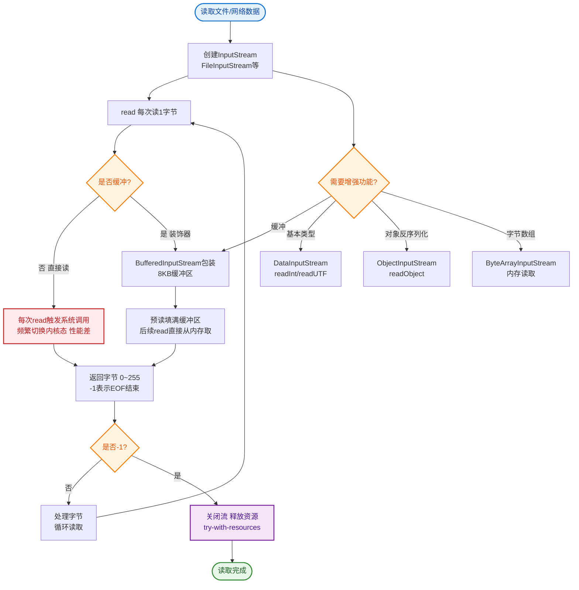
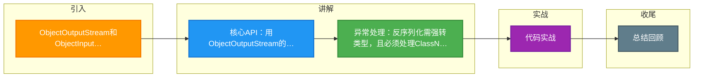

# ObjectOutputStream和ObjectInputStream对对象进行序列化及反序列化

Java 提供了 `ObjectOutputStream` 和 `ObjectInputStream` 两个高级流类来处理对象的序列化和反序列化。

- **ObjectOutputStream**：调用 `writeObject(Object obj)` 方法，将对象序列化为字节流并写入输出流（如文件）。
- **ObjectInputStream**：调用 `readObject()` 方法，从输入流中读取字节流并反序列化为 Java 对象。

**增强细节与原理**：
*   **流处理链**：这两个类通常处理在底层字节流（如 `FileOutputStream`, `ByteArrayOutputStream`, `SocketOutputStream`》）之上，形成装饰器模式。
*   **方法签名与异常**：
    *   `writeObject` 抛出 `IOException`。
    *   `readObject` 返回 `Object` 类型，通常需要强转，且可能抛出 `ClassNotFoundException`（反序列化时找不到类的定义）和 `InvalidClassException`（版本不匹配）。
*   **操作序列**：
    1.  **序列化**：先写入魔数（0xACED）和版本号，再写入类的描述符，最后写入实例数据。
    2.  **反序列化**：读取魔数验证，读取类描述符加载类，递归读取父类数据，最后填充实例字段。如果流中包含多个对象，必须按照写入的顺序依次读取。
*   **资源管理**：这两个流都实现了 `AutoCloseable`，应使用 try-with-resources 语句以确保底层流被正确关闭，防止资源泄露。

**调用链路图**：
```text
Application Layer
       │
       ├─> ObjectOutputStream.writeObject(obj)
       │        │
       │        ▼
       │  ┌───────────────────┐
       │  │   Metadata Check  │ (Check Serializable)
       │  └────────┬──────────┘
       │           │
       ▼           ▼
    Underlying Stream (File/Network)
    ┌──────────────────────┐
    │ FileOutputStream    │ <-- Actual Bytes written
    └──────────────────────┘
```

### 实战案例
在高并发缓存场景下，曾遇到反序列化阻塞问题。原因是 `ObjectInputStream` 读取类描述符时会持有全局锁，导致多线程同时反序列化不同类时发生锁竞争。解决方法是使用预加载类或采用 ThreadLocal 缓存流对象（需谨慎处理复位）。

### 代码示例 (Java - 基础操作)
```java
// 序列化
try (ObjectOutputStream oos = new ObjectOutputStream(new FileOutputStream("data.obj"))) {
    oos.writeObject(userObject);
} catch (IOException e) {
    e.printStackTrace();
}

// 反序列化
try (ObjectInputStream ois = new ObjectInputStream(new FileInputStream("data.obj"))) {
    User user = (User) ois.readObject(); // 强转 + 捕获 ClassNotFoundException
} catch (IOException | ClassNotFoundException e) {
    e.printStackTrace();
}
```

## 常见考点
1.  **try-with-resources**：演示代码中使用 `try (ObjectOutputStream oos = new ObjectOutputStream(new FileOutputStream(file)))` 的正确写法。
2.  **ClassNotFoundException**：反序列化时，为什么必须保证 CLASSPATH 下存在对应的 .class 文件？如果类结构变了会发生什么？
3.  **引用一致性**：如果同一个对象在流中被写入两次，`ObjectOutputStream` 会使用引用句柄机制，确保反序列化后两次读取的引用指向同一个内存对象（即 `a == b` 为 true），而不是两个内容相同的对象。


## 核心流程图


## 记忆要点

- 核心API：用ObjectOutputStream的writeObject序列化，ObjectInputStream的readObject反序列化
- 异常处理：反序列化需强转类型，且必须处理ClassNotFoundException
- 引用一致性：同一对象多次序列化只占用一个句柄，反序列化后仍是同一个内存对象

## 结构化回答

**30 秒电梯演讲：** 用流工具完成读写操作。打个比方，用水管注水和抽水，水管换成数据线。

**展开框架：**
1. **核心API** — 用ObjectOutputStream的writeObject序列化，ObjectInputStream的readObject反序列化
2. **异常处理** — 反序列化需强转类型，且必须处理ClassNotFoundException
3. **引用一致性** — 同一对象多次序列化只占用一个句柄，反序列化后仍是同一个内存对象

**收尾：** 我在项目里踩过坑——在高并发缓存场景下，曾遇到反序列化阻塞问题。您想深入聊哪一段：原理、避坑还是对比选型？

## 视频脚本

> 预计时长：3 分钟 | 由浅入深

| 时间 | 画面/字幕 | 口播台词 | 讲解要点 |
|------|----------|----------|----------|
| 0:00 | 标题卡：ObjectOutputStream… | "ObjectOutputStream和ObjectInputStream对对象进行序列化及反序列化？一句话——用水管注水和抽水，水管换成数据线。" | 开场钩子 |
| 0:45 | 概念动画/示意图 | "用流工具完成读写操作——用水管注水和抽水，水管换成数据线" | 核心定义 |
| 1:30 | 核心示意 | "用ObjectOutputStream的writeObject序列化，ObjectInputStream的readObject反序列化" | 要点1 |
| 2:15 | 异常处理示意 | "反序列化需强转类型，且必须处理ClassNotFoundException" | 要点2 |
| 3:00 | 总结卡 | "记住这几条，面试不慌。下期讲进阶追问。" | 收尾 |

### 视频流程图



