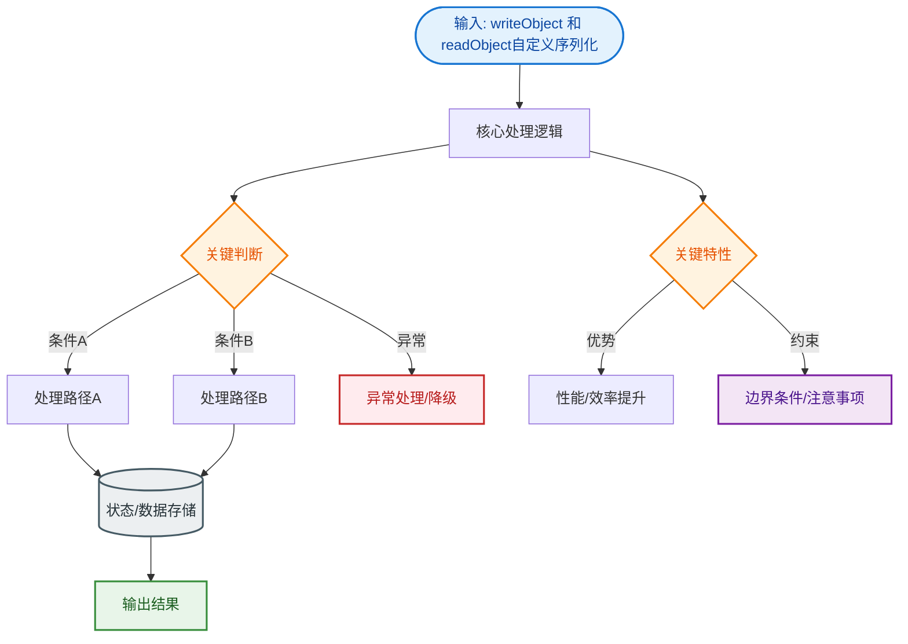

# writeObject 和 readObject自定义序列化策略

虽然默认序列化机制很方便，但有时我们需要控制序列化的过程（例如加密敏感字段或优化性能）。可以在类中提供 `private void writeObject(java.io.ObjectOutputStream out)` 和 `private void readObject(java.io.ObjectInputStream in)` 方法。JVM 在序列化/反序列化该类对象时，会自动调用这些自定义方法，而不是使用默认机制。

### 1. 原理细节与调用流程
这是基于**反射机制**的约定。`ObjectOutputStream` 在检查对象时，会通过反射查找是否定义了这两个方法（签名必须严格匹配 `private`）。

**调用逻辑图**：
```text
┌─────────────────────┐
│   ObjectOutputStream│
│   .writeObject(obj) │
└──────────┬──────────┘
           │
           ▼
┌─────────────────────┐     No      ┌──────────────────────┐
│ 检查类是否有自定义   │────────────►│ 使用默认序列化机制    │
│ writeObject 方法？   │             │ (反射写入非transient) │
└──────────┬──────────┘             └──────────────────────┘
           │ Yes
           ▼
┌─────────────────────┐
│  反射调用自定义方法  │◄───────┐
│  obj.writeObject()  │        │
└──────────┬──────────┘        │
           │                  │ 用户代码
           ▼                  │ (如加密/控制字段)
┌─────────────────────┐        │
│ out.defaultWriteObject()     │
│ (必须首先调用，负责非transient│
│  字段的默认序列化)    │────────┘
└─────────────────────┘
```

### 2. 关键代码规范
- **defaultWriteObject/defaultReadObject**：在自定义方法内部，通常第一行需要调用 `out.defaultWriteObject()` 或 `in.defaultReadObject()`。这负责处理该类中所有非 `transient` 字段的默认序列化，之后才处理自定义逻辑（如加密字段或写入非序列化对象）。
- **访问权限必须是 private**：为了保证安全性，防止被外部随意调用，JVM 要求这两个方法必须是 `private` 的。JVM 会通过反射绕过访问控制检查进行调用。

### 3. 边界条件
- 如果实现了 `Externalizable` 接口，则不会调用这两个方法，而是调用 `writeExternal` 和 `readExternal`。

### 实战案例
在处理用户隐私数据时，必须对密码字段进行加密存储。默认序列化会明文写出所有字段。通过重写 `writeObject`，先执行 `defaultWriteObject()` 处理普通字段，再手动对 `password` 进行 AES 加密后写入流；`readObject` 中则对应解密，从而在物理存储层面保证数据安全。

### 代码示例 (Java - 敏感字段加密)
```java
private void writeObject(ObjectOutputStream out) throws IOException {
    out.defaultWriteObject(); // 先默认序列化其他字段
    // 对敏感字段进行加密后写入
    out.writeObject(encrypt(this.sensitiveData)); 
}

private void readObject(ObjectInputStream in) throws IOException, ClassNotFoundException {
    in.defaultReadObject(); // 先默认反序列化其他字段
    // 读取并解密敏感字段
    this.sensitiveData = decrypt((String) in.readObject());
}
```

## 常见考点
1. **为什么要先调用 defaultWriteObject？**
   为了维持序列化机制的兼容性并处理非 `transient` 字段。如果不调用，这些字段将不会被序列化，除非手动逐个写入。
2. **writeObject 和 readObject 的顺序是否必须一致？**
   是的，写入和读取数据的顺序必须严格一致，否则会导致反序列化时数据错乱或抛出 `OptionalDataException`。
3. **这两个方法是公有的还是私有的？为什么？**
   必须是 `private` 的。这是 JVM 的规范约定，用以区分这是用户定义的回调方法而非公共 API。JVM 通过反射访问私有方法。


## 核心流程图


## 记忆要点

- 实现机制：自定义private的writeObject/readObject方法，JVM会通过反射自动回调调用
- 代码规范：方法内必须先调用defaultWriteObject处理普通字段，再处理敏感逻辑
- 读写一致：自定义写入和读取数据的顺序必须严格一致，否则会导致数据错乱

## 结构化回答

**30 秒电梯演讲：** 自定义序列化逻辑。打个比方，默认打包易碎，自己动手加固包装。

**展开框架：**
1. **实现机制** — 自定义private的writeObject/readObject方法，JVM会通过反射自动回调调用
2. **代码规范** — 方法内必须先调用defaultWriteObject处理普通字段，再处理敏感逻辑
3. **读写一致** — 自定义写入和读取数据的顺序必须严格一致，否则会导致数据错乱

**收尾：** 我在项目里踩过坑——在处理用户隐私数据时，必须对密码字段进行加密存储。您想深入聊哪一段：原理、避坑还是对比选型？

## 视频脚本

> 预计时长：3 分钟 | 由浅入深

| 时间 | 画面/字幕 | 口播台词 | 讲解要点 |
|------|----------|----------|----------|
| 0:00 | 标题卡：writeObject 和 read… | "writeObject 和 readObject自定义序列化策略？一句话——默认打包易碎，自己动手加固包装。" | 开场钩子 |
| 0:45 | 概念动画/示意图 | "自定义序列化逻辑——默认打包易碎，自己动手加固包装" | 核心定义 |
| 1:30 | 实现机制示意 | "自定义private的writeObject/readObject方法，JVM会通过反射自动回调调用" | 要点1 |
| 2:15 | 代码规范示意 | "方法内必须先调用defaultWriteObject处理普通字段，再处理敏感逻辑" | 要点2 |
| 3:00 | 总结卡 | "记住这几条，面试不慌。下期讲进阶追问。" | 收尾 |
