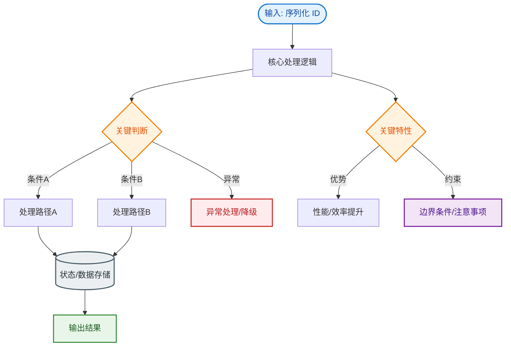

# 序列化 ID

`serialVersionUID` 是序列化版本号，用于验证序列化的对象和加载的类是否兼容。如果类没有显式定义该 ID，JVM 会根据类信息自动生成。若类结构发生修改（如新增字段），自动生成的 ID 会变化，导致反序列化失败（`InvalidClassException`）。显式定义该 ID 可以保证即使类升级，只要版本号不变，仍能尝试兼容老数据的反序列化。

### 1. 生成算法细节
- **显式定义**：建议为 `private static final long serialVersionUID = 1L;`。
- **自动生成**：如果未定义，JDK 会根据类的详细信息（类名、接口、属性、方法修饰符等）通过 **SHA-PRNG** 算法生成一个指纹（Hash值）。这极度依赖于编译器的实现，不同 JDK 可能生成不同的 ID。

### 2. 兼容性判断规则

| 类变更情况 | serialVersionUID 相同 | serialVersionUID 不同 |
| :--- | :--- | :--- |
| **新增字段** | ✅ 兼容。反序列化时新字段设为默认值 | ❌ 抛出 `InvalidClassException` |
| **删除字段** | ✅ 兼容。旧数据中该字段被丢弃 | ❌ 抛出 `InvalidClassException` |
| **修改字段类型** | ❌ 抛出 `ClassCastException` (赋值时) | ❌ 抛出 `InvalidClassException` |

### 3. 判断流程图
```text
┌──────────────────────────┐
│   开始反序列化            │
└──────────┬───────────────┘
           │
           ▼
┌──────────────────────────┐
│ 读取流中的 serialVersionUID │
└──────────┬───────────────┘
           │
           ▼
┌──────────────────────────┐    不一致    ┌──────────────────────────┐
│ 与当前类加载的 UID 比较  │─────────────►│ 抛出 InvalidClassException│
└──────────┬───────────────┘              └──────────────────────────┘
           │ 一致
           ▼
┌──────────────────────────┐
│ 尝试字段映射与数据填充    │
└──────────────────────────┘
```

### 4. 实战深化
- **实战案例**：在分布式 RPC（如 Dubbo）中，服务提供方升级了实体类（新增字段）但忘记指定 `serialVersionUID`，导致消费方反序列化时报 `InvalidClassException`，引发大面积服务不可用。务必在 DTO 实体类中显式固定版本号。
- **关键代码**：
```java
public class UserDTO implements Serializable {
    // 显式指定版本号，避免自动生成导致的不兼容
    private static final long serialVersionUID = 1L;
    
    private String name;
    // 新增字段，若UID不变，老数据反序列化时此字段为null
    private Integer age; 
}
```


## 核心流程图


## 记忆要点

- 核心作用：serialVersionUID用于验证序列化对象与加载类的版本是否兼容
- 自动生成陷阱：若未显式指定，类结构改变会导致JVM自动生成的ID变化，抛InvalidClassException
- 兼容规则：ID一致时新增字段兼容，但修改字段类型必抛ClassCastException

## 结构化回答

**30 秒电梯演讲：** 序列化版本控制ID。打个比方，文件版本号，1.0版软件打不开2.0版文件。

**展开框架：**
1. **核心作用** — serialVersionUID用于验证序列化对象与加载类的版本是否兼容
2. **自动生成陷阱** — 若未显式指定，类结构改变会导致JVM自动生成的ID变化，抛InvalidClassException
3. **兼容规则** — ID一致时新增字段兼容，但修改字段类型必抛ClassCastException

**收尾：** 我在项目里踩过坑——public class UserDTO implements Serializable {。您想深入聊哪一段：原理、避坑还是对比选型？

## 视频脚本

> 预计时长：3 分钟 | 由浅入深

| 时间 | 画面/字幕 | 口播台词 | 讲解要点 |
|------|----------|----------|----------|
| 0:00 | 标题卡：序列化 ID | "序列化 ID？一句话——文件版本号，1.0版软件打不开2.0版文件。" | 开场钩子 |
| 0:45 | 概念动画/示意图 | "序列化版本控制ID——文件版本号，1.0版软件打不开2.0版文件" | 核心定义 |
| 1:30 | 核心作用示意 | "serialVersionUID用于验证序列化对象与加载类的版本是否兼容" | 要点1 |
| 2:15 | 自动生成陷阱示意 | "若未显式指定，类结构改变会导致JVM自动生成的ID变化，抛InvalidClassException" | 要点2 |
| 3:00 | 总结卡 | "记住这几条，面试不慌。下期讲进阶追问。" | 收尾 |
