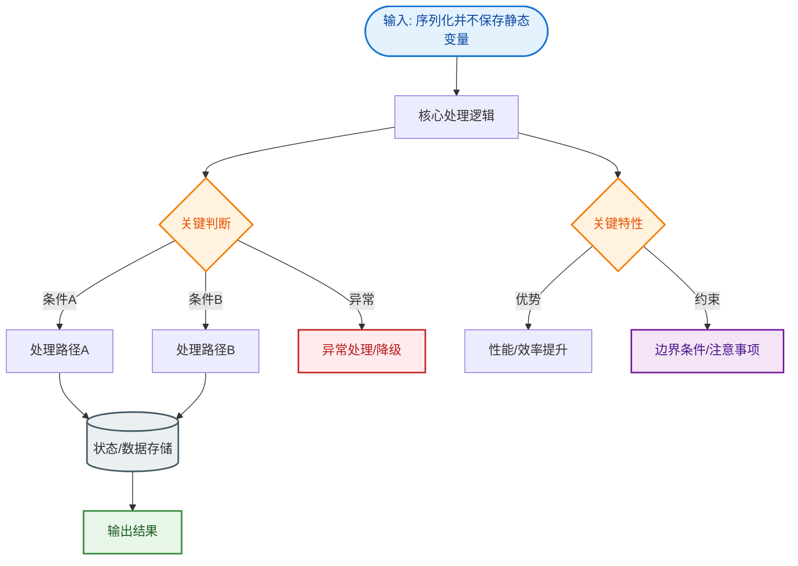

# 序列化并不保存静态变量

**序列化并不保存静态变量**。因为静态变量属于类本身，在内存中只有一份拷贝，被所有实例共享。序列化保存的是对象的状态（即实例变量的值）。因此，当对象被反序列化时，静态变量的值将取决于当前类加载器中该静态变量的当前值，而不是对象被序列化时的值。

### 1. 深层原理
- **存储位置**：静态变量存储在 **方法区** 的静态域中，而序列化的对象数据存储在 **堆** 中。Java 的序列化机制（`ObjectOutputStream`）底层是操作对象堆内存中的数据（实例字段），并不会去扫描方法区的静态域。

### 2. 生命周期与类加载器
- 反序列化时，如果目标 JVM 已经加载了该类（且静态变量已初始化），那么该类的静态变量值就是当前 JVM 内存中的值。
- 如果目标 JVM 尚未加载该类，类加载器会加载并初始化类，执行 `<clinit>` 方法（静态代码块），此时静态变量的值由初始化逻辑决定，与发送端无关。

### 3. 数据流示意图
```text
[发送端 JVM]
ClassUser { static count = 10; instance id = 5 } ──序列化──┐
                                                             ▼
                     [网络/磁盘传输流] (只包含 instance id=5)
                                                             │
[接收端 JVM] ◄──────────────────反序列化◄──────────────────┘
ClassUser { static count = 99; instance id = 5 }  <-- 反序列化后结果
                                              ^
                                              │
                                      静态变量值为本地值 (99)
```

### 4. 实战深化
- **实战案例**：在集群环境下利用 Session 序列化同步时，若 Session 对象依赖静态变量标记全局状态（如维护一个静态计数器），会发现反序列化恢复后的 Session 数据“丢失”或与预期不一致，因为静态变量并未随对象流转。
- **关键代码**：
```java
public class ClusterSession implements Serializable {
    private static final long serialVersionUID = 1L;
    
    // 错误做法：序列化不保存此值，集群间不同步
    public static int globalRequestCount = 0; 
    
    // 正确做法：使用实例字段保存状态
    private int instanceRequestCount; 
}
```

## 技术原理

**静态变量是类级别的属性**
静态变量（`static` 修饰）属于类本身，存放在 JVM 的方法区（JDK 8+ 为元空间 Metaspace 的静态域），在内存中只有一份拷贝，被该类的所有实例共享。它的生命周期与类加载器绑定，不依赖于任何具体对象实例的存在。

**序列化只保存实例成员变量**
Java 序列化的目的是保存对象的运行时状态（实例字段），`ObjectOutputStream` 底层只扫描对象堆内存中的实例字段，不会去访问方法区的静态域。因此静态变量天然被排除在序列化数据流之外——序列化字节流中只有实例字段，没有类信息或静态字段。

**反序列化后取 JVM 当前静态值**
反序列化时，如果目标 JVM 已加载该类，静态变量使用的是当前 JVM 内存中的值；如果尚未加载，类加载器会触发 `<clinit>` 执行静态代码块初始化静态变量，此时值由初始化逻辑决定，与发送端完全无关。这就是为什么发送端 `static count = 10`，接收端反序列化后可能是 99。

**transient 关键字可阻止实例变量序列化**
若希望某个实例字段也不参与序列化（如密码、临时缓存），用 `transient` 修饰即可。序列化时会跳过 transient 字段，反序列化后该字段为类型默认值（引用类型为 null，基本类型为 0/false）。

## 代码示例

```java
public class Session implements Serializable {
    private static final long serialVersionUID = 1L;

    // 错误：序列化不保存静态变量，集群间不同步
    public static int globalRequestCount = 0;

    // 正确：用实例字段保存会话状态
    private int sessionRequestCount;
    private String userId;

    // transient：临时缓存不参与序列化
    private transient Map<String, Object> localCache;
}
```

```text
// 数据流验证
[发送端 JVM] Session { static count=10, instance field id=5 }
                            |
                       序列化（只含 id=5）
                            v
[接收端 JVM] 反序列化得到 { static count=99, id=5 }
                          ^                 ^
                  本地静态值              来自序列化流
```

## 注意事项

- 核心结论：因为静态变量属于类信息存于方法区，所以序列化绝不保存静态变量。
- 值恢复规则：反序列化时静态变量使用的是目标 JVM 当前的静态变量值。
- 避坑指南：集群环境同步对象状态时，切勿将全局状态保存在静态变量中。
- 集群计数器、限流阈值等共享状态应放 Redis/DB，而非静态变量，否则各节点数据不一致。
- transient 反序列化后是默认值，需要时可在 `readObject` 中手动恢复。


## 核心流程图


## 记忆要点

- 核心结论：因为静态变量属于类信息存于方法区，所以序列化绝不保存静态变量
- 值恢复规则：反序列化时静态变量使用的是目标JVM当前的静态变量值
- 避坑指南：集群环境同步对象状态时，切勿将全局状态保存在静态变量中

## 结构化回答

**30 秒电梯演讲：** 静态变量不属于对象状态。打个比方，全班共用一本课本，拍照不用拍课本。

**展开框架：**
1. **核心结论** — 因为静态变量属于类信息存于方法区，所以序列化绝不保存静态变量
2. **值恢复规则** — 反序列化时静态变量使用的是目标JVM当前的静态变量值
3. **避坑指南** — 集群环境同步对象状态时，切勿将全局状态保存在静态变量中

**收尾：** 我在项目里踩过坑——public class ClusterSession implements Serializable {。您想深入聊哪一段：原理、避坑还是对比选型？

## 视频脚本

> 预计时长：3 分钟 | 由浅入深

| 时间 | 画面/字幕 | 口播台词 | 讲解要点 |
|------|----------|----------|----------|
| 0:00 | 标题卡：序列化并不保存静态变量 | "序列化并不保存静态变量？一句话——全班共用一本课本，拍照不用拍课本。" | 开场钩子 |
| 0:45 | 概念动画/示意图 | "静态变量不属于对象状态——全班共用一本课本，拍照不用拍课本" | 核心定义 |
| 1:30 | 核心结论示意 | "因为静态变量属于类信息存于方法区，所以序列化绝不保存静态变量" | 要点1 |
| 2:15 | 值恢复规则示意 | "反序列化时静态变量使用的是目标JVM当前的静态变量值" | 要点2 |
| 3:00 | 总结卡 | "记住这几条，面试不慌。下期讲进阶追问。" | 收尾 |
