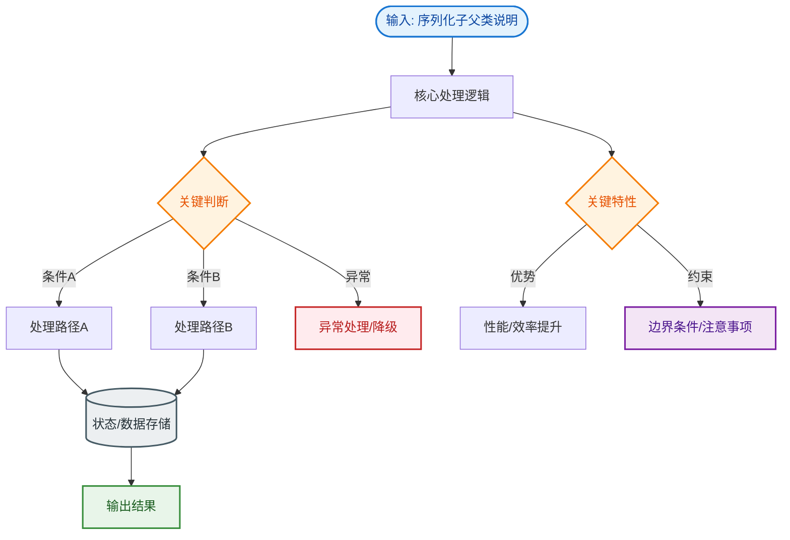
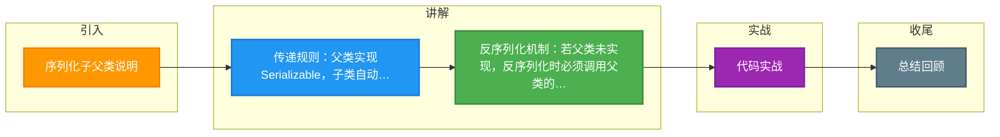

# 序列化子父类说明

关于序列化中子类和父类的关系：
1. **父类未实现 Serializable**：如果父类没有实现序列化接口，那么在序列化子类对象时，父类定义的成员变量不会被序列化（父类字段必须有无参构造函数，否则反序列化报错）。
2. **父类实现 Serializable**：如果父类实现了 `Serializable` 接口，那么子类自然也就支持序列化，父类和子类的字段都会被序列化。

### 1. 详细机制分析
- **父类未实现 Serializable**：
  - **序列化时**：仅仅递归序列化子类及实现了 `Serializable` 的祖先类的字段，父类字段直接被忽略。
  - **反序列化时**：JVM 需要构建父类部分的状态。由于数据流中没有父类的数据，JVM 必须调用父类的**无参构造函数**（public 或 protected）来初始化父类字段。如果父类没有无参构造函数，将抛出 `InvalidClassException: no valid constructor`。

- **父类实现 Serializable**：
  - 父类字段会被写入流中。反序列化时，父类字段直接从流中恢复，不依赖构造函数。

### 2. 反序列化初始化流程图
```text
反序列化子类对象:
│
├─ 1. 从内存中分配空间 (不调用任何构造函数)
│
├─ 2. 检查父类链:
│   ├─ 如果父类实现了 Serializable?
│   │   └─ YES: 从二进制流中直接读取父类字段值进行填充
│   │   └─ NO :  调用父类的无参构造函数初始化父类字段!
│
├─ 3. 对子类字段进行填充 (来自二进制流)
│
└─ 4. 如果有 readObject()，调用它进行最终处理
```

### 3. 实战深化
- **实战案例**：继承第三方库的父类（如 `BaseException`）进行序列化时，经常遇到反序列化报错 `no valid constructor`。这是因为父类通常只定义了有参构造函数，解决方法通常是自定义 `readObject` 方法手动恢复父类字段，或者确保父类存在无参构造。
- **关键代码**：
```java
// 父类未实现 Serializable 且只有有参构造
public class Parent {
    private int code;
    public Parent(int code) { this.code = code; } // 无无参构造
}

public class Child extends Parent implements Serializable {
    private static final long serialVersionUID = 1L;
    
    // 必须显式定义无参构造供父类反序列化初始化调用，否则运行时报错
    public Child() { 
        super(0); // 必须显式调用父类构造器
    }
}
```


## 核心流程图


## 记忆要点

- 传递规则：父类实现Serializable，子类自动支持序列化且父子字段均保存
- 反序列化机制：若父类未实现，反序列化时必须调用父类的无参构造初始化父类字段
- 致命异常：父类未实现接口且无无参构造，反序列化必抛no valid constructor异常

## 结构化回答

**30 秒电梯演讲：** 父类未实现接口则父类字段不序列化。打个比方，只有你（子类）买了票，你爸爸（父类）没买票，爸爸不能上车。

**展开框架：**
1. **传递规则** — 父类实现Serializable，子类自动支持序列化且父子字段均保存
2. **反序列化机制** — 若父类未实现，反序列化时必须调用父类的无参构造初始化父类字段
3. **致命异常** — 父类未实现接口且无无参构造，反序列化必抛no valid constructor异常

**收尾：** 我在项目里踩过坑——// 父类未实现 Serializable 且只有有参构造。您想深入聊哪一段：原理、避坑还是对比选型？

## 视频脚本

> 预计时长：3 分钟 | 由浅入深

| 时间 | 画面/字幕 | 口播台词 | 讲解要点 |
|------|----------|----------|----------|
| 0:00 | 标题卡：序列化子父类说明 | "序列化子父类说明？一句话——只有你（子类）买了票，你爸爸（父类）没买票，爸爸不能上车。" | 开场钩子 |
| 0:45 | 概念动画/示意图 | "父类未实现接口则父类字段不序列化——只有你（子类）买了票，你爸爸（父类）没买票，爸爸不能上车" | 核心定义 |
| 1:30 | 传递规则示意 | "父类实现Serializable，子类自动支持序列化且父子字段均保存" | 要点1 |
| 2:15 | 反序列化机制示意 | "若父类未实现，反序列化时必须调用父类的无参构造初始化父类字段" | 要点2 |
| 3:00 | 总结卡 | "记住这几条，面试不慌。下期讲进阶追问。" | 收尾 |

### 视频流程图



