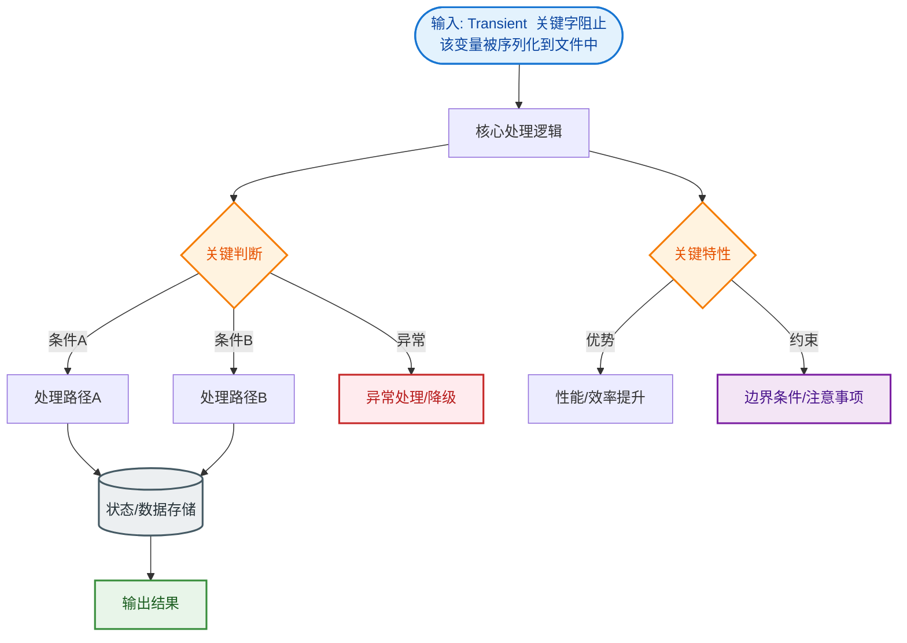

# Transient  关键字阻止该变量被序列化到文件中

`transient` 关键字用于修饰变量，表示该变量不参与序列化过程。

### 1. 作用机制
- **阻止序列化**：在变量声明前加上 `transient` 关键字，该变量在对象序列化时不会被写入文件或网络流中。
- **反序列化后的值**：对象被反序列化后，`transient` 变量的值会被重置为类型的初始值（如 `int` 为 0，对象为 `null`），而非序列化时的状态。

### 2. 深层原理与架构
当 JVM 进行序列化时，会遍历对象的类层级结构。对于每个字段，它会检查修饰符。如果标记为 `transient`，序列化过滤器会跳过该字段，不将其传递给底层的 `ObjectOutputStream` 进行写入。

**序列化字段过滤逻辑：**
```text
Object (Instance)
    │
    ├── Field A (int) ────────► [检查 Modifiers] ──► Normal ──► 写入流
    │
    ├── Field B (transient) ──► [检查 Modifiers] ──► Transient ──► 跳过
    │                                                             │
    └── Field C (String) ─────► [检查 Modifiers] ──► Normal ──► 写入流
```

### 3. 应用场景
常用于安全控制或无需持久化的字段。
- **敏感信息保护**：例如密码字段，可在序列化时忽略（或配合自定义加密逻辑），避免明文存储或传输。
- **上下文相关数据**：如 `Thread`、`Socket` 连接、`InputStream` 等非可序列化资源，或者基于运行时环境计算得出的缓存值。

### 4. 进阶：与 Externalizable 的区别
如果类实现了 `Externalizable` 接口（而非 `Serializable`），`transient` 关键字**失效**。所有的字段默认都不被序列化，必须由开发者在 `writeExternal` 方法中显式决定写什么字段。

### 5. 静态变量说明
静态变量（`static`）不属于对象状态，因此无论是否加 `transient`，都不会被序列化。

### 6. 实战深化
- **实战案例**：使用 Redis 序列化缓存包含大字段（如 `List<Image>`）的用户对象时，若图像无需缓存，应用 `transient` 修饰以大幅降低网络传输开销和 Redis 内存占用。同时，可在反序列化后按需从数据库或文件系统懒加载。
- **关键代码**：
```java
public class UserProfile implements Serializable {
    private static final long serialVersionUID = 1L;
    private String username;
    
    // 敏感信息或大对象，不序列化
    private transient String password;
    private transient byte[] largeAvatarData;

    // 自定义反序列化逻辑，恢复非默认值
    private void readObject(ObjectInputStream in) throws IOException, ClassNotFoundException {
        in.defaultReadObject();
        // 模拟从配置中心或运行时环境恢复密码（实际应用中通常不恢复密码）
        this.password = "RECOVERED_DUMMY"; 
    }
}
```


## 核心流程图


## 记忆要点

- 核心作用：transient关键字修饰的变量不参与序列化传输
- 值恢复规则：反序列化后transient变量被重置为类型默认值（如0或null）
- 接口失效：若实现Externalizable接口，transient关键字直接失效，需手动写入

## 结构化回答

**30 秒电梯演讲：** 标记变量不参与序列化过程，保护隐私或跳过无用数据。打个比方，就像搬家打包时，给某些箱子贴上“不带走”标签，只带走剩下的东西。

**展开框架：**
1. **核心作用** — transient关键字修饰的变量不参与序列化传输
2. **值恢复规则** — 反序列化后transient变量被重置为类型默认值（如0或null）
3. **接口失效** — 若实现Externalizable接口，transient关键字直接失效，需手动写入

**收尾：** 我在项目里踩过坑——public class UserProfile implements Serializable {。您想深入聊哪一段：原理、避坑还是对比选型？

## 视频脚本

> 预计时长：3 分钟 | 由浅入深

| 时间 | 画面/字幕 | 口播台词 | 讲解要点 |
|------|----------|----------|----------|
| 0:00 | 标题卡：Transient  关键字阻止该变… | "Transient  关键字阻止该变量被序列化到文件中？一句话——就像搬家打包时，给某些箱子贴上“不带走”标签，只带走剩下的东西。" | 开场钩子 |
| 0:45 | 概念动画/示意图 | "标记变量不参与序列化过程，保护隐私或跳过无用数据——就像搬家打包时，给某些箱子贴上“不带走”标签，只带走剩下的东西" | 核心定义 |
| 1:30 | 核心作用示意 | "transient关键字修饰的变量不参与序列化传输" | 要点1 |
| 2:15 | 值恢复规则示意 | "反序列化后transient变量被重置为类型默认值（如0或null）" | 要点2 |
| 3:00 | 总结卡 | "记住这几条，面试不慌。下期讲进阶追问。" | 收尾 |
