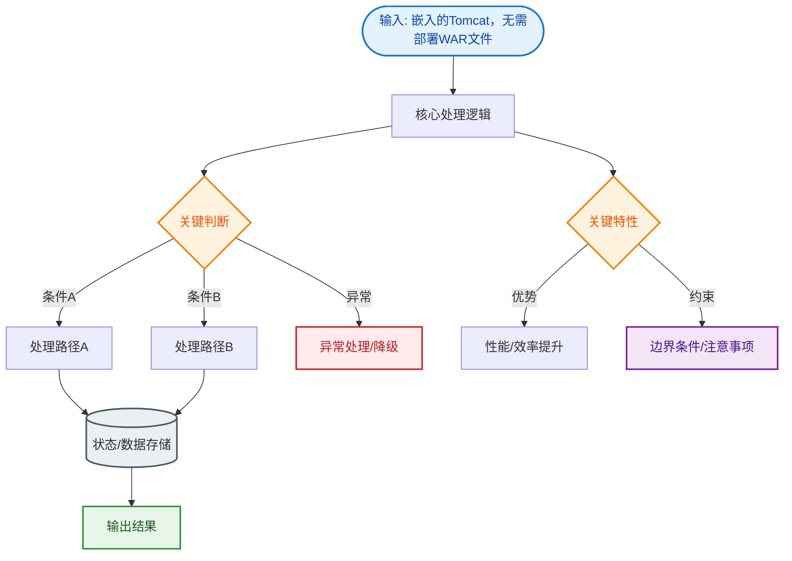
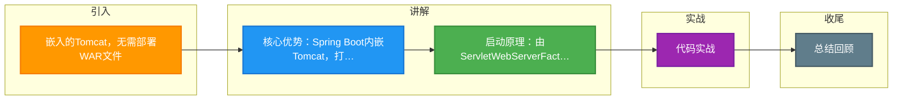

# 嵌入的Tomcat，无需部署WAR文件

Spring Boot 内置了 Web 容器（如 Tomcat），应用程序可以直接打包成可执行的 JAR 包运行，无需部署外部的 WAR 文件到独立服务器。

### 核心优势
1. **简化部署**：将 Web 服务器嵌入到应用中，通过 `java -jar` 即可启动。
2. **开箱即用**：省去了下载、安装和配置 Tomcat 服务器的繁琐步骤。
3. **微服务友好**：每个微服务可以独立携带运行环境，互不干扰。

### 实现原理与细节
Spring Boot 通过 `ServletWebServerFactory`（如 `TomcatServletWebServerFactory`）自动配置嵌入式容器。启动时，它会创建一个 Tomcat 实例，并将 Spring MVC 的 `DispatcherServlet` 注册进去。打包的 JAR 文件采用特殊的嵌套结构（`BOOT-INF` 存放业务类，`lib/` 存放依赖），通过自定义的类加载器（`LaunchedURLClassLoader`）加载，使得依赖库可以打包在一个文件中。

```text
┌─────────────────────────────────────────────────────────────┐
│                    Spring Boot Executable JAR               │
├─────────────────────────────────────────────────────────────┤
│  BOOT-INF/classes  │  BOOT-INF/lib  │  org/springframework/ │
│  (用户代码)         │  (第三方依赖)    │  (启动器 Launched类)   │
├─────────────────────────────────────────────────────────────┤
│                       启动流程                              │
│  1. java -jar 调用 JarLauncher (Main-Class)                │
│  2. LaunchedURLClassLoader 加载 BOOT-INF 下的类            │
│  3. 调用用户定义的 main() 方法 (SpringApplication.run)     │
│  4. refreshContext() -> onRefresh() -> 启动嵌入式 Tomcat   │
└─────────────────────────────────────────────────────────────┘
```

### 关键参数与边界
- **切换容器**：引入 `spring-boot-starter-jetty` 或 `undertow` 依赖，并排除 Tomcat，即可无缝切换 Web 容器。
- **端口冲突**：嵌入式容器默认占用 8080 端口，需注意虚拟化或容器化部署时的端口映射。
- **资源限制**：与传统独立容器不同，嵌入式容器由应用进程管理，JVM 退出即服务停止，需配合 KeepAlive 或进程管理工具（如 Systemd, K8s）保证高可用。

### 实战深化
- **实战对比（部署方式选择）**：

| 特性 | 嵌入式容器 | 外置容器 (WAR) |
| :--- | :--- | :--- |
| **部署复杂度** | 低 (直接运行 JAR) | 高 (需安装 Tomcat、配置 Server.xml) |
| **多版本管理** | 支持 (不同服务可带不同版本 Tomcat) | 差 (共享容器，依赖冲突难处理) |
| **运维控制** | 应用进程与容器进程绑定，维护简单 | 需单独维护容器生命周期，升级麻烦 |
| **适用场景** | 微服务、云原生应用 | 传统单体应用、需利用容器高级特性时 |

- **实战案例**：在 K8s 环境下，利用 Java Agent 注入动态 Agent 时（如 Arthas 或 SkyWalking），如果使用嵌入式的 Jar 包启动，经常遇到 Attach 失败的问题，通常需要调整启动参数或使用 Kubernetes 的 Sidecar 模式来处理监控探针的注入。
- **关键代码**：
```java
// 自定义嵌入式 Web 容器工厂配置 (例如修改 Tomcat 线程池)
@Bean
public WebServerFactoryCustomizer<TomcatServletWebServerFactory> tomcatCustomizer() {
    return factory -> {
        factory.addConnectorCustomizers(connector -> {
            Http11NioProtocol protocol = (Http11NioProtocol) connector.getProtocolHandler();
            // 自定义最大连接数，针对高并发场景调优
            protocol.setMaxConnections(2000);
            protocol.setAcceptCount(100);
        });
    };
}
```


## 核心流程图


## 记忆要点

- 核心优势：Spring Boot内嵌Tomcat，打 Jar包可直接用 java -jar 运行，微服务友好
- 启动原理：由ServletWebServerFactory创建Tomcat并注册DispatcherServlet
- 灵活切换：只需排除Tomcat依赖引入Jetty或Undertow，即可无缝切换Web容器

## 结构化回答

**30 秒电梯演讲：** 将Web服务器内嵌在应用中，无需外部容器即可运行。打个比方，就像自带灶台的快餐车，去哪都能开火做饭，不需要依赖外面的餐厅厨房。

**展开框架：**
1. **核心优势** — Spring Boot内嵌Tomcat，打 Jar包可直接用 java -jar 运行，微服务友好
2. **启动原理** — 由ServletWebServerFactory创建Tomcat并注册DispatcherServlet
3. **灵活切换** — 只需排除Tomcat依赖引入Jetty或Undertow，即可无缝切换Web容器

**收尾：** 我在项目里踩过坑——// 自定义嵌入式 Web 容器工厂配置 (例如修改 Tomcat 线程池)。您想深入聊哪一段：原理、避坑还是对比选型？

## 视频脚本

> 预计时长：3 分钟 | 由浅入深

| 时间 | 画面/字幕 | 口播台词 | 讲解要点 |
|------|----------|----------|----------|
| 0:00 | 标题卡：嵌入的Tomcat，无需部署WAR文… | "嵌入的Tomcat，无需部署WAR文件？一句话——就像自带灶台的快餐车，去哪都能开火做饭，不需要依赖外面的餐厅厨房。" | 开场钩子 |
| 0:45 | 概念动画/示意图 | "将Web服务器内嵌在应用中，无需外部容器即可运行——就像自带灶台的快餐车，去哪都能开火做饭，不需要依赖外面的餐厅厨房" | 核心定义 |
| 1:30 | 核心优势示意 | "Spring Boot内嵌Tomcat，打 Jar包可直接用 java -jar 运行，微服务友好" | 要点1 |
| 2:15 | 启动原理示意 | "由ServletWebServerFactory创建Tomcat并注册DispatcherServlet" | 要点2 |
| 3:00 | 总结卡 | "记住这几条，面试不慌。下期讲进阶追问。" | 收尾 |

### 视频流程图



